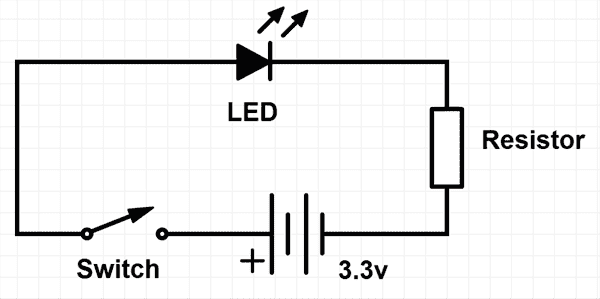
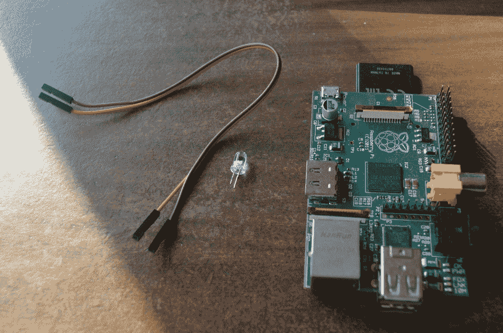
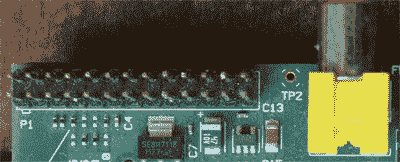
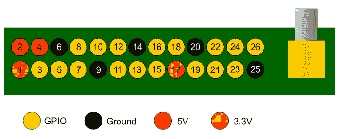
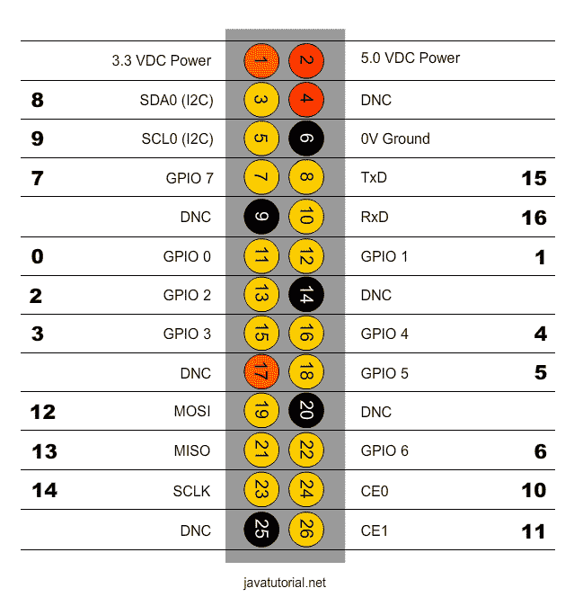
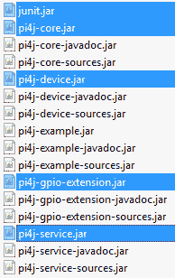

# Raspberry Pi Java 教程

> 原文： [https://javatutorial.net/raspberry-pi-java-tutorial](https://javatutorial.net/raspberry-pi-java-tutorial)

在本教程中，我将向您展示如何使用 Raspberry Pi 和 [Java](https://javatutorial.net/install-java-9-eclipse) 来闪烁 LED 灯。 这将是一个完整的分步教程，从连接电缆开始，通过 GPIO 解释，最后编写 Java 代码。 在本教程的最后，我将向您展示如何使用连接到 Raspberry 的 LED 灯编写完整的 Java 程序。

## 介绍

您可以建立的最简单的电路之一是连接到光源和开关的电池（电阻器用于保护 LED）：



在上图中，Raspberry Pi 替换了开关和电池。

## 要求

带有 Raspbian 操作系统的 Raspberry Pi 板（了解如何[安装和配置 Raspbian](http://javatutorial.net/install-raspbian-to-sd-card "Install Raspbian to SD Card") ）

1 x LED 灯

2 x 母对母跳线电缆（您可以在[网上购买 40 支](http://www.ebay.com/sch/i.html?_from=R40&_trksid=p2050601.m570.l1313.TR0.TRC0.H0.Xfemale+to+female+jumper+cable+wires&_nkw=female+to+female+jumper+cable+wires&_sacat=0)，价格低于 2 美元）



## Raspberry Pi GPIO

根据该模型，Raspberry Pi 在板的边缘，黄色视频输出插座旁边提供了不同数量的 GPIO（通用输入/输出）引脚。



这些引脚是 Pi 与外界之间的物理接口。 每个引脚可以打开或关闭，或者在计算方面变为高电平或低电平。 当引脚为高电平时，它输出 3.3 伏特（3v3）；当引脚处于高电平时，它输出 3 伏特。 当引脚为低电平时，它关闭。 26 个引脚中的 17 个（用于型号 A 和 B）是 GPIO 引脚; 其他是电源或接地引脚。 型号 A +和 B +有 40 个引脚，其中 26 个是 GPIO 引脚。 本教程适用于所有 Raspberry Pi 型号。



## 连线

看下图。 我们将使用跳线将 LED 阴极（-）连接到 Raspberry Pi 的 6 号针脚，将阳极（+）连接到＃12 的针脚。


首先将电缆连接到 LED。 我将红色电缆连接到阳极，将棕色电缆连接到阴极。 您可以使用任何喜欢的颜色。


现在，将电缆的另一端连接到 Raspberry 板的针脚 6 和 12


组装完成。 现在打开 Pi。

## 在 Raspberry Pi 上安装 Pi4J

在本教程中，我们将使用 Pi4J。 [Pi4J](http://pi4j.com/ "Pi4J project") 是一种开源 Java API，它与设备进行低级通信，并为我们提供了一种抽象和面向对象的方法，以使用 Java 编程语言来控制 Pi 的 GPIO。

最简单的安装方法是在您的 Pi 上运行以下命令。 这将下载所需的所有依赖项和文件，并将它们放在`/opt/pi4j/lib`文件夹中。 如果此方法不适合您，则可以在此处探索其他[安装选项](http://pi4j.com/install.html)。

```java
curl -s get.pi4j.com | sudo bash
```

Pi4J 为 GPIO 引脚提供名称和编号，如下所示：



## 编写代码

首先将 Pi4J 库包含到您的项目中。 如果使用 Maven，则可以将此依赖项添加到 POM 文件中：

```java
<dependency>
	<groupId>com.pi4j</groupId>
	<artifactId>pi4j-core</artifactId>
	<version>${project.version}</version>
</dependency>
```

您也可以使用老式的方法：

1）从[下载页面](http://pi4j.com/download.html)下载 pi4j ZIP 文件

2）复制以下 JAR 文件并将其包含在您的项目中（在下载的档案的 lib 文件夹中找到）：



编译代码需要 JAR 文件。

现在，我们有了所有的依赖关系，让我们编写代码。 我们的程序将执行以下操作：

1）开启 LED 2 秒钟

2）关闭 LED 并等待 1 秒钟

3）开启 LED 1 秒钟

```java
import com.pi4j.io.gpio.GpioController;
import com.pi4j.io.gpio.GpioFactory;
import com.pi4j.io.gpio.GpioPinDigitalOutput;
import com.pi4j.io.gpio.PinState;
import com.pi4j.io.gpio.RaspiPin;

public class LedControl {

    public static void main(String[] args) throws InterruptedException {

        // get a handle to the GPIO controller
    	final GpioController gpio = GpioFactory.getInstance();

        // creating the pin with parameter PinState.HIGH
        // will instantly power up the pin
        final GpioPinDigitalOutput pin = gpio.provisionDigitalOutputPin(RaspiPin.GPIO_01, "PinLED", PinState.HIGH);
        System.out.println("light is: ON");

        // wait 2 seconds
        Thread.sleep(2000);

        // turn off GPIO 1
        pin.low();
        System.out.println("light is: OFF");

        // wait 1 second
        Thread.sleep(1000);

        // turn on GPIO 1 for 1 second and then off
        System.out.println("light is: ON for 1 second");
        pin.pulse(1000, true);

        // release the GPIO controller resources
        gpio.shutdown();
    }
}
```

像这样在 Raspberry 上执行程序

```java
sudo java -classpath .:classes:/opt/pi4j/lib/'*' LedControl
```

现在，您应该看到指示灯先亮 2 秒钟，然后亮 1 秒钟。