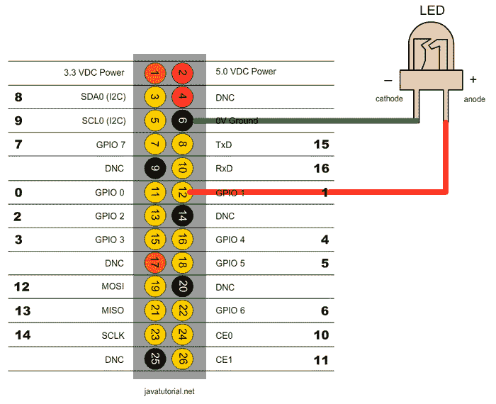

# 使用 PWM 的 Raspberry Pi LED 亮度调节

> 原文： [https://javatutorial.net/raspberry-pi-dim-led-pwm-java](https://javatutorial.net/raspberry-pi-dim-led-pwm-java)

在本教程中，我将向您展示如何使用 PWM 控制电压以使 LED 变暗。

打开和关闭 LED 很容易。 您可以在我的[上一教程](http://javatutorial.net/raspberry-pi-java-tutorial "Raspberry Pi Java Tutorial")中了解如何执行此操作。 现在，我将向您展示如何控制电压电平以使 LED 灯变弱或变强。 通常，Raspberry GPIO 使用 3.3 的电压。 当该引脚处于上升状态时，输出电压等于 3.3，而当该引脚处于下降状态时，电压为 0。那么如何将电压更改为例如 3.3V 的 50% ？ 我们可以使用**脉宽调制（PWM）**进行此操作。根据 Wikipedia，PWM 是：“一种用于将消息编码为脉冲信号的技术。 尽管这种调制技术可用于编码信息以进行传输，但其主要用途是允许控制提供给电气设备，尤其是惯性负载（如电机）的功率。

在 Raspberry Pi 中，只有一个引脚支持硬件 PWM。 硬件 PWN 引脚产生非常干净的信号。 虽然您可以制作一个软件 PWM，但所有引脚都可以产生 PWM。 软件的 PWM 引脚没有如此清晰的信号，您必须自行设定时序。

我们将使用与[先前教程](http://javatutorial.net/raspberry-pi-java-tutorial "Raspberry Pi Java Tutorial")中完全相同的电路。 看下图



以下代码示例将使 LED 逐渐变亮，然后完全熄灭 3 次。 我将 Pi4j API 用于 Java 绑定。 如果您想知道如何使用 Pi4j 安装，配置和运行项目，请参阅我的[上一教程](http://javatutorial.net/raspberry-pi-java-tutorial "Raspberry Pi Java Tutorial")。

```java
import com.pi4j.wiringpi.Gpio;
import com.pi4j.wiringpi.SoftPwm;

public class DimLEDPWM {

	private static int PIN_NUMBER = 1;

	public static void main(String[] args) throws InterruptedException {
		// initialize wiringPi library, this is needed for PWM
		Gpio.wiringPiSetup();

		// softPwmCreate(int pin, int value, int range)
		// the range is set like (min=0 ; max=100)
		SoftPwm.softPwmCreate(PIN_NUMBER, 0, 100);

		int counter = 0;
		while (counter < 3) {

			// fade LED to fully ON
			for (int i = 0; i <= 100; i++) {
				// softPwmWrite(int pin, int value)
				// This updates the PWM value on the given pin. The value is
				// checked to be in-range and pins
				// that haven't previously been initialized via softPwmCreate
				// will be silently ignored.
				SoftPwm.softPwmWrite(PIN_NUMBER, i);
				Thread.sleep(25);
			}

			// fade LED to fully OFF
			for (int i = 100; i >= 0; i--) {
				SoftPwm.softPwmWrite(PIN_NUMBER, i);
				Thread.sleep(25);
			}

			counter++;
		}
	}
}

```

您可以使用以下命令在 Raspberry 上运行该程序：

```java
sudo java -classpath .:classes:/opt/pi4j/lib/'*' DimLEDPWM
```