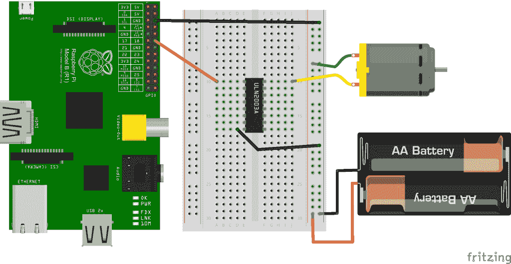
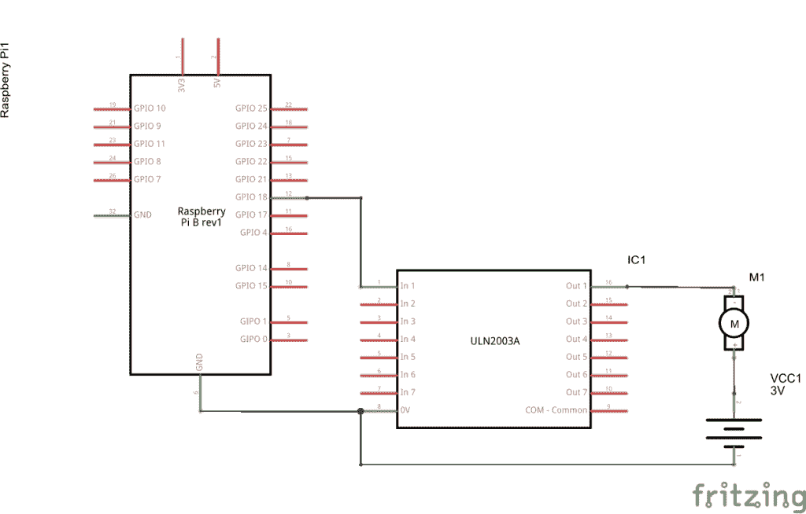

# Raspberry Pi 控制电机速度

> 原文： [https://javatutorial.net/raspberry-pi-control-motor-speed](https://javatutorial.net/raspberry-pi-control-motor-speed)

在本教程中，我将向您展示如何使用 Raspberry Pi 控制直流电机的速度。

如果您正在寻找有关如何同时控制电机的速度和方向的教程，请查看我关于该主题的最新教程。 [Raspberry Pi 用 Java 控制直流电机的速度和方向](https://javatutorial.net/raspberry-pi-control-dc-motor-speed-and-direction-java)

控制电机是使用 Raspberry Pi 可以做的最令人兴奋的事情之一。 电机是耗电的组件。 它们通常需要比 Raspberry 提供的 3V3 更高的功率。 这就是我们将电机连接到外部电源（电池）的原因。 您可以使用本教程中描述的相同技术来处理需要外部电源的任何组件。

## 构建电路

在做任何事情之前，我们都必须将它们挂钩。 对于本教程，您将需要

*   直流电机
*   外部电源（电池）–您可能需要根据电机使用不同的电压
*   达灵顿数组芯片（ULN2003）–在本教程的后面，我将为您提供更多详细信息
*   几根电线

看下图。 它显示了如何构建电路。



这是我们的电路原理图



## 达灵顿数组芯片

ULN2003 是七对晶体管，可让我们以安全的方式通过 GPIO 端口使用 3V3 切换更高的电压。 我们可以改用标准晶体管，但为什么可以订购价格低于 0.20 美元的 ULN2003 并可以同时控制 7 台电机，为什么还要打扰呢。

ULN2003 的另一重要之处在于，它可以保护您的 Raspberry GPIO 端口免受电感负载（继电器，螺线管，电机等）关闭时可能出现的电压尖峰的影响。

## 控制马达

我们将使用软件 PWM 来控制电机速度。 如果您想了解更多有关 PWM 的信息，请阅读我以前的教程[具有 PWM 和 Java 的 Raspberry Pi 调光 LED](http://javatutorial.net/raspberry-pi-dim-led-pwm-java "Raspberry Pi Dim LED with PWM and Java")。 我们将使用 [Pi4j](http://pi4j.com/) API 用 Java 编写速度控制程序。 如果您想知道如何使用 Pi4j 安装，配置和运行项目，[请参阅本教程](http://javatutorial.net/raspberry-pi-java-tutorial "Raspberry Pi Java Tutorial")。

在 Pi4j 中，PWM 值从 0 到 100.在以下示例程序中，我们将利用此值并首先以 25% 的速度旋转电机，然后将其旋转至半速（50% ），然后转至全速（100% ），然后 终于把它拒绝了。

```java
import com.pi4j.wiringpi.Gpio;
import com.pi4j.wiringpi.SoftPwm;

public class MotorPWM {

	private static int PIN_NUMBER = 1;

	public static void main(String[] args) throws InterruptedException {

		System.out.println("Started");

		// initialize wiringPi library, this is needed for PWM
		Gpio.wiringPiSetup();

		// softPwmCreate(int pin, int value, int range)
		// the range is set like (min=0 ; max=100)
		SoftPwm.softPwmCreate(PIN_NUMBER, 0, 100);

		setSpeed(25);
		setSpeed(50);
		setSpeed(100);
		setSpeed(0);

		System.out.println("Finished");
	}

	private static void setSpeed(int speed) throws InterruptedException {
		System.out.println("Speed is set to " + speed + "%");
		// softPwmWrite(int pin, int value)
		// This updates the PWM value on the given pin. The value is checked to
		// be in-range and pins that haven't previously been initialized via 
		// softPwmCreate will be silently ignored.
		SoftPwm.softPwmWrite(PIN_NUMBER, speed);
		// wait 3 seconds
		Thread.sleep(3000);
	}
}

```

您可以使用以下命令在 Raspberry 上运行该程序：

```java
sudo java -classpath .:classes:/opt/pi4j/lib/'*' MotorPWM
```

观看视频以查看最终结果

<https://www.youtube.com/embed/OqBoNk0HCY8?feature=oembed>