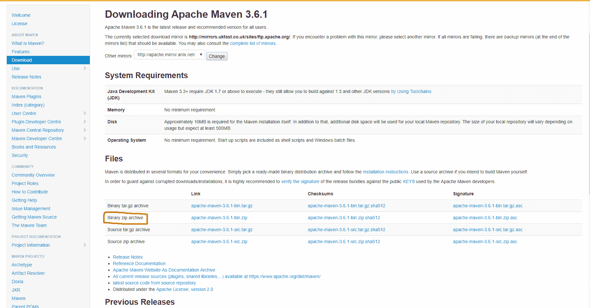
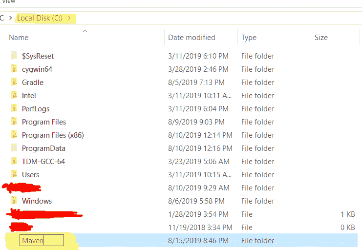
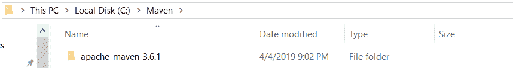
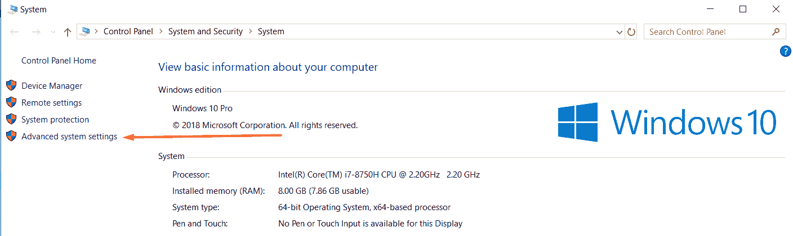
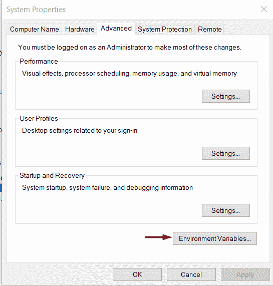
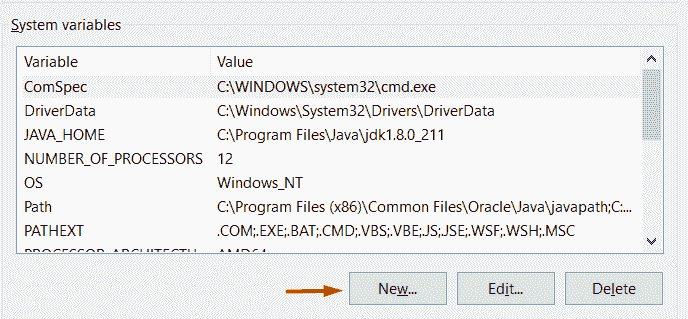
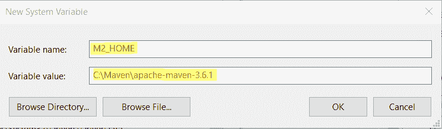
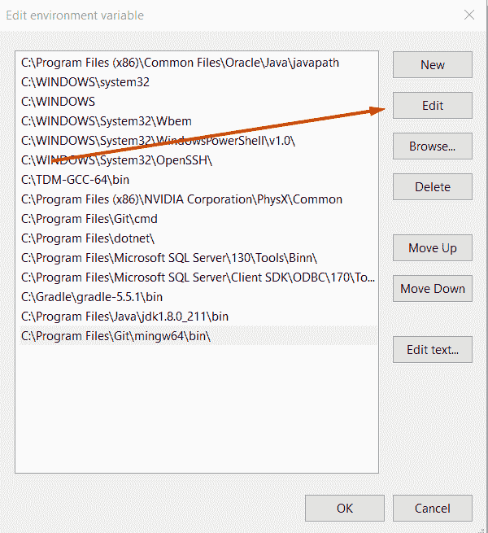

# 如何在 Windows，Linux 和 Mac 上安装 Maven

> [https://javatutorial.net/how-to-install-maven-on-windows-linux-and-mac](https://javatutorial.net/how-to-install-maven-on-windows-linux-and-mac)

在本教程中，我们将介绍 Maven 的安装过程。


如果您是 **WINDOWS** 用户（如果不是，则向下滚动以查看如何安装 Maven（如果您是 Linux 或 Mac 用户））：

在继续下一步之前，请确保您已在系统上安装了 JDK。 如果没有，您可以查看[本文](https://javatutorial.net/install-java-8-jdk-on-ubuntu)，以获取快速的分步指南。 要查看 Maven 的所有必要最低要求，请在此处单击[或查看下面的图像](http://maven.apache.org/download.cgi#Requirements)


单击此处的[并下载最新版本](https://maven.apache.org/download.cgi)。 您可以选择二进制版本或完整版本（也可以包含源代码和文档）。 我建议下载二进制文件，因为无论如何您都可以在线找到所有源代码和文档。



如果您不希望包含源文件和文档，请选择二进制版本。 当您单击链接时，它将自动开始下载 zip 文件。 如果仍然无法刷新页面，请重试。

下载完成后，将存档解压缩到 C，最好在 C 中创建一个名为 Maven 的文件夹，然后将文件解压缩到其中。



创建 Maven 文件夹后，将文件从下载的 zip 文件解压缩到该文件夹​​中。



现在我们必须设置`M2_HOME`。 在能够运行 Maven 之前，我们需要在环境变量中进行设置并将`bin`添加到`PATH`。

**添加`M2_HOME`**

1.  右键单击此 PC 上的某个位置
    1.  选择属性
    2.  在右侧，选择高级系统设置
        
        
    3.  之后，单击“环境变量…” 
    
        
    4.  在“系统变量”下，选择“新建…”
    
        
    5.  输入框打开时，键入`M2_HOME`作为变量名和 Maven 的路径
    
        
    6.  在系统变量下，选择“路径”，然后单击“编辑”。
    
        
    7.  添加路径`C:\Maven\apache-maven-3.6.1\bin`

**验证安装是否成功**

要知道安装是否成功，请在 CMD 中键入以下内容：

```java
mvn --version
```

如果您得到以下信息：

```java
Apache Maven 3.6.1 (d66c9c0b3152b2e69ee9bac180bb8fcc8e6af555; 2019-04-04T20:00:29+01:00)
Maven home: C:\Maven\apache-maven-3.6.1\bin\..
Java version: 1.8.0_211, vendor: Oracle Corporation, runtime: C:\Program Files\Java\jdk1.8.0_211\jre
Default locale: en_US, platform encoding: Cp1252
OS name: "windows 10", version: "10.0", arch: "amd64", family: "windows"
```

那你就好了

## Linux

要求：

*   [Oracle JDK 11](https://www.javahelps.com/2017/09/install-oracle-jdk-9-on-linux.html)

1.  下载[`apache-maven-3.6.1-bin.tar.gz`](https://maven.apache.org/download.cgi)二进制文件（如果您不希望包含源代码和文档）。
2.  在终端中输入`cd /opt`
3.  将 apache-maven 存档解压缩到`opt`目录中：`sudo tar -xvzf ~/Downloads/apache-maven-3.6.0-bin.tar.gz`
4.  添加为环境变量：`M2_HOME="/opt/apache-maven-3.6.0"`并将`bin`目录附加到`Path`变量：`/opt/apache-maven-3.6.0/bin`
5.  更新`mvn`命令：
    1.  `sudo update-alternatives --install "/usr/bin/mvn" "mvn" "/opt/apache-maven-3.6.0/bin/mvn" 0`
    2.  ``sudo update-alternatives --set mvn /opt/apache-maven-3.6.0/bin/mvn``
6.  将 bash 完成添加到`mvn`：`sudo wget https://raw.github.com/dimaj/maven-bash-completion/master/bash_completion.bash --output-document /etc/bash_completion.d/mvn`。 这将使您可以通过单击 Tab 两次来完成 Maven 命令。
7.  键入`mvn –version`以验证其是否有效

## MAC

1.  打开终端并转到提取文件的目录并以超级用户身份登录
2.  通过键入删除`tar.gz`存档。`rm Downloads/apache-maven*bin.tar.gz`
3.  修复权限：`chown -R root:wheel Downloads/apache-maven*`
4.  切换 Maven 内容：`mv Downloads/apache-maven* /opt/apache-maven`
5.  存档管理会话：`exit`
6.  将 Maven 二进制文件添加到路径，然后追加：
    1.  `nano $HOME/.profile`
    2.  `export PATH=$PATH:/opt/apache-maven/bin`
7.  `Ctrl + x`保存并退出`nano`
8.  要加载新设置，请执行 bash
9.  要测试安装是否成功，请键入`mvn -version`