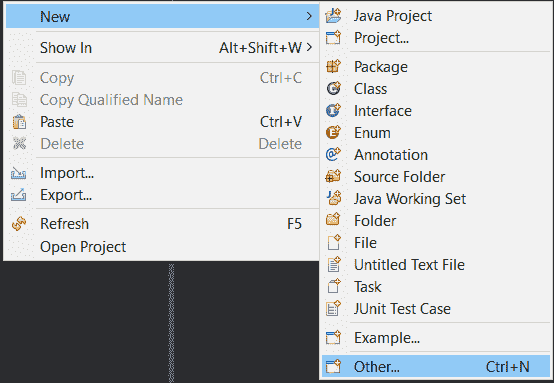
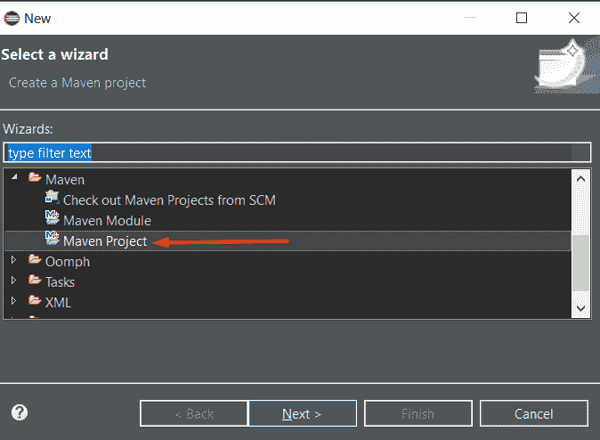
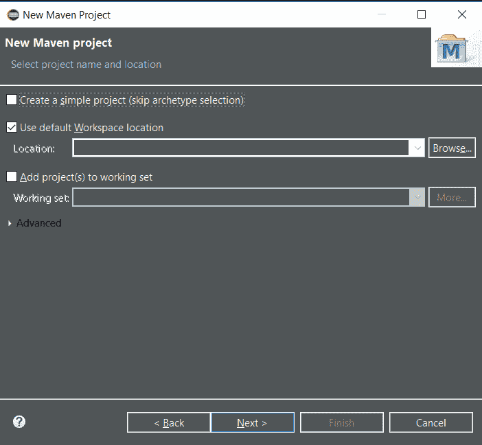
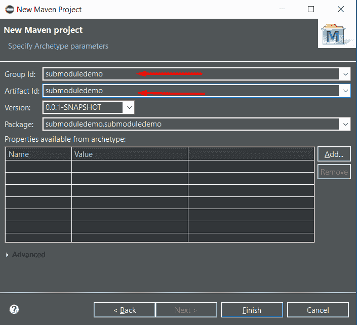
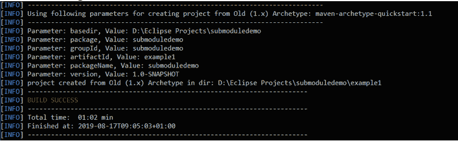
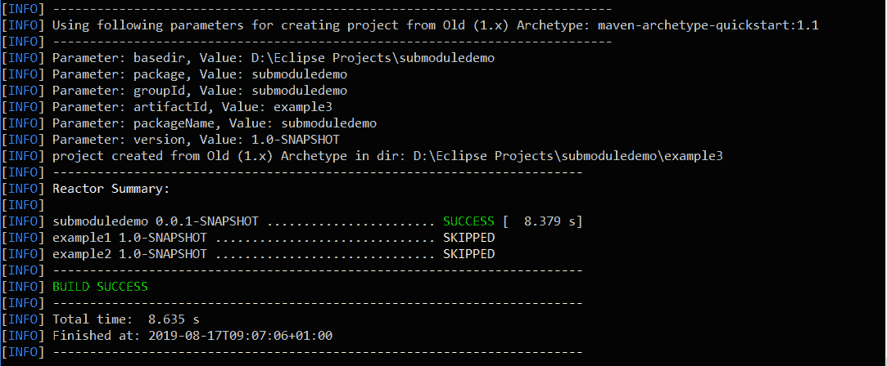
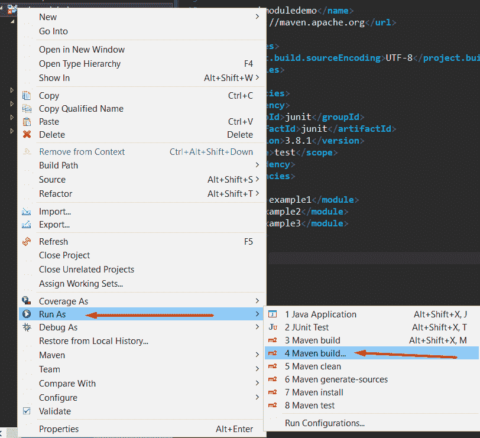
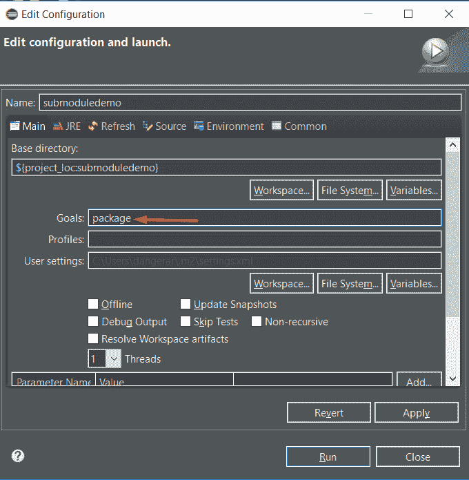
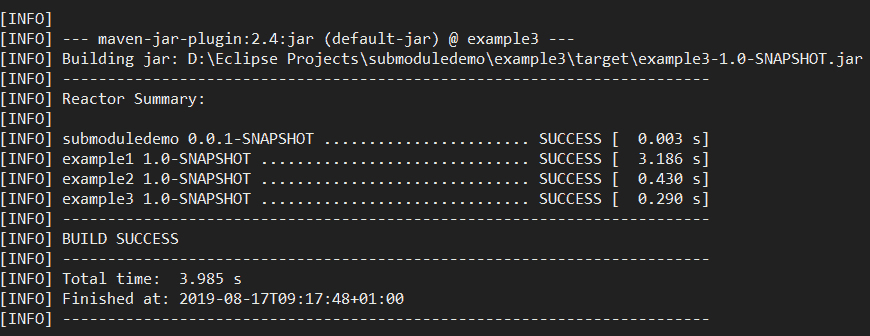

# 如何在 Java 中使用 Maven 创建子模块

> 原文： [https://javatutorial.net/how-to-create-submodules-with-maven-in-java](https://javatutorial.net/how-to-create-submodules-with-maven-in-java)

您将需要什么。

*   [IDE](https://javatutorial.net/choose-your-java-ide-eclipse-netbeans-and-intellij-idea) 或文本编辑器
*   [JDK 1.8](https://javatutorial.net/install-java-8-jdk-on-ubuntu) 或更高版本
*   [Maven](https://javatutorial.net/how-to-install-maven-on-windows-linux-and-mac)


Maven 的多模块到底是什么？

这个多模块项目是基于处理多个子模块的 POM 聚合器构建的。 聚合器通常位于项目的根目录中，并且必须具有 pom 类型的包装。 子模块也是 Maven 项目，很酷的事情是它们可以单独构建，也可以通过同一聚合器 POM 构建。

我们为什么要使用多模块？
减少重复。 如果我们有一个包含多个模块的项目并对其进行更改，则不必分别构建所有模块。 取而代之的是，我们可以运行一个 Maven 命令来为我们执行此操作。

什么是父级？

maven 项目中的父项是 pom 打包类型，它使该项目充当聚合器，这意味着它将不再产生其他工件。

什么是模块？

将模块视为**子项目**，可以有效地继承父项目（聚合器）的属性。 同样，所有模块都可以使用单个命令构建，从而帮助我们节省了大量时间。 不同的孩子可以有不同的包装类型，这太棒了！ 一个子项目可能是 JAR 项目，可以打包到 WAR 项目中，依此类推。

让我们开始构建我们的应用程序！

要在 **Eclipse** 中的项目中创建`pom.xml`文件和整个 Maven，请执行以下步骤：

*   点击“新建 -&gt; 其他”
*   
*   之后，选择“Maven Project”
*   
*   点击“下一步”
*   选择快速入门，如下所示：
*   为其提供一个组 ID 和工件 ID：
*   
*   单击“完成”。
*   好的，太好了！ 现在，我们建立了 Maven 项目。

要使用终端创建`pom.xml`文件，请键入以下内容：

```java
mvn archetype:generate -DgroupId=com.submoduledemo                        
-DartifactId= submoduledemo                        
-DarchetypeArtifactId=maven-archetype-quickstart                        
-DinteractiveMode=false
```

现在，将`pom.xml`的文件打包类型更改为`pom`。 这将在父级中进行。

```java
<project xmlns="http://maven.apache.org/POM/4.0.0" xmlns:xsi="http://www.w3.org/2001/XMLSchema-instance"  xsi:schemaLocation="http://maven.apache.org/POM/4.0.0 http://maven.apache.org/xsd/maven-4.0.0.xsd">  <modelVersion>4.0.0</modelVersion>  
<groupId>submoduledemo</groupId> 
 <artifactId>submoduledemo</artifactId>  
<version>0.0.1-SNAPSHOT</version>  <
packaging>pom</packaging>  
<name>submoduledemo</name>  
<url>http://maven.apache.org</url>  
<properties>    
<project.build.sourceEncoding>UTF-8</project.build.sourceEncoding>  
</properties>  
<dependencies>   
 <dependency>      
<groupId>junit</groupId>      
<artifactId>junit</artifactId>      
<version>3.8.1</version>      
<scope>test</scope>    
</dependency>  
</dependencies>
</project>
```

现在该添加一些子模块（子项目）了。 转到父级的目录并运行以下命令：

```java
mvn archetype:generate -DgroupId= submoduledemo -DartifactId=example1
mvn archetype:generate -DgroupId= submoduledemo -DartifactId=example2
mvn archetype:generate -DgroupId= submoduledemo -DartifactId=example3
```

这些命令中的每一个执行后，您应该看到类似以下的内容：

 


 

Maven 之所以知道这些是子模块或子项目而不是父项目，是因为我们在父文件夹中创建了这最后 3 个子目录，因此请注意。

自动运行这三个命令（生成三个子项目）后， [Maven](https://javatutorial.net/how-to-install-maven-on-windows-linux-and-mac) 将生成它们并通过添加以下内容为我们修改`pom.xml`文件：

```
<modules>
<module>example1</module>
<module>example2</module>
<module>example3</module>
</modules>
```

现在，关于构建子模块的最酷的事情是，当我们在父项目目录中运行`mvn package`命令时，Maven 将测试作为子级创建的所有三个模块，并以此结果进行构建。 如果一个子模块依赖于另一个子模块，例如`example1`依赖于`example2`，则 Maven 将在构建`example1`之前构建`example2`。

构建整个项目之前的最后一件事，如果我们想在子模块之间共享配置，则应在其`pom.xml`文件中声明父对象，如下所示：

```
<parent>
<groupId>submoduledemo</groupId>
<artifactId>submoduledemo</artifactId>
<version>1.0-SNAPSHOT</version>
</parent>
```

最后，建立项目

在 Eclipse 中，右键单击“项目 Run As -&gt; Maven 构建”，如下所示：



然后输入包：



您应该看到类似以下内容：



该构建为我们所有的子模块生成了三个`.jar`文件。

要在命令行中执行相同的操作，只需键入`mvn package`。