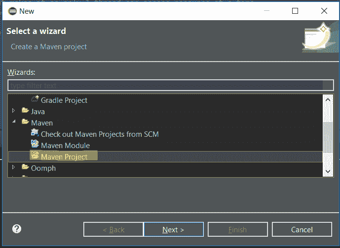
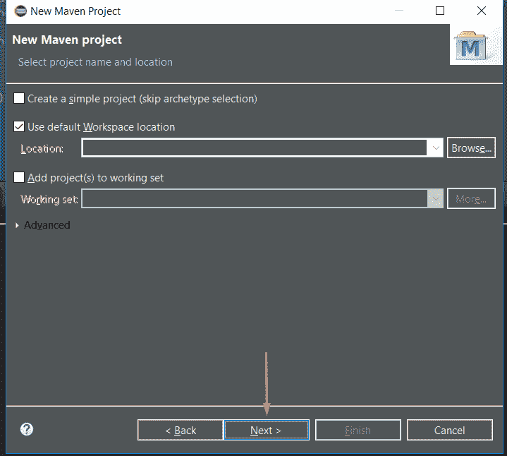
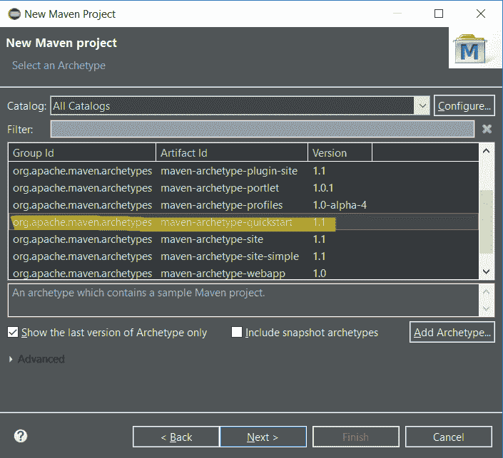
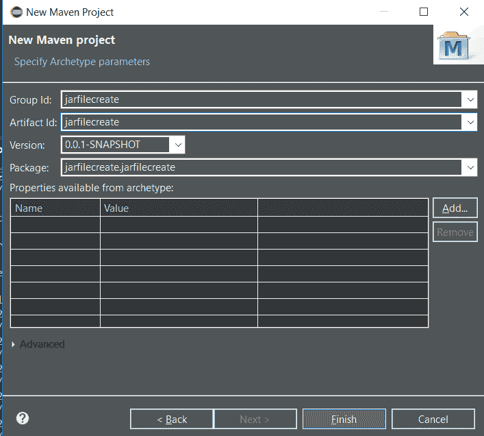
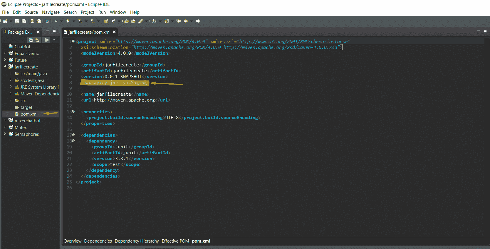
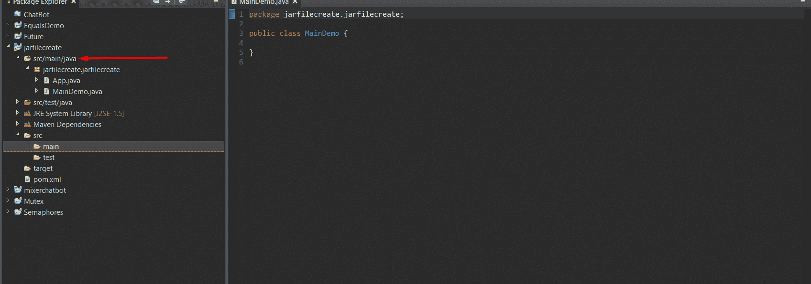
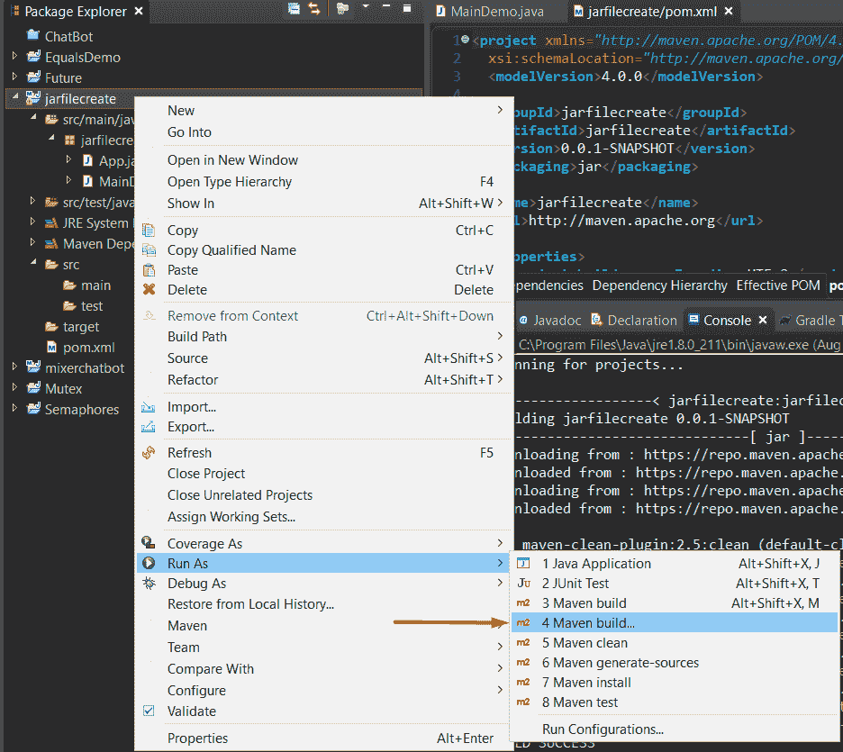
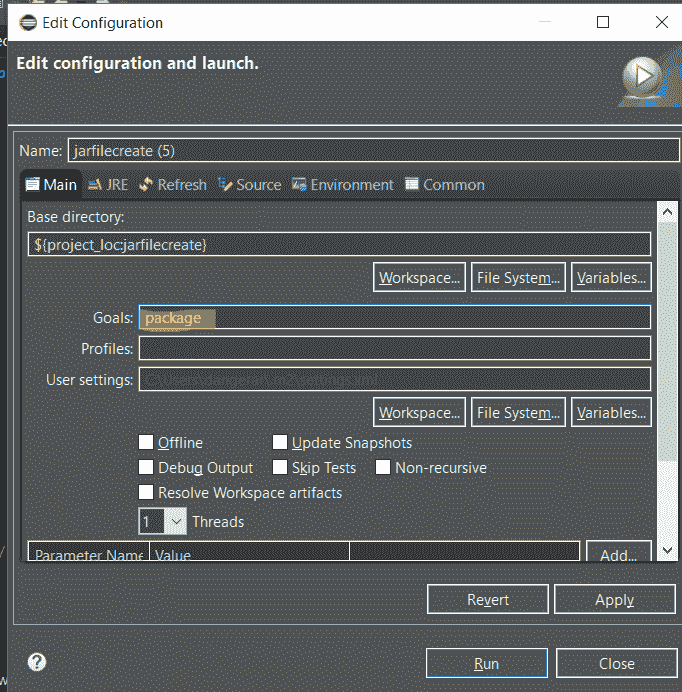
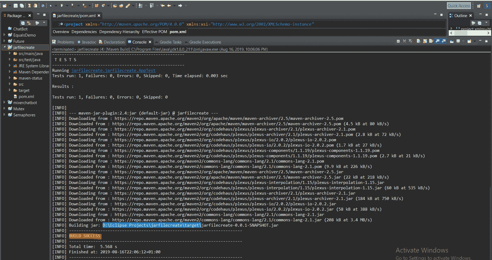
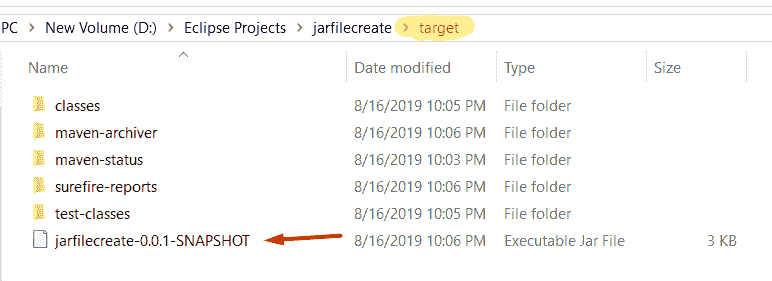

# 如何使用 Maven 创建 Java JAR 文件

> 原文： [https://javatutorial.net/how-to-create-java-jar-file-with-maven](https://javatutorial.net/how-to-create-java-jar-file-with-maven)

创建可执行文件 jar 时，通常我们不需要其他依赖项。 我们需要做的就是创建一个 [Maven](https://javatutorial.net/how-to-install-maven-on-windows-linux-and-mac) Java 项目，并在`main`方法旁边至少有 1 个类。


请注意，我们假定您已在计算机上安装了 Maven。 如果您不这样做，请按照本教程的[分步指南](https://javatutorial.net/how-to-install-maven-on-windows-linux-and-mac)。

让我们从在 Eclipse 中创建 Maven 项目开始。

步骤 1 – 打开 Eclipse 并创建一个新的 Maven 项目（文件 -&gt; 新建 -&gt; 其他 -&gt; Maven 项目）



步骤 2 – 创建 Maven 项目后，在新窗口中单击“下一步”，如下所示：



步骤 3 – 选择`maven-archetype-quickstart`，然后单击“Next”，如下所示：



步骤 4 – 提供组和工件 ID，然后点击“完成”：



现在，我们的 Maven 项目已在 Eclipse 中创建。

打开`pom.xml`时，它应如下所示：

```java
<project xmlns="http://maven.apache.org/POM/4.0.0" xmlns:xsi="http://www.w3.org/2001/XMLSchema-instance"
  xsi:schemaLocation="http://maven.apache.org/POM/4.0.0 http://maven.apache.org/xsd/maven-4.0.0.xsd">
  <modelVersion>4.0.0</modelVersion>

  <groupId>jarfilecreate</groupId>
  <artifactId>jarfilecreate</artifactId>
  <version>0.0.1-SNAPSHOT</version>
  <packaging>jar</packaging>

  <name>jarfilecreate</name>
  <url>http://maven.apache.org</url>

  <properties>
    <project.build.sourceEncoding>UTF-8</project.build.sourceEncoding>
  </properties>

  <dependencies>
    <dependency>
      <groupId>junit</groupId>
      <artifactId>junit</artifactId>
      <version>3.8.1</version>
      <scope>test</scope>
    </dependency>
  </dependencies>
</project>

```



xml 文件中突出显示的行指定将要创建的文件为 **jar** 。 您也可以删除它，因为默认情况下，包为 **jar**。

到目前为止，我们已经在 Eclipse 中创建了 Maven 项目，并且还指定了将要创建的文件，其类型为 **jar**。

步骤 5 – 让我们添加一个具有`main`方法的类。 重要提示：我们需要将其添加到`src/main/`中：



在`main`方法中添加一条打印语句。将会用于本教程。

步骤 7 – 要最终创建 jar 文件，请右键单击“Project -&gt; Run As -&gt; Maven build -&gt; input package”：



之后，只需输入包：



点击“运行”，您应该看到类似以下内容的内容：



蓝色突出显示的文本显示了我的 jar 文件的存储位置。 通常，它存储在目标文件夹中。 让我们从此处复制`path`文件夹并将其粘贴，然后查看 jar 文件是否在那里。

那里是：



另外，如果您使用终端，要获取 jar 文件，则需要键入`mvn package`，这将导致相同的结果。