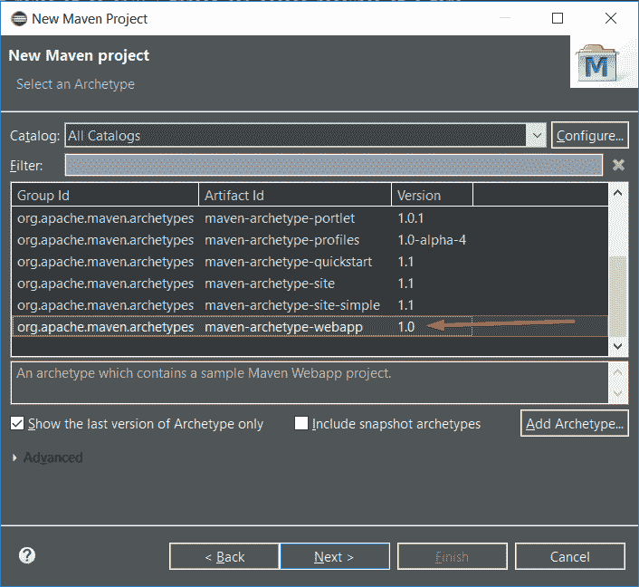
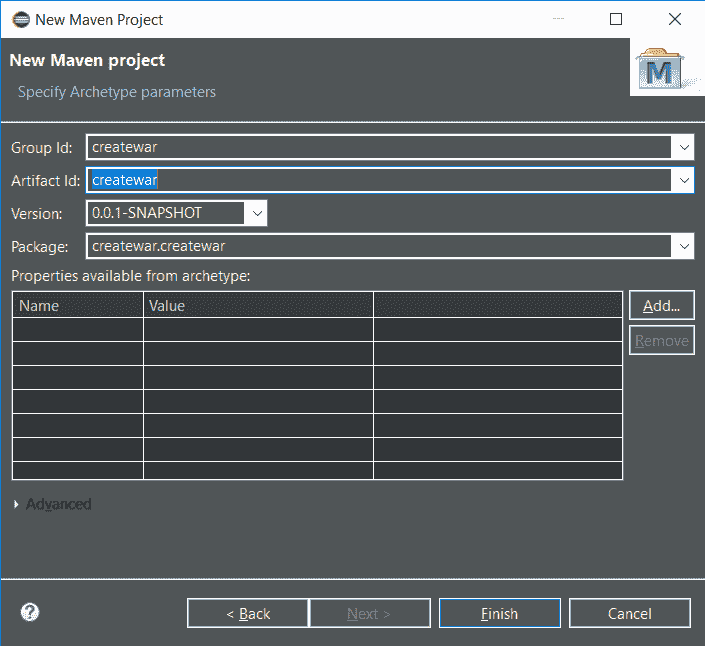
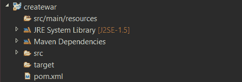
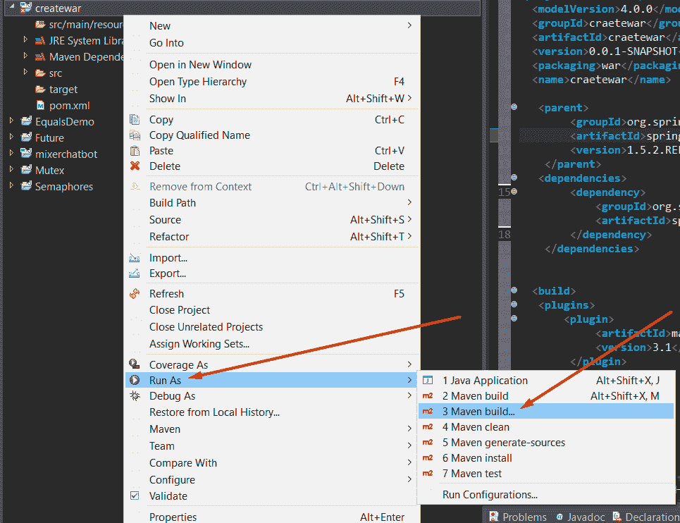
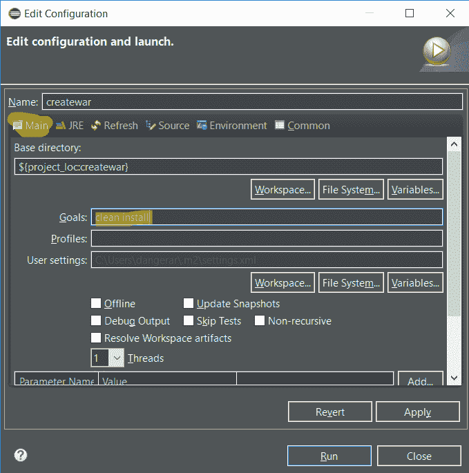
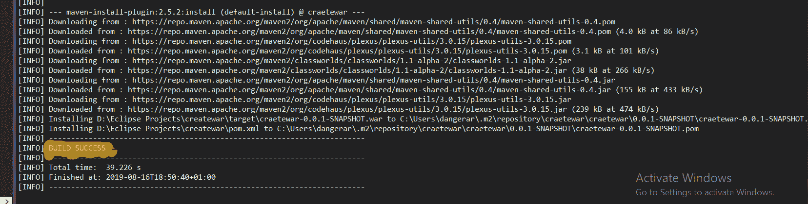
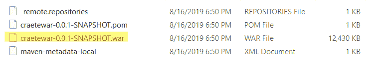
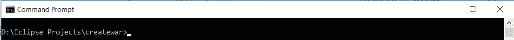
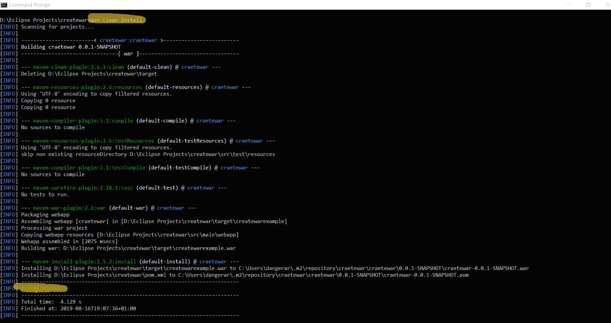
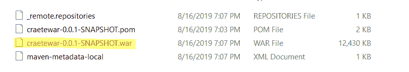

# 如何使用 Maven 创建 Java WAR 文件

> 原文： [https://javatutorial.net/how-to-create-java-war-file-with-maven](https://javatutorial.net/how-to-create-java-war-file-with-maven)

在继续进行下一步之前，请确保已在系统上安装了 JDK 和 Maven。


如果您尚未安装 JDK，[请点击此处](https://javatutorial.net/install-java-8-jdk-on-ubuntu)。

如果您尚未安装 Maven，[请点击此处](https://javatutorial.net/how-to-install-maven-on-windows-linux-and-mac)。

## 使用 Eclipse 生成 WAR 文件

步骤 1 – 打开 Eclipse 并创建一个新的 Maven 项目（文件 -&gt; 新建 -&gt; 其他 -&gt; Maven 项目）


步骤 2 – 创建 Maven 项目后，在新窗口中单击“下一步”，如下所示：


步骤 3 – 选择`maven-archetype-webapp`并单击“Next”，如下所示：



步骤 4 – 输入详细信息，例如我的，然后单击“完成”



您的 Maven 项目目录应类似于以下内容：



并且`pom.xml`应该看起来像这样：

```java
<project xmlns="http://maven.apache.org/POM/4.0.0" xmlns:xsi="http://www.w3.org/2001/XMLSchema-instance"
  xsi:schemaLocation="http://maven.apache.org/POM/4.0.0 http://maven.apache.org/maven-v4_0_0.xsd">
  <modelVersion>4.0.0</modelVersion>
  <groupId>createwar</groupId>
  <artifactId>createwar</artifactId>
  <packaging>war</packaging>
  <version>0.0.1-SNAPSHOT</version>
  <name>createwar Maven Webapp</name>
  <url>http://maven.apache.org</url>
  <dependencies>
    <dependency>
      <groupId>junit</groupId>
      <artifactId>junit</artifactId>
      <version>3.8.1</version>
      <scope>test</scope>
    </dependency>
  </dependencies>
  <build>
    <finalName>createwar</finalName>
  </build>
</project>

```

步骤 6 – 将`pom.xml`替换为以下代码：

```java
<project xmlns="http://maven.apache.org/POM/4.0.0" xmlns:xsi="http://www.w3.org/2001/XMLSchema-instance"
	xsi:schemaLocation="http://maven.apache.org/POM/4.0.0 http://maven.apache.org/xsd/maven-4.0.0.xsd">
	<modelVersion>4.0.0</modelVersion>
	<groupId>CrunchifyTutorial</groupId>
	<artifactId>CrunchifyTutorial</artifactId>
	<version>0.0.1-SNAPSHOT</version>
	<packaging>war</packaging>
	<build>
		<sourceDirectory>src</sourceDirectory>
		<plugins>
			<plugin>
				<artifactId>maven-compiler-plugin</artifactId>
				<version>3.1</version>
				<configuration>
					<source>1.7</source>
					<target>1.7</target>
				</configuration>
			</plugin>
			<plugin>
				<artifactId>maven-war-plugin</artifactId>
				<version>2.4</version>
				<configuration>
					<warSourceDirectory>WebContent</warSourceDirectory>
					<failOnMissingWebXml>false</failOnMissingWebXml>
				</configuration>
			</plugin>
		</plugins>
	</build>
	<dependencies>
		<dependency>
			<groupId>javax.servlet</groupId>
			<artifactId>servlet-api</artifactId>
			<version>2.5</version>
		</dependency>
	</dependencies>
</project>
```

最重要的几行是：

```java
<packaging>war</packaging>
```

和：

```java
<artifactId>maven-compiler-plugin</artifactId>
```

这就是我们有效地将其转换为 WAR 的地方。

步骤 7 – 右键点击“Project- &gt; Run As -&gt; Maven build…”



步骤 8 – 在“目标”部分中键入`clean install`，然后单击“运行”，如下所示：



步骤 9 – 您应该看到`BUILD SUCCESS`，像这样：



恭喜！ 您有您的`.war`文件。



## 使用 CMD 生成 WAR 文件

步骤 1 – 通过在我们安装了 Java 的地方添加编译器来修改`pom.xml`文件。

**pom.xml**

```java
<project xmlns="http://maven.apache.org/POM/4.0.0" xmlns:xsi="http://www.w3.org/2001/XMLSchema-instance" xsi:schemaLocation="http://maven.apache.org/POM/4.0.0 http://maven.apache.org/xsd/maven-4.0.0.xsd">
  <modelVersion>4.0.0</modelVersion>
  <groupId>craetewar</groupId>
  <artifactId>craetewar</artifactId>
  <version>0.0.1-SNAPSHOT</version>
  <packaging>war</packaging>
  <name>craetewar</name>

   <parent>
        <groupId>org.springframework.boot</groupId>
        <artifactId>spring-boot-starter-parent</artifactId>
        <version>1.5.2.RELEASE</version>
    </parent>
   <dependencies>
		<dependency>
			<groupId>org.springframework.boot</groupId>
			<artifactId>spring-boot-starter-web</artifactId>
		</dependency>
    </dependencies>

  <build>  
  <finalName>createwarexample</finalName>
   <plugins>  
       <plugin>
            <artifactId>maven-compiler-plugin</artifactId>
            <version>3.1</version>
			<configuration>
			<fork>true</fork>
			<executable>C:\Program Files\Java\jdk1.8.0_211\bin\javac.exe</executable>
			</configuration>
        </plugin>
    </plugins>  
   </build> 

</project>
```

**注意**：`<executable>`是重要的部分。 您的 Java 版本可能有所不同，请确保牢记这一点并放置正确的文件夹路径。

步骤 2 – 在终端中转到项目的文件夹路径，例如：



步骤 3 - 运行`mvn clean install`，它将负责创建 WAR 文件：



有我们的 WAR 文件：



好的！ 我们已经成功使用 Eclipse 和 Terminal 生成了 WAR 文件。

如果您有兴趣生成 JAR 文件，我已经有关于该主题的文章。 您可以通过[单击此处](https://javatutorial.net/how-to-create-java-jar-file-with-maven)来遵循它。