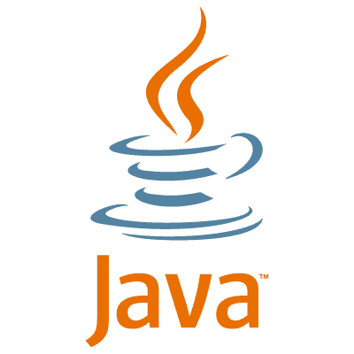

# Java 概述

> 原文： [https://javatutorial.net/java-overview](https://javatutorial.net/java-overview)

这是面向初学者的一系列教程中的第一个 **Java 教程**。 如果您想以简单的方式学习 Java，那么您来对地方了。 在本教程中，我不会详细介绍。 我的目标是教您如何立即编写 Java 代码！ 如果您需要详细信息，请访问我们网站 [javatutorial.net](https://javatutorial.net) 上的[高级部分](https://javatutorial.net/category/java-core)。

这是 Java 的官方徽标

## Java 的好处

为什么 Java 是当今编程语言的最佳选择？ 当前 [Java 是世界上排名第一的开发平台](http://javatutorial.net/java-is-the-most-popular-programming-language-of-2015)！ 它无处不在 - 在台式机，移动设备，企业服务器上……甚至 DVD 播放器都运行 Java。 如果您仍然不相信，那么这里有一些有趣的统计信息（*来自 Oracle 时间轴）：

*   全球有超过 900 万开发人员使用 Java
*   每年 10 亿次 Java 下载
*   30 亿台设备运行 Java
*   97% 的企业台式机运行 Java

## 为什么要使用 Java？

*   **Java 简单易学** – 它的设计语法与 C/C++类似。 每个人都可以学习。 您不需要大学学位或昂贵的课程，只需继续阅读本教程，您便会很快建立起来。
*   **Java 是安全的** – Java Applet 在这里是一个例外，我们将在另一篇文章中讨论。
*   **Java 是可移植的** - 编写一次即可在任何地方运行。 您的代码将在 Windows，Linux 和 Mac 上运行，而无需进行任何更改。
*   **Java 是可重用的** – 您将在线查找大量库。 您无需成为每个编程主题的专家，只需找到合适的库并使用它即可。

## Java 与其他编程语言相比如何？

有许多编程语言，例如 C/C++，PHP，PEARL 等。它们通常专门致力于最好地完成特定任务。 是什么使 Java 与众不同？ Java 是面向对象的，基于类的编程语言，并且是通用的！ 您可以编写桌面应用程序，前端和后端服务器逻辑，连接和操作数据库，通过网络发送和接收对象或为手机或 Android 设备编写移动应用程序。 您可以使用 Java 进行任何编程！

请不要将 Java 与 JavaScript 混淆！ JavaScript 是 Web 浏览器解释的脚本语言，而不是独立的编程语言。 Java 和 JavaScript 除了名称外没有其他共同之处。

## Java 的历史

Sun 的员工 James Gosling，Mike Sheridan 和 Patrick Naughton 于 1991 年 6 月开始了创建 Java 的项目。 创作者首先将项目命名为 Oak。 一段时间后，名称更改为绿色。 最终，开发人员从 Java 咖啡中为编程语言命名为 Java，据说该语言的创造者大量使用了 Java 咖啡。 Sun Microsystems 于 1996 年公开发布了 Java 1.0 的第一个版本。 它很快吸引了一大批开发人员。 Sun Microsystems 于 2009 年被 Oracle Corporation 收购。现在 Oracle 拥有 Java 的权利和功能开发。

James Gosling – Java 之父

## Java 版本

如果您不熟悉 Java，请不用担心！ 我们将在下一个教程中说明适合您的版本以及在何处下载。

*   JDK 1.0（1996 年 1 月 21 日）
*   JDK 1.1（1997 年 2 月 19 日）
*   J2SE 1.2（1998 年 12 月 8 日）
*   J2SE 1.3（2000 年 5 月 8 日）
*   J2SE 1.4（2002 年 2 月 6 日）
*   J2SE 5.0（2004 年 9 月 30 日）
*   Java SE 6（2006 年 12 月 11 日）
*   Java SE 7（2011 年 7 月 28 日）
*   Java SE 8（2014 年 3 月 18 日）
*   Java SE 9（2017 年 9 月 21 日）
*   Java SE 10（2018 年 3 月）
*   Java SE 11（2018 年 9 月）
*   Java SE 12（2019 年 3 月）

在我们的下一个教程[简单的 Java 示例](http://javatutorial.net/simple-java-example "Simple Java Example")中，我们将说明如何下载和安装 Java。 我们还将向您展示如何编写，编译和运行一个简单的 Java 程序。