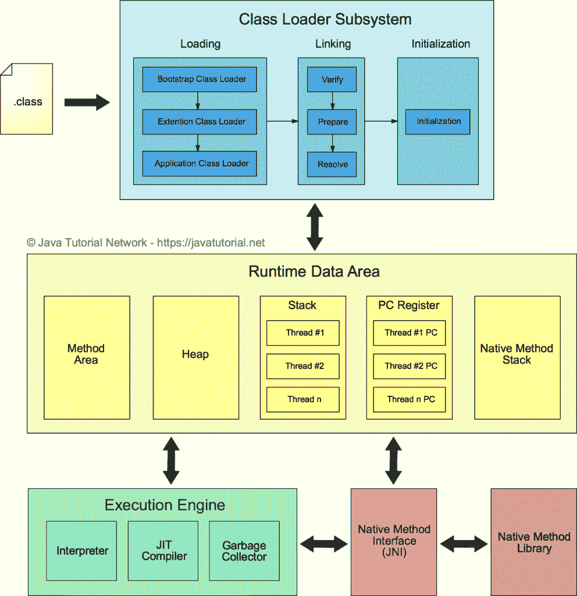

# JVM 解释

> 原文： [https://javatutorial.net/jvm-explained](https://javatutorial.net/jvm-explained)

本文介绍了 Java 虚拟机（JVM）及其架构

JVM 代表 Java 虚拟机。 它为您提供了执行已编译程序的环境，称为字节码。 来自不同供应商的 JVM 有多种实现，可用于各种平台。 在本文中，我将解释 JVM 的主要组件，包括内存管理，类加载和垃圾收集器。

通常，我们不深入探讨 JVM 的内部机制。 如果我们的代码行得通，那么我们就不会在乎内部机制了……直到那天出了问题，我们需要调整 JVM 或修复内存泄漏。

Java 虚拟机问题在求职面试中非常受欢迎。 采访者喜欢提出有关 JVM 的各种问题，以证明您对 Java 平台的一般理解。

## 什么是 Java 虚拟机

Java 被设计为可在各种平台上运行，其概念为“一次编写，随处运行”。 这是什么意思？ 例如，与像 C++ 这样的编程语言不同，在 C++ 中，代码是针对特定平台进行编译并在其上本地运行的，而 Java 源代码则首先被编译为字节码`.class`文件。 编译后，类文件将由虚拟机（VM）解释。 看下图

在不同平台上运行 Java 字节码–“一次编写，随处运行”的概念

首先，我们将 Java 源代码（`.java`文件）编译为字节码（`.class`文件）。 字节码是 Java 和机器语言之间的中间语言。 您可以在任何 JVM 实现上执行相同的字节码，而无需调整一个或另一个 OS 或平台的代码。

## Java 虚拟机架构

Java 虚拟机包含三个主要区域：

*   类加载器子系统
*   运行时数据区
*   执行引擎

我们将更详细地介绍每个

Java 虚拟机架构图

### 类加载器子系统

我们已经在单独的教程中介绍了类加载器。 您可能需要查看 [Java 类加载器](https://javatutorial.net/java-class-loaders-explained)，以了解更多详细信息。

#### 载入

编译的类存储为`.class`文件。 当我们尝试使用类时，Java [类加载器](https://javatutorial.net/java-class-loaders-explained)将该类加载到内存中。 在已经运行的类中通过名称引用类时，这些类将引入 Java 环境。 一旦第一个类运行，以后将由类加载器完成加载类的尝试。 通常，通过声明并使用静态`main()`方法来完成第一类的运行。

有三种类型的类加载器：

1.  **自举类加载器** - 它加载 JDK 内部类，通常加载`rt.jar`和其他核心类，例如`java.lang.*`包类
2.  **扩展类加载器** - 它从 JDK 扩展目录（通常是 JRE 的`lib/ext`目录）加载类。
3.  **系统类加载器** - 从系统类路径加载类，可以在使用`-cp`或`-classpath`命令行选项调用程序时进行设置。

#### 链接

链接类或接口涉及验证和准备该类或接口，其直接超类，其直接超接口以及必要时其元素类型。

JVM 要求维护以下所有属性：

*   类或接口在链接之前已完全加载。
*   在初始化类或接口之前，必须对其进行完全验证和准备。
*   链接期间检测到的错误会抛出到程序中某个位置，在该位置上，程序将采取某些操作，这些操作可能直接或间接地需要链接到错误所涉及的类或接口。

#### 初始化

类或接口的初始化包括执行其类或接口的初始化方法或调用该类的构造函数。

因为 Java 虚拟机是多线程的，所以类或接口的初始化需要仔细的同步，因为某些其他线程可能试图同时初始化同一类或接口。

这是类加载的最后阶段，在这里所有静态变量都将被分配原始值，并且将执行静态块。

### 运行时数据区

运行时数据区域内有五个组件：

#### 方法区

所有类级别的数据（包括静态变量）都将存储在此处。 每个 JVM 只有一个方法区域，它是共享资源。

#### 堆区

所有对象及其对应的实例变量和数组都将存储在此处。 每个 JVM 还有一个堆区。 由于“方法”和“堆”区域共享多个线程的内存，因此存储的数据不是线程安全的。

#### 栈区

对于每个线程，将创建一个单独的运行时栈。 对于每个方法调用，将在栈存储器中创建一个条目，称为栈帧。 所有局部变量都将在栈存储器中创建。 栈区域是线程安全的，因为它不是共享资源。 栈框架分为三个子实体：

*   局部变量数组–与该方法有关，涉及多少局部变量，并且相应的值将存储在此处。
*   操作数栈–如果需要执行任何中间操作，则操作数栈充当执行该操作的运行时工作区。
*   帧数据–与该方法相对应的所有符号都存储在此处。 在任何例外情况下，捕获块信息都将保留在帧数据中。

#### PC 寄存器

每个线程将具有单独的 PC 寄存器，以保存当前执行指令的地址，一旦执行了该指令，PC 寄存器将被下一条指令更新。

#### 本机方法栈

本机方法栈保存本机方法信息。 对于每个线程，将创建一个单独的本机方法栈。

### 执行引擎

分配给运行时数据区的字节码将由执行引擎执行。 执行引擎读取字节码并逐段执行。

#### 解释器

解释器解释字节码的速度较快，但执行速度较慢。 解释器的缺点是，当多次调用一种方法时，每次都需要新的解释。

#### JIT 编译器

JIT 编译器消除了解释器的缺点。 执行引擎将使用解释器的帮助来转换字节码，但是当发现重复的代码时，它将使用 JIT 编译器，该编译器将编译整个字节码并将其更改为本地代码。 此本地代码将直接用于重复的方法调用，从而提高系统的性能。

#### 垃圾收集器

垃圾收集器（GC）收集并删除未引用的对象。 可以通过调用`System.gc()`来触发垃圾收集，但是不能保证执行。 JVM 的垃圾收集收集创建的对象。

#### Java 本机接口（JNI）

JNI 将与本机方法库进行交互，并提供执行引擎所需的本机库。

#### 本机方法库

它是执行引擎所需的本机库的集合。

参考文献

[Oracle 的 Java 虚拟机规范](https://docs.oracle.com/javase/specs/jvms/se8/html/index.html)