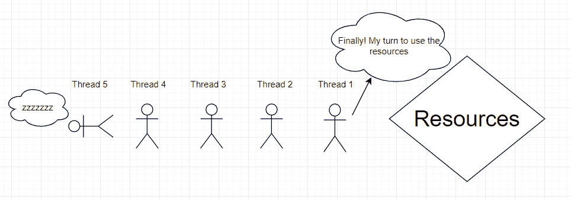

# Java 互斥量示例

> 原文： [https://javatutorial.net/java-mutex-example](https://javatutorial.net/java-mutex-example)

在更深入地了解互斥量之前，先给出一个示例：

想想一个队列。 不管长短，都没关系。 现在想想一辆正在出售游乐园门票的卡车。 一次一个人可以买票。 该人买了票后，就该排队了。

这个小故事与理解互斥量有什么关系？ 让我解释。


**互斥量允许每个线程具有 1 个许可**。换句话说，一次只能有 1 个线程可以访问资源。 在上面的类比中，两个人不能同时购买门票。互斥量也是如此。 它不是线程，而是人员，而是票证。 同样的事情或多或少..

互斥量与`Semaphore`略有不同，因此`Semaphore`允许多个线程访问资源。意思是，多个人可以同时购买门票。



## 构造器

1.  `public Semaphore(int permits)`；
2.  `public Semaphore(int permits, boolean fair)`

第一个构造函数是我们实际上可以区分互斥量和`Semaphore`的地方。 如果那里有 1 作为参数，则意味着将只允许 1 个线程获取锁。 请记住，由于它没有第二个参数`boolean fair`，因此您正在使`Semaphore`类以任何顺序访问任何线程。

第二个构造函数如果传递`true`（公平），则确保按线程请求访问并在队列中等待的顺序给出访问。

## 互斥量基本代码实现

```java
import java.util.concurrent.Semaphore;

public class MutexDemo {

    // create a Semaphore instance that makes it so only 1 thread can access resource at a time
    private static Semaphore mutex = new Semaphore(1);

    static class ThreadDemo extends Thread {

		private String name = "";

		public ThreadDemo(String name) {
		    this.name = name;
		}

		@Override
		public void run() {
		    try {
                                // check the above mentioned analogy in the article for reference
				System.out.println("How many people can buy a ticket at a time: " + mutex.availablePermits());
				System.out.println(name + " is buying a ticket..."); 
				mutex.acquire();
				try {
					Thread.sleep(1000);

					System.out.println(name + " is still buying a ticket. How many people can still buy the ticket alongside him: " + mutex.availablePermits());
				} finally {
					mutex.release();
					System.out.println(name + " bought the ticket.");
					System.out.println("How many people can buy tickets after " + name + " has finished buying the ticket: " + mutex.availablePermits());
				}
		    } catch (Exception e) {
		    	e.printStackTrace();
		    }
		}
    }

    public static void main(String[] args) {

	ThreadDemo thread1 = new ThreadDemo("Bob");
	thread1.start();

	ThreadDemo thread2 = new ThreadDemo("Charlie");
	thread2.start();

	ThreadDemo thread3 = new ThreadDemo("Christie");
	thread3.start();

    }
}
```

**输出**

```java
How many people can buy a ticket at a time: 1
Bob is buying a ticket...
How many people can buy a ticket at a time: 0
Charlie is buying a ticket...
How many people can buy a ticket at a time: 0
Christie is buying a ticket...
Bob is still buying a ticket. How many people can still buy the ticket alongside him: 0
Bob bought the ticket.
How many people can buy tickets after Bob has finished buying the ticket: 1
Charlie is still buying a ticket. How many people can still buy the ticket alongside him: 0
Charlie bought the ticket.
How many people can buy tickets after Charlie has finished buying the ticket: 1
Christie is still buying a ticket. How many people can still buy the ticket alongside him: 0
Christie bought the ticket.
How many people can buy tickets after Christie has finished buying the ticket: 1
```

从输出中可以看到，**当有人买票时，没有其他人可以买**。这是显示以下内容的行之一：

Bob 仍在买票。 还有多少人可以和他一起买票： **0**

但是，在他“购买”了机票之后，其他人立即购买了机票。

归根结底，它涉及`acquire()`和`release()`。`acquire()`是指该人开始“购买机票”的时间，`release()`是指该人“购买机票”的时间。