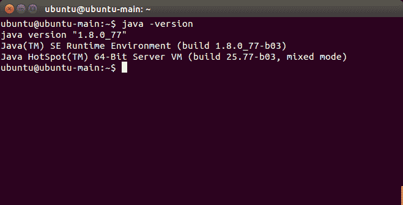

# 在 Ubuntu 上安装 Java 8 JDK

> 原文： [https://javatutorial.net/install-java-8-jdk-on-ubuntu](https://javatutorial.net/install-java-8-jdk-on-ubuntu)

在本教程中，您将学习如何通过 PPA 在 Ubuntu 或 LinuxMint 上安装最新的 Java 8。


如果您使用的是 Windows，请改用 [Windows Java 安装指南](https://javatutorial.net/simple-java-example)。

Oracle Java PPA 安装可在 Ubuntu 18.04 LTS，16.04 LTS，15.10、14.04 LTS，12.04 LTS 和 LinuxMint 发行版上运行。

首先添加 PPA 存储库

```java
$ sudo add-apt-repository ppa:webupd8team/java
$ sudo apt-get update
$ sudo apt-get install oracle-java8-installer
```

完成安装后，您可以通过键入以下内容进行验证

```java
$ java -version
```

您应该会看到类似的输出（取决于您的 Java 版本）



验证 Java 安装

PPA 存储库还提供了一个实用程序来设置环境变量：

```java
$ sudo apt-get install oracle-java8-set-default
```