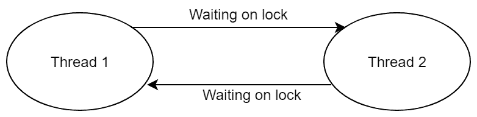

# Java 中的活锁和死锁

> 原文： [https://javatutorial.net/livelock-and-deadlock-in-java](https://javatutorial.net/livelock-and-deadlock-in-java)

以下文章讨论了 Java 中的活锁和死锁状态，它们如何发生以及如何避免它们。

## 活锁

Java 中的活锁是一种递归条件，其中两个或多个线程不断重复一段特定的代码。

当一个线程不断响应另一个线程并且另一个线程也执行相同操作时，就会发生活锁。

要对其进行分解，我们可以总结以下几点：

*   一个线程响应另一个线程的行为而运行，而另一个线程也响应先前的线程而运行，则可能发生活锁。
*   活锁线程无法继续进行。
*   线程没有被阻塞； 他们只是忙于互相回应。

活锁也被称为资源匮乏的特例

让我们通过将其与现实世界联系起来来理解该概念。 考虑两辆车在狭窄桥梁的相对两侧。 一次只能乘一辆车通过桥。 这两辆车的驾驶员都很有礼貌，正在等待对方先通过桥。 他们互相鸣叫，让他们知道他们想让对方先通过。 但是，两者都没有越过桥梁并互相鸣喇叭。 这种情况类似于活锁。

现在，通过一些编码来尝试这种实际情况：

第一辆等待过桥的汽车的等级：

```java
public class Car1 {
    private boolean honking = true;
    public void passBridge(Car2 car2) {
        while (car2.hasPassedBridge()) {
            System.out.println("Car1 waiting to pass the bridge");

            try {
                Thread.sleep(1000);
            } catch (InterruptedException ex) {
                ex.printStackTrace();
            }
        }

        System.out.println("Passed bridge");

        this.honking= false;
    }

    public boolean hasPassedBridge() {
        return this.honking;
    }
}

```

等待通过桥的第二辆车的类别：

```java
public class Car2 {
    private boolean honking = true;

    public void passBridge(Car1 car1) {

        while (car1.hasPassedBridge()) {

            System.out.println("Car 2 is waiting to pass the bridge!");

            try {
                Thread.sleep(1000);
            } catch (InterruptedException ex) {
                ex.printStackTrace();
            }
        }

        System.out.println("Car 2 has passed the bridge!");

        this.honking = false;
    }

    public boolean hasPassedBridge() {
        return this.honking;
    }
 }

```

主要测试类别：

```java
public class BridgeCheck {
   static final Car2 car2 = new Car2();
   static final Car1 car1 = new Car1();
   public static void main(String[] args) {
        Thread t1 = new Thread(new Runnable() {
            public void run() {
                car2.passBridge(car1);
            }
        });
        t1.start();

        Thread t2 = new Thread(new Runnable() {
            public void run() {
                car1.passBridge(car2);
            }
        });
        t2.start();
    }
}

```

输出：

这导致了非终止循环。

## 死锁

死锁与活锁有些不同。 死锁是一种状态，其中每个成员都在等待其他成员释放锁。

可能存在以下情况：一个线程正在等待另一个线程获取的对象锁，而第二个线程正在等待第一个线程获取的对象锁。 由于两个线程都在互相等待释放锁，因此这种情况称为死锁。



图：死锁状态

让我们看一下发生死锁的情况：

```java
public class DeadlockExample{

private static String A = "Something A";
private static String B = "Something B";

    public void someFunction(){
        synchronized(A){//may deadlock here
            synchronized(B){
                // function does some work here
            }
        }
    }

    public void someOtherFunction(){
        synchronized(B){//may deadlock here
            synchronized(A){
                // the function does something here
            }   
        }
    }
}

```

考虑两个线程 T1 和 T2，T1 获取 A 并等待 B 完成其功能。 但是，T2 获取 B 并等待 A 完成其自身的功能。 在这里，T1 和 T2 正在等待被其他线程锁定的资源。 因此，这是一个僵局方案。


## 避免死锁：

*   第一个建议是避免同时使用多线程，但这在许多情况下可能不切实际。 因此，这种解决方案不是很明智。
*   分析并确保在事先访问资源时没有锁。
*   在上面的编码示例中，为避免死锁，只需管理访问资源的顺序（访问 A 和 B 的顺序）。
*   避免一次持有多个锁，以防万一您必须始终以相同的顺序获得这些锁。
*   避免在持有锁的同时执行外来代码。
*   尝试使用可中断的锁，以便即使遇到死锁，也可以中断这些锁，并且可以毫无问题地执行该过程。