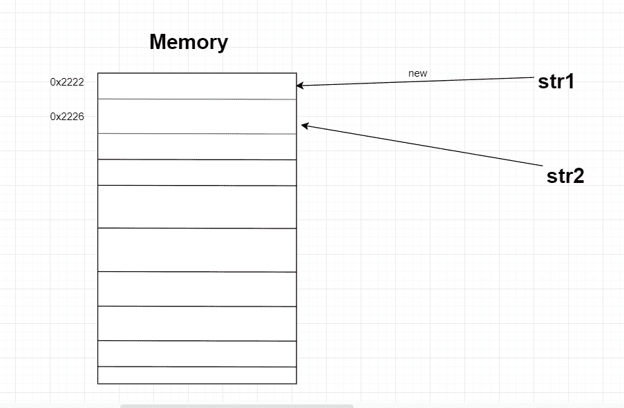

# Java `equals()`方法示例

> 原文： [https://javatutorial.net/java-equals-method-example](https://javatutorial.net/java-equals-method-example)

Java `equals()`方法和`==`运算符都用于比较对象是否相等。 但是，他们以非常不同的方式进行检查，从而产生不同的结果。


它们之间的主要区别是`==`检查两个对象是否都指向相同的内存位置，并且`equals()`求和对象中包含的实际值的比较。

一个示例将为您提供更多线索：

`Animal.java`

```java
public class Animal {
	private String name;
	private int age;

	public Animal (String n, int a) {
		this.name = n;
		this.age = a;
	}
}

```

`EqualsDemo.java`

```java
public class EqualsDemo {
	public static void main(String[] args) {
		Animal animal1 = new Animal("Vic", 4);
		Animal animal2 = new Animal("Vic", 4);

		if (animal1 == animal2)
			System.out.println("These objects are equal.");
		else 
			System.out.println("These objects are not equal.");
	}
}

```

您认为会打印出什么？

**输出**：

```java
These objects are not equal.

```

即使两个对象都是同一个类的实例并包含相同的值，但它们并不引用相同的对象。 每当您键入`new`的关键字时，它都会自动创建一个新的对象引用。 当我们使用`new`关键字创建两个对象时，即使它们包含相同的值，它们也不相同。 它们指向不同的存储位置。

## 使用`equals()`方法和`==`运算符比较字符串

`EqualsDemo.java`

```java
public class EqualsDemo {
	public static void main(String[] args) {
		String str1 = "First string";
		String str2 = "First string";

		if (str1 == str2)
			System.out.println("Equal");
		else 
			System.out.println("Not equal");
	}
}

```

您认为将在屏幕上显示什么？

**输出**：

```java
Equal
```

如果您说“等于”，那么您将是正确的。 当字符串包含相同的内容

```java
Not equal
```

它们指向相同的存储位置。

现在让我们做与上面完全相同的示例，但改用`new`关键字。

## 使用`new`关键字创建相同内容的字符串

`EqualsDemo.java`

```java
public class EqualsDemo {
	public static void main(String[] args) {
		String str1 = new String("First string");
		String str2 = new String("First string");

		if (str1 == str2)
			System.out.println("Equal");
		else 
			System.out.println("Not equal");
	}
}

```

您认为现在将打印什么？

**输出**： 

```java
Not equal
```

如我上面指出的，打印不等于的原因是因为，当您使用`new`关键字创建对象时，会创建一个指向其自身存储位置的新指针。



这是一个直观的示例。 内存位置刚刚组成。 但是从示例中可以看到，当创建`str1`和`str2`时，它们指向不同的内存位置。 因此，当您使用`==`运算符比较它们时，无论如何，您都会得到假。

## 覆盖`equals()`方法以符合条件

假设您要在两个对象上调用`.equals()`，并且如果它们包含相同的名称和年龄，则应返回`true`。

`Animal.java`

```java
public class Animal {
	private String name;
	private int age;

	public Animal (String n, int a) {
		this.name = n;
		this.age = a;
	}

	public String getName() {
		return this.name;
	}

	public int getAge() {
		return this.age; 
	}

	public boolean equals(Animal a) {
		if (this.name.equals(a.getName()) && this.age == a.getAge()) 
			return true;
		else 
			return false;

	}
}

```

`EqualsDemo.java`

```java
public class EqualsDemo {
	public static void main(String[] args) {
		Animal animal1 = new Animal("Vic", 4);
		Animal animal2 = new Animal("Vic", 4);

		if (animal1.equals(animal2)) 
			System.out.println("These objects are equal.");
		else 
			System.out.println("Not equal");
	}
}

```

**输出**：

```java
These objects are equal.
```

我们在`Animal`类中重写`equals`方法，因此它符合我们自己的条件。 如果我们不重写它，而只是对两个对象调用`equals`方法，它将不会返回`true`。

## 在字符串上调用`equals()`

`EqualsDemo.java`

```java
public class EqualsDemo {
	public static void main(String[] args) {
		String str1 = "str";
		String str2 = "str";

		if(str1.equals(str2)) {
			System.out.println("equal");
		}
		else {
			System.out.println("not equal");
		}
	}
}
```

**输出**

```java
equal
```

在字符串上调用`equals()`时，它将检查每个字符是否在两个字符串中都相同。 意思是，比较字符串时应始终使用`equals`，而不是`==`。

## 对使用`new`关键字创建的字符串的调用`equals`

`EqualsDemo.java`

```java
public class EqualsDemo {
	public static void main(String[] args) {
		String str1 = new String("str");
		String str2 = new String("str");

		if(str1.equals(str2)) {
			System.out.println("equal");
		}
		else {
			System.out.println("not equal");
		}
	}
}

```

**输出**：

```java
equal
```

如您所见，使用`equals`时两个对象（字符串）是否指向不同的存储位置并不重要。 如果两个字符串中的内容相同，则返回`true`。

## 结论

比较字符串时，应始终使用`.equals()`而不是`==`。