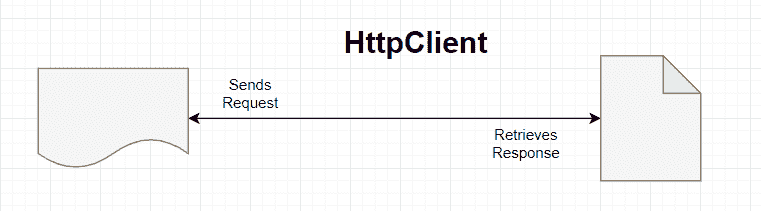

# Java 11 HTTP 客户端示例

> 原文： [https://javatutorial.net/java-11-http-client-example](https://javatutorial.net/java-11-http-client-example)

Java 11 引入了 HTTP 客户端，该客户端可用于通过网络发送请求并检索其响应。 HTTP 客户端取代了旧的`HttpUrlConnection`类，并且不支持易用性。 HTTP 客户端 API 同时支持 HTTP/1.1 和 HTTP/2。


`HttpClient`也是不可变的，这意味着它可以用于发送多个请求。

每个`HttpRequest`必须提供一个[`BodyHandler`](https://docs.oracle.com/en/java/javase/11/docs/api/java.net.http/java/net/http/HttpResponse.BodyHandler.html)，并且其（`BodyHandler`）函数用于确定如何处理响应（如果有的话）。

可以同步或异步发送请求

*   [`send(HttpRequest, BodyHandler)`](https://docs.oracle.com/en/java/javase/11/docs/api/java.net.http/java/net/http/HttpClient.html#send(java.net.http.HttpRequest,java.net.http.HttpResponse.BodyHandler))阻塞，直到发送了请求并接收到响应为止
*   [`sendAsync(HttpRequest, BodyHandler)`](https://docs.oracle.com/en/java/javase/11/docs/api/java.net.http/java/net/http/HttpClient.html#sendAsync(java.net.http.HttpRequest,java.net.http.HttpResponse.BodyHandler))发送请求并同时接收响应（异步）。 此方法返回[`CompletableFuture`](https://docs.oracle.com/en/java/javase/11/docs/api/java.base/java/util/concurrent/CompletableFuture.html)，仅当响应可用时才完成。



`HttpResponse.BodyHandler`

*   允许在收到实际的响应主体之前检查响应代码

`HttpResponse.BodyHandlers`

存在`BodyHandlers`的唯一目的是处理响应主体类型。 一些例子：

*   `BodyHandlers.ofByteArray()`
*   `BodyHandlers.ofString()`
*   `BodyHandlers.ofFile()`
*   `BodyHandlers.ofInputStream()`
*   等等

## 数据作为响应流

*   `HttpClient`实际上是请求正文的订阅者和响应正文字节的发布者
*   请求和响应主体作为响应流（具有无阻塞背压的数据流）公开

`HttpRequest.BodyPublisher`

*   将 Java 对象转换为适合作为请求正文发送的字节缓冲区

`HttpRequest.BodyPublishers`

*   `BodyPublishers::ofByteArray(byte[])`
*   `BodyPublishers::ofFIle(Path)`
*   `BodyPublishers::ofString(String)`
*   等等

`HttpRequest.BodySubscriber`

*   使用响应主体字节并将其转换为 Java 类型

顺便说一句，让我们看看一些实现。 首先，我们将发送 GET 请求：

```java
HttpRequest request = HttpRequest.newBuilder()
               .uri(URI.create("https://javatutorial.net/"))
               .build();
```

现在，让我们发送一个 HTTP 请求。 我将向您展示同步和异步示例：

## 同步（在`HttpResponse`可用之前将一直阻塞）GET

```java
HttpClient client = HttpClient.newHttpClient();
HttpRequest request = HttpClient.newBuilder()
        .uri(URI.create("https://javatutorial.net/")
        .version(Version.HTTP_1_1)
        .connectTimeout(Duration.ofSeconds(20))
        .authenticator(Authenticator.getDefault())
        .build();
HttpResponse<String> response = client.send(request, BodyHandlers.ofString());
System.out.println(response.statusCode());
System.out.println(response.body());
```

## 异步 GET

```java
HttpClient client = HttpClient.newHttpClient();
HttpRequest request = HttpRequest.newBuilder()
               .uri(URI.create("https://javatutorial.net/"))
               .connectTimeout(Duration.ofSeconds(20))
               .build();
client.sendAsync(request, BodyHandlers.ofString())
               .thenApply(HttpResponse::body)
               .thenAccept(System.out::println);

```

## POST

```java
HttpClient client = HttpClient.newBuilder().build();
HttpRequest request = HttpRequest.newBuilder()
        .uri(URI.create("https://javatutorial.net/"))
        .POST(BodyPublishers.ofString(data))
        .build();
HttpResponse<?> response = client.send(request, discarding());
```

## 总结

HTTP 客户端的角色是替换`URLConnection` API，并且在 Java 11 中作为 Java SE 平台的一部分进行了标准化，并且位于`java.net.http`包中。 一个主要优点是它使用了现代 Java 语言以及 API 功能。