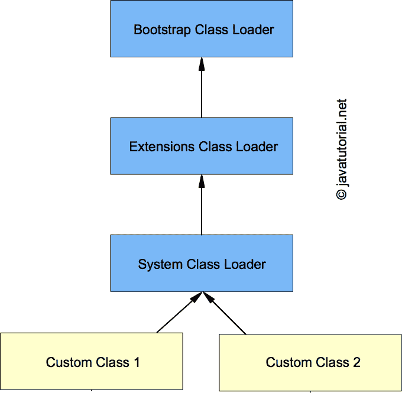

# Java 类加载器介绍

> 原文： [https://javatutorial.net/java-class-loaders-explained](https://javatutorial.net/java-class-loaders-explained)

本文介绍了 Java 类加载器的关键组件。

Java 类加载器是 [Java 虚拟机（JVM）](https://javatutorial.net/jvm-explained)的重要组成部分。 它们用于加载类和接口。 Althaout 类装入器是 JVM 不可或缺的一部分，它们对于 Java 的内部工作非常重要，因此您在作为 Java 开发人员的日常工作中不太可能需要创建自定义类装入器。 例如，如果要创建将在诸如 Tomcat 之类的容器上执行的应用程序，则可以使用自定义类加载器的实际应用程序。 Tomcat 要做的是为每个 Web 应用程序创建一个类加载器（以便它以后可以卸载 Web 应用程序并释放内存）。

本文旨在解释类加载器的工作方式，并列出 Java 类加载器的关键组件。 您下次 Java 面试时可能会遇到有关类加载器的问题。

## 什么是 Java 类加载器

我们知道 Java 程序在 [Java 虚拟机（JVM）](https://javatutorial.net/jvm-explained)上运行。 当我们编译 Java 类时，它将转换为平台和机器无关的字节码。 编译的类存储为`.class`文件。 当我们尝试使用类时，Java 类加载器将该类加载到内存中。 在已经运行的类中通过名称引用类时，这些类将引入 Java 环境。 一旦第一个类运行，以后将由类加载器完成加载类的尝试。 通常，通过声明并使用静态`main()`方法来完成第一类的运行。



类加载器的层次结构

## Java 类加载器的类型

1.  **自举类加载器** - 它加载 JDK 内部类，通常加载`rt.jar`和其他核心类，例如`java.lang.*`包类
2.  **扩展类加载器** - 它从 JDK 扩展目录（通常是 JRE 的`lib / ext`目录）加载类。
3.  **系统类加载器** - 从系统类路径加载类，可以在使用`-cp`或`-classpath`命令行选项调用程序时进行设置。

## 何时以及如何加载类

何时加载类？ 确实有两种情况：

1.  当执行新的字节码时（例如，`MyClass mc = new MyClass()`😉
2.  当字节码静态引用一个类时（例如`System.out`）。

类加载器是分层的。 第一个类是在类中声明的静态`main()`方法的帮助下专门加载的。 所有随后加载的类均由已加载并正在运行的类加载。

进一步的类加载器在加载类时遵循以下规则：

1.  检查该类是否已经加载。
2.  如果未加载，请要求父类加载器加载该类。
3.  如果父类加载器无法加载类，请尝试在该类加载器中加载它。

## 静态与动态类加载

使用 Java 的`new`运算符静态加载类。 动态加载是一种使用`Class.forName()`在运行时以编程方式调用类加载器的功能的技术。

## `loadClass`和`Class.forName`之间的区别

`loadClass`仅加载类，但不初始化对象，而`Class.forName`在加载对象后初始化对象。 例如，如果您使用`ClassLoader.loadClass`加载 JDBC 驱动程序，则该驱动程序将无法注册，并且您将无法使用 JDBC

`java.lang.Class.forName(String className)`方法返回与具有给定字符串名称的类或接口关联的`Class`对象。 如果找不到该类，则此方法引发`ClassNotFoundException`

下面的示例演示`Class.forName`的用法

```java
package net.javatutorial;

import java.lang.reflect.Method;

public class ClassForNameExample {

	public static void main(String[] args) {
		try {
			Class<?> c = Class.forName("java.awt.Point");
			System.out.println("name = " + c.getName());
			System.out.println("package = " + c.getPackage());
			Method[] methods = c.getDeclaredMethods();
			System.out.println("----- Class methods ---------------");
			for (Method method : methods) {
				System.out.println(method.getName());
			}
		} catch (ClassNotFoundException e) {
			e.printStackTrace();
		}
	}

}
```

加载`java.awt.Point`类。 比我们打印类名称，包和该类所有可用方法的名称。 这是在 Java 8 中执行程序的结果：

```java
name = java.awt.Point
package = package java.awt, Java Platform API Specification, version 1.8
----- Class methods ---------------
equals
toString
getLocation
getX
getY
setLocation
setLocation
setLocation
move
translate
```