# 如何测试独立的 Java 应用程序

> 原文： [https://javatutorial.net/how-to-profile-standalone-java-applications](https://javatutorial.net/how-to-profile-standalone-java-applications)

## 什么是单元测试？

单元测试是一种软件测试方法，其中正在测试 Java 应用程序的小组件。 其目的是确认每个软件的行为均符合预期。 即使是这样，您也可以使用单元测试来确定另一种实现是否在内存和性能方面会带来更好的结果。 如果您对单元测试不是很熟悉，建议您参考本主题的本教程。

## 什么是性能分析？

性能分析会检查应用程序，并尝试查找与 Java 应用程序相关的内存或性能问题。它允许您执行的操作是通过监视 [JVM（Java）来获取有关性能，方法时序，对象分配等的数据。 虚拟机）](https://javatutorial.net/jvm-explained)。

### 您可以使用 [IDE](https://javatutorial.net/choose-your-java-ide-eclipse-netbeans-and-intellij-idea) 来剖析这些类型的 Java 应用程序：

1.  Java EE / Web 应用程序
2.  Java 自由格式项目
3.  Java SE 项目
4.  NetBeans 模块和模块套件

### JProfiler（Ej 技术）

对于分析工具，JProfiler 是许多开发人员的最佳选择。 它具有相对易于使用的界面，可帮助检查系统性能，内存使用情况，内存泄漏（如果有）和线程分析。

通过提供所有这些信息，我们可以诊断我们的应用程序的行为，并在需要时进行更改。 请注意，下图显示了正在运行的应用程序。

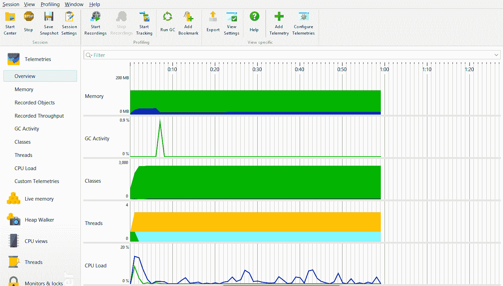

JProfiler 界面概述

从上图可以看到，它显示了与性能，内存直接相关的不同组件，可以轻松地帮助您优化程序。

### 让我们尝试一个使用 JProfiler（或一般情况下进行概要分析）的实际用例 - 内存泄漏检测

#### 什么是内存泄漏？

要了解内存泄漏，如果您具有有关内存的基本知识，那将是一个好主意。 如果您不希望阅读，请随时阅读[本文](https://javatutorial.net/java-memory-examples)和[此文章](https://javatutorial.net/java-increase-memory)。

如果您之前已经编写过 Java 应用程序，则可能会遇到这个普遍存在的问题。 真正的实质是尚未释放回池中的内存。

考虑以下示例：想象您必须创建所需的对象。 但是，当您不再需要它时，请继续前进，而不是从内存中“释放”它。 幕后发生的事情是，仍然引用该对象。 当应用程序开始消耗更多资源时，它很快就会耗尽资源，并导致`OutOfMemoryError`。

这是[垃圾收集](https://javatutorial.net/java-garbage-collection)无法从内存中删除这些未使用的对象的时候。

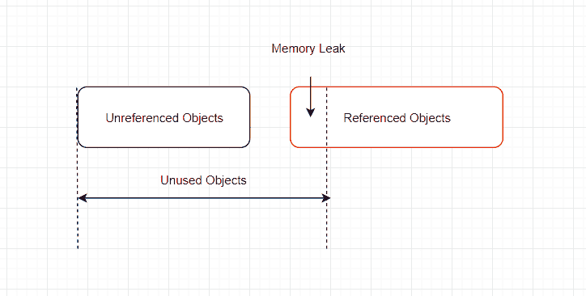

上图给出的主要结论是 – **未使用的对象仍然占据运行中的内存，应用程序拥有的资源越多，它得到的性能越差，最终导致一个结果 – `OutOfMemoryError`。**

既然您知道什么是内存泄漏，并且实际上在编写应用程序时要考虑到这一点，那么让我们看看性能分析如何帮助我们识别并消除内存泄漏。

要在 Java 应用程序中轻松跟踪内存泄漏，请导航至左侧空白处的**堆查询器**：

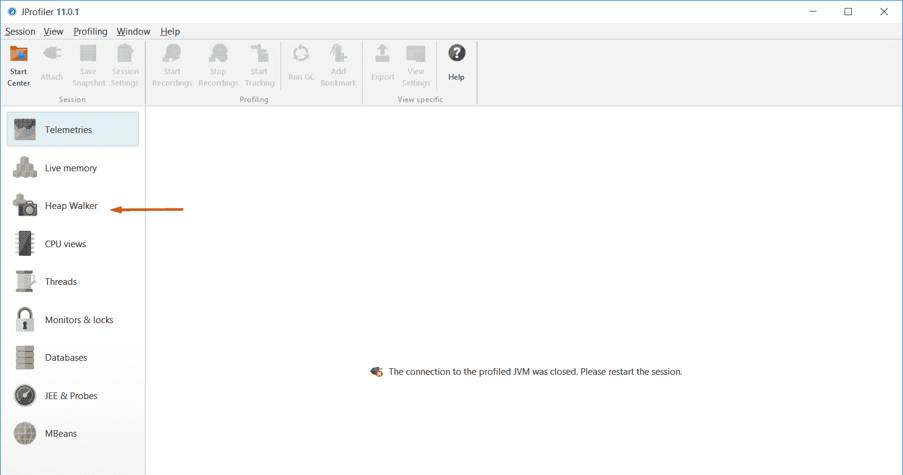

堆沃克 Jprofiler

要启动示例项目，请单击左上角的“启动中心”：
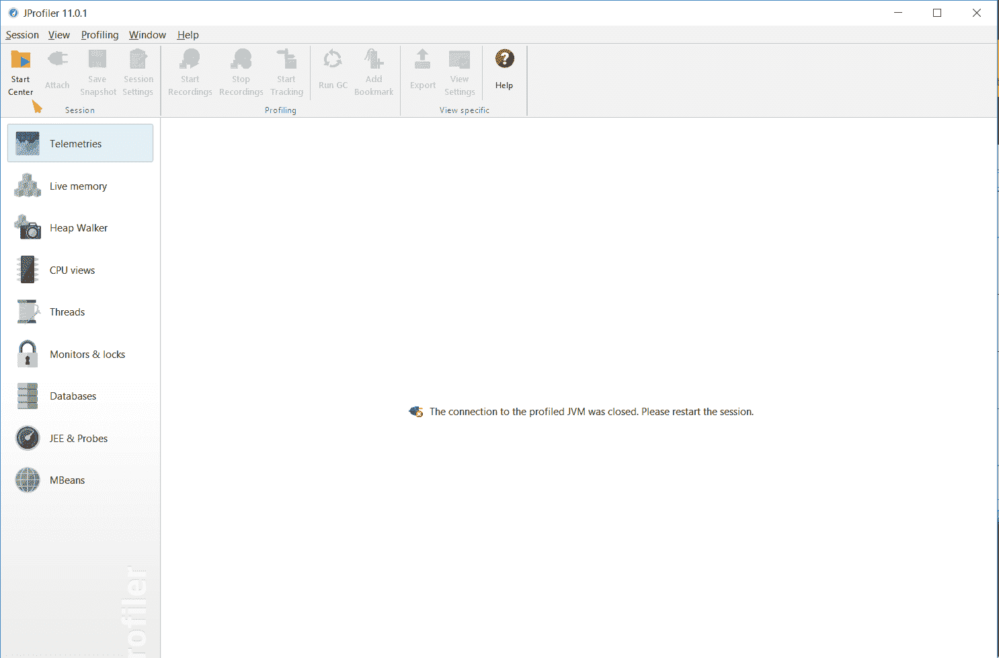

然后选择第一个选项并选择开始：

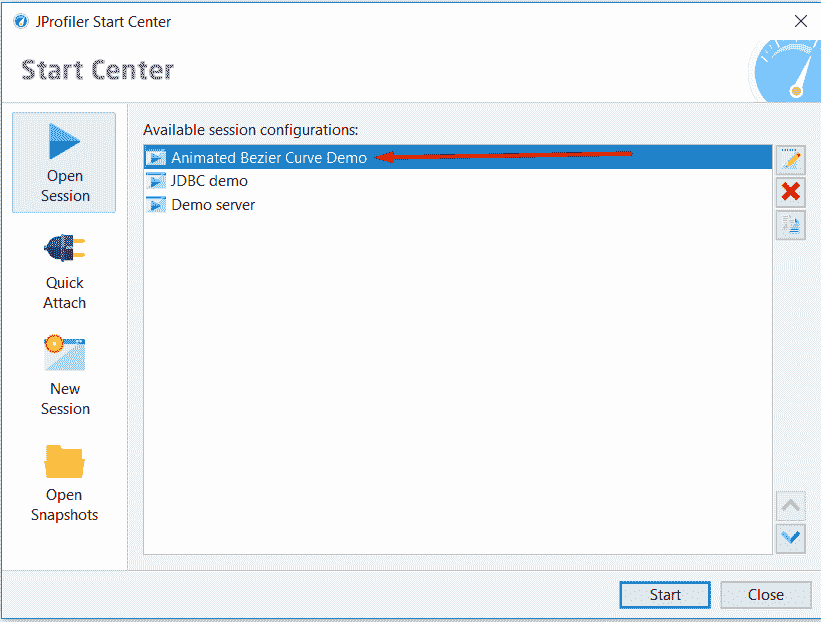

您应该会看到以下窗口：
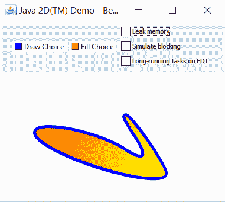

我们感兴趣的是“内存泄露”。但是在单击它之前，请选择“标记堆”以表明我们对新分配的对象感兴趣。

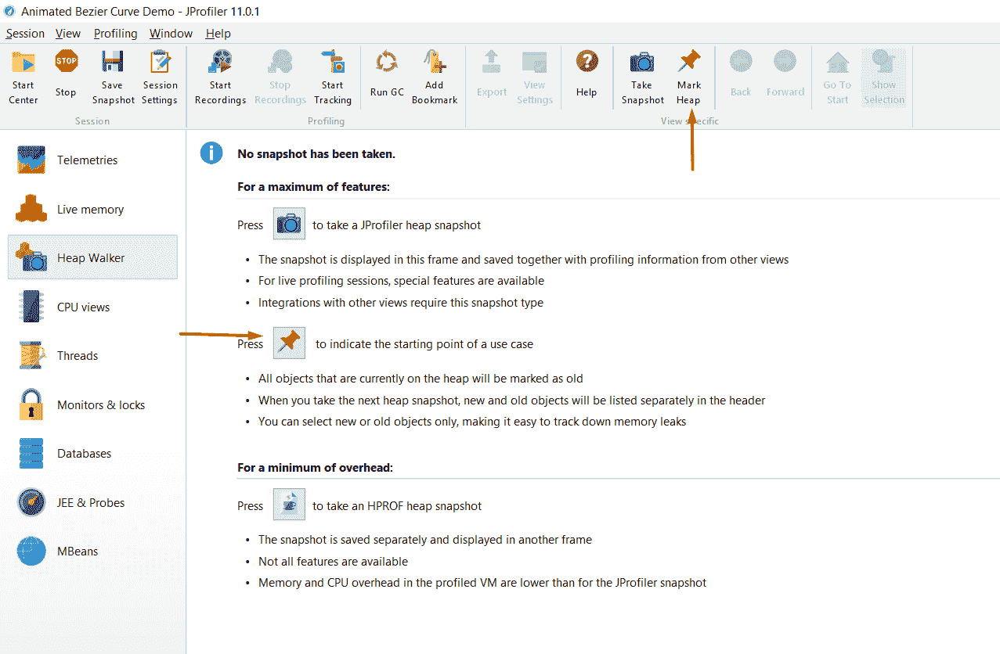

现在，这是应用程序开始创建未进行垃圾收集的对象的过程。

现在我们已经完成了，单击“Memory Leak”，然后等待一些时间来创建新对象。

现在，让我们进行堆快照：

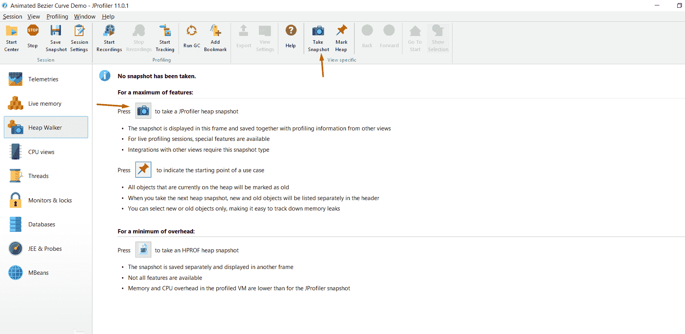

现在，当我们单击“Heap Walker”时，我们将看到自上次标记堆操作以来已创建了多少个实例：

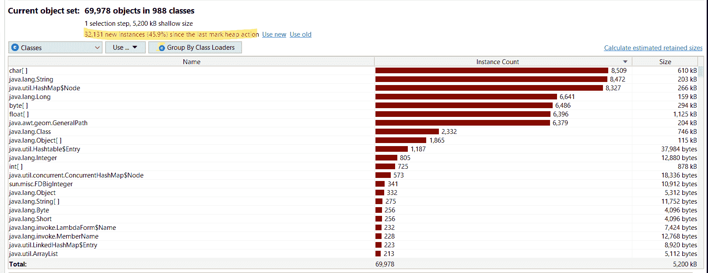

通过查看此窗口，我们不知道哪些对象正完全参与内存泄漏。 为此，我们需要单击“使用新的”。

然后我们将看到：

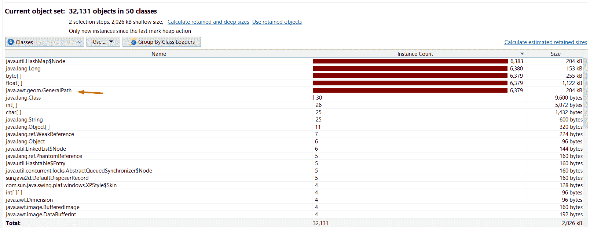

选择最通用的类​​并选择传入的引用，然后单击“确定”：

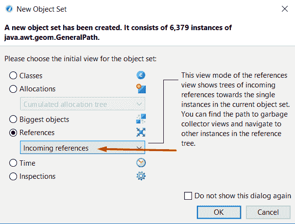

从那里开始，查找内存泄漏的最佳方法是在“显示 GC 根目录的路径”上进行选择：

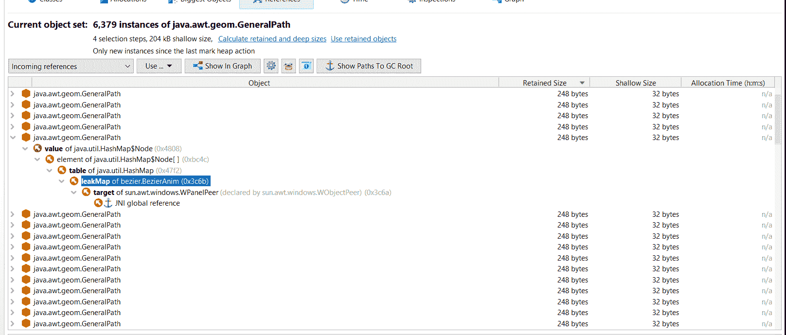

我们设法找到实例的泄漏。

## 结论

通常，测试是程序员必须能够使用的最重要的技术之一。 有许多工具可以帮助测试和调试。 有些比其他的简单，例如 Eclipse 中的 Debug 模式，有些则更复杂，例如 JProfiler。 但是，如果您关心性能，优化和无内存问题，有时您需要深入研究给定 Java 应用程序的内部工作。