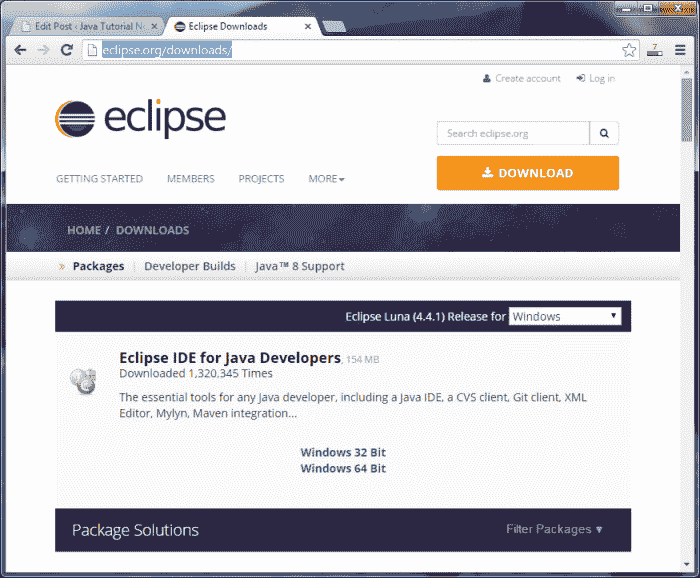
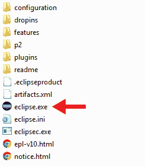
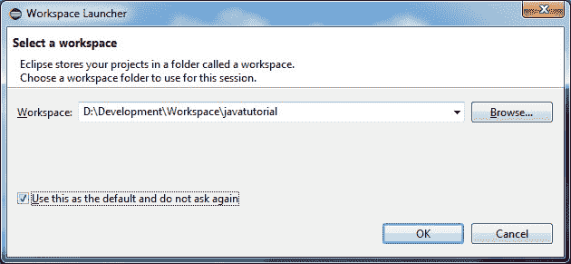
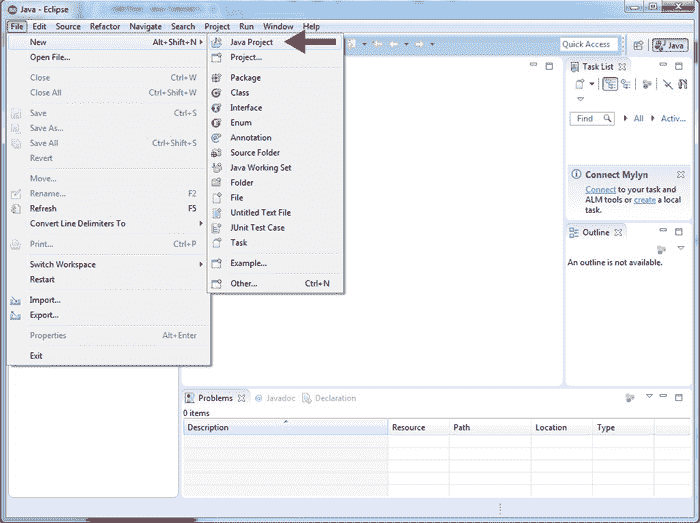
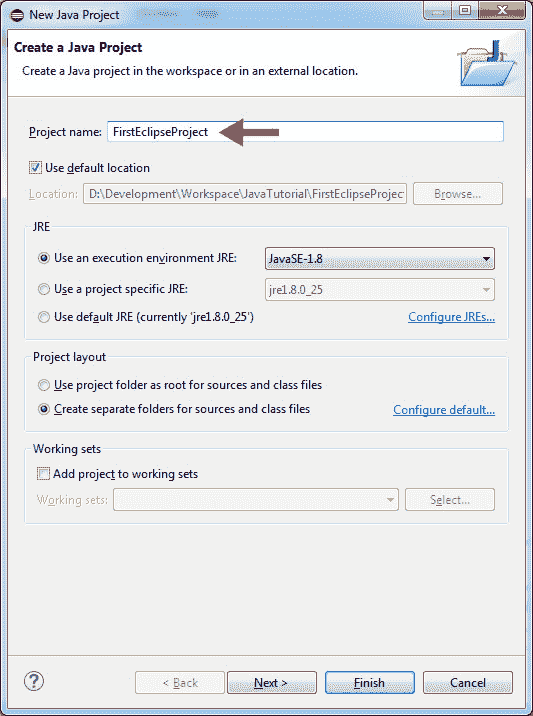
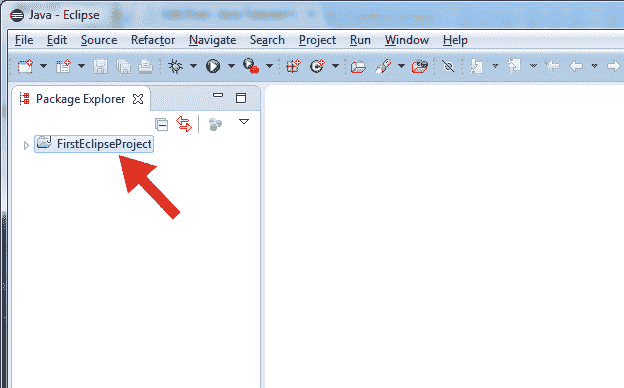
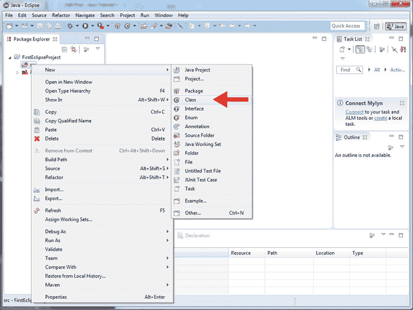
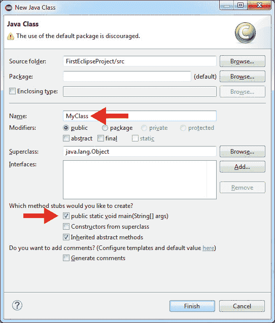
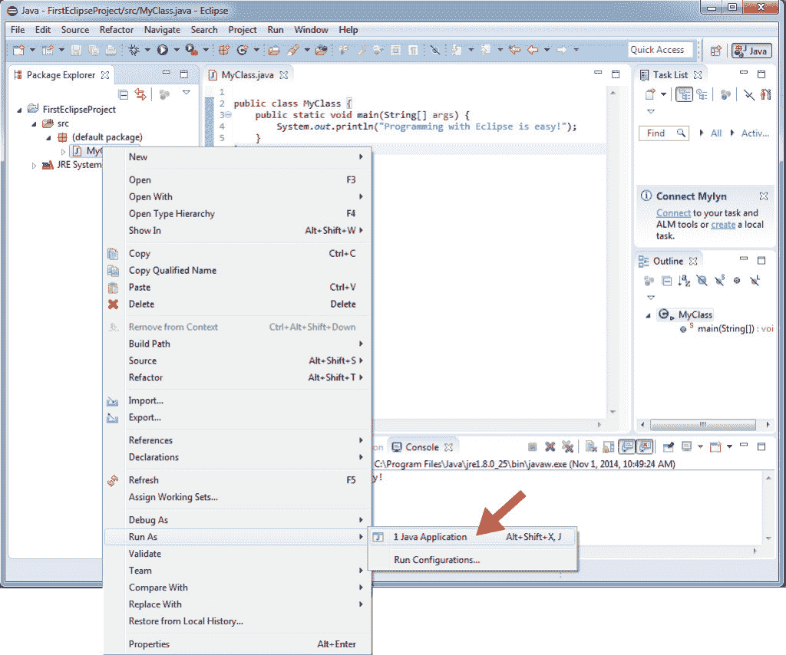
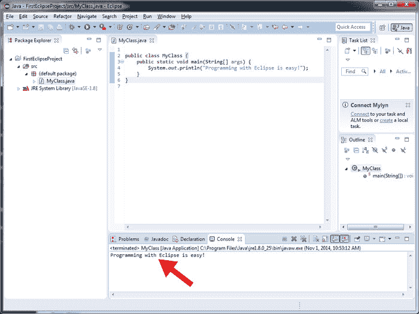

# Java Eclipse 教程

> 原文： [https://javatutorial.net/java-eclipse-tutorial](https://javatutorial.net/java-eclipse-tutorial)

在本教程中，我将向您展示如何使用 Eclipse IDE 简化 Java 编程。

## 什么是 Eclipse IDE

IDE 代表集成开发环境。 换句话说，Eclipse 是功能强大且高级的文本编辑器，具有许多插件和工具。 使用 Eclipse，您可以更快地编写 Java 程序并按一下按钮即可执行它们。 但是 Eclipse 的功能更多。 插件架构使您能够不断添加所需的开发工具。

您始终可以以“老式方式”编译和运行程序。 有关更多详细信息，请阅读我们以前的教程[简单 Java 示例](https://javatutorial.net/simple-java-example "Simple Java Example")。 但是，如果您想像专业人士一样编码，则必须学习如何使用行业标准 IDE（例如 Eclipse）。

## 安装 Eclipse

安装 Eclipse 既简单又直接。 如果您的计算机上尚未安装 Java JDK，请立即安装。 您可以在本教程[简单 Java 示例](https://javatutorial.net/simple-java-example "Simple Java Example")中找到有关安装 Java 的更多详细信息。

现在转到 [http://eclipse.org/downloads/](http://eclipse.org/downloads/ "Eclipse download") 。 找到“面向 Java 开发人员的 Eclipse IDE”。 您必须下载与您的 Java 版本相对应的 Eclipse 版本。 例如，如果您已安装 Java x64 Bit，则采用 Eclipse x64 Bit 和 x32 ​​Bit 版本。



您将下载 Windows 的`.zip`文件或 MacOS 或 Linux 操作系统的`tar.gz`文件。

下载完成后，只需将文件解压缩到硬盘上即可。 打开解压缩的文件夹并启动可执行文件。 对于 Windows，它是`eclipse.exe`



现在，您必须为项目选择一个工作区。 工作区是硬盘驱动器上 Eclipse 存储 Java 项目的文件夹。 我将使用`D:\Development\Workspace\javatutorial`作为我所有教程项目和示例的主文件夹。



就是这样了！ 您已经成功安装了 Eclipse。 您将看到一个欢迎屏幕，其中包含指南和帮助材料的链接。 您可以芦苇其中一些，或暂时关闭此屏幕。

## 使用 Eclipse 创建 Java 项目

Java 代码是在 Eclipse 的项目中组织的。 因此，让我们从第一个项目开始。 单击“文件 -&gt; 新建 -&gt; Java 项目”



在下一个屏幕中，为您的项目命名。 在本教程中，我将使用`FirstEclipseProject`。



点击“完成”按钮。 Eclipse 将为您创建项目的结构。 现在，您将在屏幕左侧的“Package Explorer”中看到您的新项目。



展开项目。



右键单击`src`文件夹，然后转到“新建 -&gt; 类”

在下一个屏幕中，输入新 Java 类的名称。 我将使用`MyClass`作为本教程的名称。 我还将选中`public static void main(String[] args)`框，以使 Eclipse 为我创建一个`main`方法。



Eclipse 使用`main`方法为我们创建了一个新类。 现在更换

```java
// TODO Auto-generated method stub
```

与

```java
System.out.println("Programming with Eclipse is easy!");
```

您的完整代码应如下所示：

```java
public class MyClass {
	public static void main(String[] args) {
		System.out.println("Programming with Eclipse is easy!");
	}
}
```

保存您的工作。 右键单击“程序包资源管理器”中的`MyClass.java`，然后单击“-&gt; 运行方式 -&gt; Java 应用程序”



瞧……在控制台选项卡中，您应该看到程序的结果



好的！ 我告诉过你它将变得轻松有趣

在我们的下一个教程中，我将向您展示如何在 Eclipse 中使用[快捷键和组合键](https://javatutorial.net/eclipse-shortcuts)。