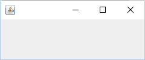
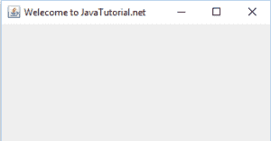

# SWING `JFrame`基础知识，如何创建`JFrame`

> 原文： [https://javatutorial.net/swing-jframe-basics-create-jframe](https://javatutorial.net/swing-jframe-basics-create-jframe)

本教程介绍了从创建到定制的`JFrame`基础知识。

## 什么是`JFrame`？

`JFrame`是`java.awt.frame`扩展的`javax.swing`包类，它增加了对 JFC/SWING 组件架构的支持。 这是顶层窗口，带有边框和标题栏。`JFrame`类具有许多可用于自定义它的方法。

## 创建一个`JFrame`

`JFrame`类具有许多用于创建`JFrame`的构造函数。 以下是描述。

`JFrame()`：创建一个不可见的框架

`JFrame(GraphicsConfiguration gc)`：创建带有空白标题和屏幕设备的图形配置的框架。

`JFrame(String title)`：创建带有标题的`JFrame`。

`JFrame(String title, GraphicsConfiguration gc)`：创建具有特定`Graphics`配置和指定标题的`JFrame`。

这是创建`JFrame`的最简单示例。

```java
package Example;

import java.awt.GraphicsConfiguration;

import javax.swing.JFrame;

public class JFrameExample {

	static GraphicsConfiguration gc;
	public static void main(String[] args){
		JFrame frame= new JFrame(gc);	
		frame.setVisible(true);
	}
}

```

这是显示方式




## 设置`JFrame`的标题

要设置`JFrame`的标题，可以使用`JFrame.setTitle(String title)`。

这是代码

```java
package Example;

import java.awt.GraphicsConfiguration;

import javax.swing.JFrame;

public class JFrameExample {

	static GraphicsConfiguration gc;
	public static void main(String[] args){
		JFrame frame= new JFrame(gc);	
		frame.setTitle("Welecome to JavaTutorial.net");
		frame.setVisible(true);
	}
}

```

这里看起来如何



设置`JFrame`的标题

## 更改`JFrame`的窗口大小

要调整框架的大小，`JFrame`提供了`JFrame.setSize(int width, int height)`方法，它需要两个参数`width`和`height`。 这是现在的代码外观

```java
package Example;

import java.awt.GraphicsConfiguration;

import javax.swing.JFrame;

public class JFrameExample {

	static GraphicsConfiguration gc;
	public static void main(String[] args){
		JFrame frame= new JFrame(gc);	
		frame.setTitle("Welecome to JavaTutorial.net");
		frame.setSize(600, 400);
		frame.setVisible(true);
	}
}

```

## 调整`JFrame`的大小

设置`JFrame`的大小后，您会注意到您仍然可以通过简单地将光标放在角落并拖动它来更改它的大小。 或者，如果按右上角关闭旁边的“调整大小”选项，它将最大化到全屏大小。 发生这种情况是因为默认情况下调整大小设置为`true`。 您可以简单地将`false`设置为

`JFrame.setResizable(false)`，现在它将根据您在代码中给定的尺寸显示，并且不会通过图形界面调整大小。

## 更改屏幕上的位置

要更改`JFrame`在屏幕上的位置，`JFranme`提供了一种方法`JFrame.setlocation(int x, int y)`，它使用两个参数`x`表示沿`x`轴的位置，`y`表示沿`y`轴的位置。 屏幕的左上角是`(0, 0)`。

## 关闭`JFrame`

您可以通过单击`JFrame`左上角的`X`（十字）来轻松关闭`JFrame`。 但是`JFrame.setDefaultCloseOperation(int)`是`JFrmae`类提供的方法，您可以设置当用户单击叉号时将发生的操作。 如果给定参数 0，则即使单击十字，`JFrame`也不会关闭。

最佳实践是使用`JFrame.EXIT_ON_CLOSE`，它退出应用程序（`JFrame`）并释放内存。

`JFrame.HIDE_ON_CLOSE`：它不会关闭`JFrame`，只是将其隐藏。

`JFrame.DISPOSE_ON_CLOSE`：关闭框架，但它继续运行并消耗内存。

`JFrame.DO_NOTHING_ON_CLOSE`：当用户单击“关闭”时，它什么也不做。

最终代码如下所示

```java
package Example;

import java.awt.GraphicsConfiguration;

import javax.swing.JFrame;

public class JFrameExample {

	static GraphicsConfiguration gc;
	public static void main(String[] args){
		JFrame frame= new JFrame(gc);	
		frame.setTitle("Welecome to JavaTutorial.net");
		frame.setSize(600, 400);
		frame.setLocation(200, 200);
		frame.setVisible(true);
		frame.setDefaultCloseOperation(JFrame.EXIT_ON_CLOSE);
		frame.setResizable(false);
	}
}

```

您可以从[链接](https://github.com/NeelumAyub/Tutorials/tree/master/JFrameExample)下载源代码