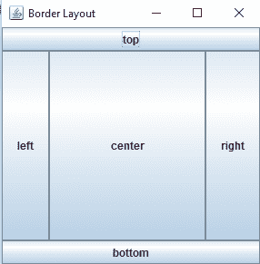
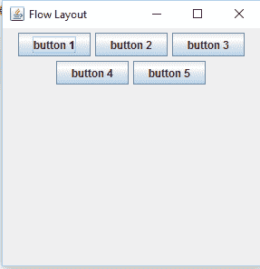
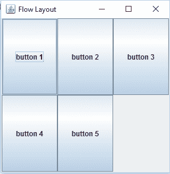

# Java SWING `JFrame`布局示例

> 原文： [https://javatutorial.net/java-swing-jframe-layouts](https://javatutorial.net/java-swing-jframe-layouts)

本教程通过示例和用法说明了各种 [JFrmae](https://javatutorial.net/swing-jframe-basics-create-jframe) 布局。

## 解释

Java AWT 包提供了许多不同的布局，例如边框布局，框布局，流式布局，网格布局等。这些布局管理器用于以特定方式排列组件。 布局用于按特定顺序管理组件。 以下是 Java 中一些常用布局的描述和示例。

## 边框布局

边框布局是最常用的布局之一。 这是`JFrame`中的默认布局。 它可以将组件定位在五个不同的区域，例如顶部，底部，左侧，右侧和中心。 在边框布局中，每个区域仅包含一个组件。 所有可用空间都放在中间。

使用：使用边框布局初始化内容窗格，并通过`add`方法向其中添加组件，并将布局作为参数。

以下示例显示以边框布局排列的组件。

```java
package javatutorial.net;
import java.awt.BorderLayout;

import javax.swing.JButton;
import javax.swing.JFrame;

public class BorderLayoutExample {

	BorderLayoutExample(){
		JFrame frame = new JFrame("Border Layout");
		JButton button,button1, button2, button3,button4;
		button = new JButton("left");
		button1 = new JButton("right");
		button2 = new JButton("top");
		button3 = new JButton("bottom");
		button4 = new JButton("center");
		frame.add(button,BorderLayout.WEST);
		frame.add(button1, BorderLayout.EAST);
		frame.add(button2, BorderLayout.NORTH);
		frame.add(button3, BorderLayout.SOUTH);
		frame.add(button4, BorderLayout.CENTER);

		frame.setSize(300,300);  
		frame.setVisible(true);  
	}

	public  static void main(String[] args){
		new BorderLayoutExample();
	}
}

```

这是边框布局的输出



边框布局

## 流式布局

流式布局是常用的布局。 这是`JPanel`使用的默认布局。 它用于将组件排成一行或一行，例如从左到右或从右到左。 如果没有剩余空间，则它将组件排成一行。 Align 属性确定组件的对齐方式，如左，右，居中等。

使用：使用`JFrame.setLayout(layout)`设置`JFrame`布局，将流式布局作为参数传递。

下例显示以流式布局排列的组件

```java
package javatutorial.net;

import java.awt.BorderLayout;
import java.awt.FlowLayout;

import javax.swing.JButton;
import javax.swing.JFrame;

public class FlowLayoutExample {

	FlowLayoutExample(){
		JFrame frame = new JFrame("Flow Layout");
		JButton button,button1, button2, button3,button4;
		button = new JButton("button 1");
		button1 = new JButton("button 2");
		button2 = new JButton("button 3");
		button3 = new JButton("button 4");
		button4 = new JButton("button 5");
		frame.add(button);
		frame.add(button1);
		frame.add(button2);
		frame.add(button3);
		frame.add(button4);
		frame.setLayout(new FlowLayout());
		frame.setSize(300,300);  
		frame.setVisible(true);  

	}
	public static void main(String[] args) {
		new FlowLayoutExample();

	}

}

```

这是流式布局的示例



流式布局

## 网格布局

网格布局将组件排列在矩形网格中。 它在单元中排列组件，每个单元具有相同的大小。 组件放置在列和行中。 `GridLayout(int row, int column)`采用两个参数，即`column`和`row`。

使用：使用`JFrame.setLayout(layout)`设置`JFrame`布局，将网格布局作为参数传递。

下面的示例显示以网格布局（2 行 3 列）排列的组件。

```java
package javatutorial.net;
import java.awt.GridLayout;
import javax.swing.JButton;
import javax.swing.JFrame;

public class gridLayoutExample {

	gridLayoutExample(){
			JFrame frame = new JFrame("Flow Layout");
			JButton button,button1, button2, button3,button4;
			button = new JButton("button 1");
			button1 = new JButton("button 2");
			button2 = new JButton("button 3");
			button3 = new JButton("button 4");
			button4 = new JButton("button 5");
			frame.add(button);
			frame.add(button1);
			frame.add(button2);
			frame.add(button3);
			frame.add(button4);
			frame.setLayout(new GridLayout(2,3));
			frame.setSize(300,300);  
			frame.setVisible(true);  

		}
		public static void main(String[] args) {
			new gridLayoutExample();

		}

	}

```

这是网格布局的输出



网格布局

这是您可以下载的[链接](https://github.com/NeelumAyub/Tutorials/tree/master/LayoutExample)完整代码。