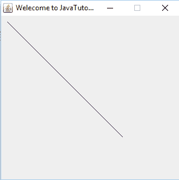
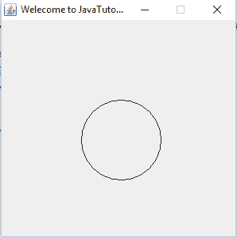
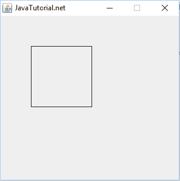
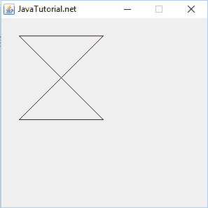
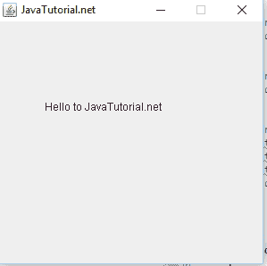
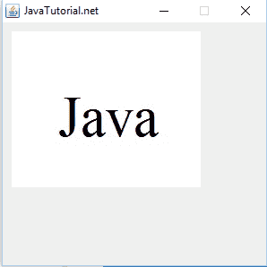

# 在`JFrame`上显示文本和图形

> 原文： [https://javatutorial.net/display-text-and-graphics-java-jframe](https://javatutorial.net/display-text-and-graphics-java-jframe)

本教程介绍了如何在[`JFrmae`](https://javatutorial.net/swing-jframe-basics-create-jframe) 上显示文本和图形，例如线条，圆形和矩形。

## 背景

Java 为我们提供了一种使用 GUI 绘制文本和图形的简便方法。 AWT 包中的`Graphics`类允许我们绘制基本的几何类型，如直线和圆。 除此之外，它还可以显示文本。 本教程将说明用于绘制形状和文本的`Graphics`类的各种功能。

## 绘制直线

`Graphics`类提供了`Graphics.drawline(int x1, int y1, int x2, int y2)`方法在屏幕上绘制一条线。 `x1`是线的第一点的`x`坐标，而`y1`是线的第一点的`y`坐标。 类似地，`x2`和`y2`是第二个线点的坐标。

这是显示一行的程序。

```java
package javatutorial.net;
import java.awt.Graphics;
import javax.swing.JFrame;
import javax.swing.JPanel;

public class JFrmaeGraphics extends JPanel{

	public void paint(Graphics g){

		g.drawLine(10, 10, 200, 300);			
	}

	public static void main(String[] args){
		JFrame frame= new JFrame("Welecome to JavaTutorial.net");	
		frame.getContentPane().add(new JFrmaeGraphics());
		frame.setSize(600, 400);
		frame.setVisible(true);
		frame.setDefaultCloseOperation(JFrame.EXIT_ON_CLOSE);
		frame.setResizable(false);		
	}
}

```

这是此代码的输出



行示例

## 绘制圆

您可以借助`Graphics.drawOval(int x, int y, int width, int height)`方法绘制圆形和椭圆形。 此功能有两个目的。`x`和`y`是位置，屏幕上的起点以及宽度和高度是设置椭圆形或圆形的宽度和高度的参数。 对于圆设置相同的宽度和高度。

此处，程序显示在屏幕上绘制圆圈的代码。

```java
package javatutorial.net;
import java.awt.Graphics;
import javax.swing.JFrame;
import javax.swing.JPanel;

public class JFrmaeGraphics extends JPanel{

	public void paint(Graphics g){
		g.drawOval(100, 100, 100, 100);					
	}

	public static void main(String[] args){
		JFrame frame= new JFrame("JavaTutorial.net");	
		frame.getContentPane().add(new JFrmaeGraphics());
		frame.setSize(300, 300);
		frame.setVisible(true);
		frame.setDefaultCloseOperation(JFrame.EXIT_ON_CLOSE);
		frame.setResizable(false);		
	}
}

```

这是此代码的输出



圈子的例子

## 绘制矩形

`Graphics`类提供了`Graphics.drawRect(int x, int y, int width, int height)`方法来绘制矩形或正方形。 前两个参数显示起点，后两个参数显示矩形或正方形的宽度和高度。 对于正方形，宽度和高度应相同。

这是绘制矩形的代码

```java
package javatutorial.net;
import java.awt.Graphics;
import javax.swing.JFrame;
import javax.swing.JPanel;

public class JFrmaeGraphics extends JPanel{

	public void paint(Graphics g){
		g.drawRect(10, 10, 100, 100);	
	}

	public static void main(String[] args){
		JFrame frame= new JFrame("JavaTutorial.net");	
		frame.getContentPane().add(new JFrmaeGraphics());
		frame.setSize(300, 300);
		frame.setVisible(true);
		frame.setDefaultCloseOperation(JFrame.EXIT_ON_CLOSE);
		frame.setResizable(false);		
	}
}	

```

这是此代码的输出



矩形示例

## 绘制多边形

绘制多边形非常容易。`Graphics`类提供了`Graphics.drawPolygon(int [], int [], int points)`的方法。 第一个参数是包含多边形所有点的`x`值的数组，第二个也是包含多边形所有点的`y`值的数组，而第三个参数显示点的数量。

```java
package javatutorial.net;
import java.awt.Graphics;
import javax.swing.JFrame;
import javax.swing.JPanel;

public class JFrmaeGraphics extends JPanel{

	public void paint(Graphics g){
	    int xValues[] = {25, 145, 25, 145, 25};
	    int yValues[] = {25, 25, 145, 145, 25};
	    int points = 5;	    
	    g.drawPolygon(xValues, yValues, points);
	}

	public static void main(String[] args){
		JFrame frame= new JFrame("JavaTutorial.net");	
		frame.getContentPane().add(new JFrmaeGraphics());
		frame.setSize(300, 300);
		frame.setVisible(true);
		frame.setDefaultCloseOperation(JFrame.EXIT_ON_CLOSE);
		frame.setResizable(false);		
	}
}

```

这是此代码的输出



多边形示例

## 绘制文字

要在屏幕上绘制文本，可以使用`Graphics.drawText(string text, int x, int y)`方法。 第一个参数是您要显示的字符串，最后两个参数是此文本将开始的点的值。

这是示例代码

```java
package javatutorial.net;
import java.awt.Graphics;
import javax.swing.JFrame;
import javax.swing.JPanel;

public class JFrmaeGraphics extends JPanel{

	public void paint(Graphics g){
		g.drawString("Hello to JavaTutorial.net", 10, 10);
	}

	public static void main(String[] args){
		JFrame frame= new JFrame("JavaTutorial.net");	
		frame.getContentPane().add(new JFrmaeGraphics());
		frame.setSize(300, 300);
		frame.setVisible(true);
		frame.setDefaultCloseOperation(JFrame.EXIT_ON_CLOSE);
		frame.setResizable(false);		
	}
}

```

这是此代码的输出



文字示例

## 绘制图像

Graphics 类提供了`Graphics.drawImage(Image, int x, int y, ImageOberver observer)`方法来绘制图像。 虽然`Image`是类，但是您可以使用`getDafaultKit()`方法获取图像的地址。 将图像放置在项目的文件夹中。

这是示例代码

```java
package javatutorial.net;
import java.awt.Graphics;
import java.awt.Image;
import java.awt.Toolkit;

import javax.swing.JFrame;
import javax.swing.JPanel;

public class JFrmaeGraphics extends JPanel{

	public void paint(Graphics g){
		 Image image = Toolkit.getDefaultToolkit().getImage("example.jpg");
		    g.drawImage(image, 10, 10, this);
	}

	public static void main(String[] args){
		JFrame frame= new JFrame("JavaTutorial.net");	
		frame.getContentPane().add(new JFrmaeGraphics());
		frame.setSize(300, 300);
		frame.setVisible(true);
		frame.setDefaultCloseOperation(JFrame.EXIT_ON_CLOSE);
		frame.setResizable(false);		
	}
}

```

这是此代码的输出



图片示例

这是[链接](https://github.com/NeelumAyub/Tutorials/tree/master/JFrameGhraphics)，您可以下载完整的代码。