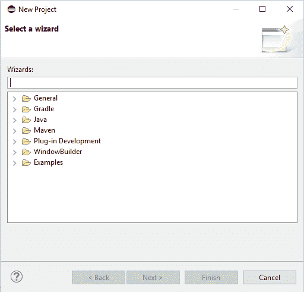
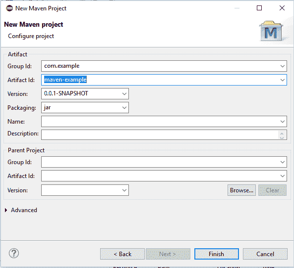
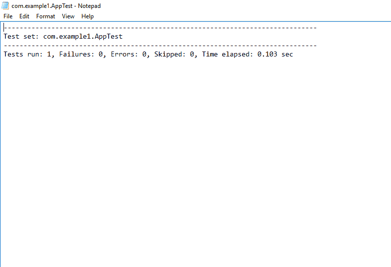
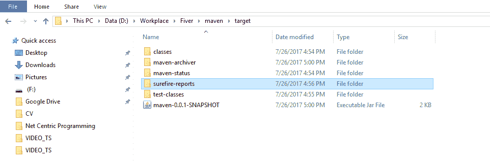

# 如何使用 Maven 创建 Java JAR 文件

> 原文： [https://javatutorial.net/create-java-jar-file-with-maven](https://javatutorial.net/create-java-jar-file-with-maven)

本教程将逐步说明如何使用 [Maven](https://javatutorial.net/how-to-install-maven-on-windows-linux-and-mac) 创建 Java JAR 文件。

## 为什么需要 Java JAR 文件？

JAR 或 Java 存档文件是一个可执行文件，带有与元数据和资源相关的库的集合。 它实际上是一个扩展名为`.JAR`的 ZIP 文件。 由于它还包含编译后的主类（`.class`格式），因此即使不使用 [IDE](https://javatutorial.net/choose-your-java-ide-eclipse-netbeans-and-intellij-idea) 也可以执行压缩和使用代码，而无需执行。 它用于通过网络分发软件程序。

因此，请按照本教程学习如何使用 Maven 创建 Java JAR 文件以及如何设置项目的依赖项。 下一节逐步说明所有要求和准则。

## 使用 Maven 创建 JAR 文件的要求

*   [Maven](https://javatutorial.net/how-to-install-maven-on-windows-linux-and-mac) （它是软件管理和综合工具）
*   [JDK](https://javatutorial.net/install-java-8-jdk-on-ubuntu) （Java 软件开发套件）
*   Eclipse（集成开发环境）

**注意**：

如果您没有 Maven，请安装适用于 Eclipse 的 Maven 插件。 您可以使用 Eclipse 中的帮助菜单轻松安装 Maven 插件。

## 步骤 1 创建一个新的 Maven 项目

第一步是在 Eclipse IDE 中创建一个新的 Maven 项目。 为了这，

*   打开你的 IDE
*   转到“文件”，选择“新建”，然后选择“Project”
*   将出现一个新窗口，选择“Maven 项目”，如下所示



选择 Maven 项目

*   单击“Maven”，然后选择“Maven 项目”
*   在“New Maven Project Wizard”中，填写工件信息组 ID 和工件 ID（保留所有默认设置），如下所示



Maven 工件信息

*   单击“完成”，将创建一个新的 Maven 项目。
*   将所有 Java 源文件放在`src/main/java`目录中，并在`src/test/resources`下创建测试文件

## 步骤 2：添加依赖项

要添加构建依赖关系，Maven 允许我们在`pom.xml`文件中使用最简单的方法。 因此，此依赖项将自动下载并添加到您的 Maven 项目中。

转到`pom.xml`文件

将 JUnit 的依赖项元素添加为

```java
<dependencies>
 <dependency> 
	 <groupId>junit</groupId>
	 <artifactId>junit</artifactId>
	 <version>4.12</version>
 </dependency>
 </dependencies>

```

您的`pom.xml`看起来像

```java
<project xmlns="http://maven.apache.org/POM/4.0.0" xmlns:xsi="http://www.w3.org/2001/XMLSchema-instance" xsi:schemaLocation="http://maven.apache.org/POM/4.0.0 http://maven.apache.org/xsd/maven-4.0.0.xsd">
  <modelVersion>4.0.0</modelVersion>
  <groupId>com.example1</groupId>
  <artifactId>maven</artifactId>
  <version>0.0.1-SNAPSHOT</version>

   <dependencies>
 <dependency> 
	 <groupId>junit</groupId>
	 <artifactId>junit</artifactId>
	 <version>4.12</version>
 </dependency>
 </dependencies>
</project>

```

单击“保存”将添加所有 jar 文件。

## 步骤 3：清理您的项目

现在清理您的 Maven 项目。 为此，转到项目的根文件夹，右键单击，在列表中找到“运行为”，然后单击“Maven clean”命令。

**替代**：

如果使用命令行，则可以键入`mvn clean`命令。

## 步骤 4：编译所有 Java 类

清理完 Maven 项目后，现在编译所有源文件。 右键单击项目的根目录，转到“运行为”，然后单击“Maven 编译”。 它将编译所有源代码。 在项目浏览器中，您将看到**目标**文件夹已创建。

**替代**：

如果使用命令行，则可以键入`mvn compile`命令

## 步骤 5：编译测试文件

现在，下一步是编译所有测试文件。 为此，转到您项目的根名称，然后右键单击，转到“运行为”，然后单击“Maven 测试”。 构建成功后，您将在**目标**文件夹下看到`surefire-reports`文件夹。 如果打开此文件夹，您将看到一个包含构建信息的文本文件，如下图所示。



报告文件显示构建信息。

**替代**：

如果使用命令行，则可以键入`mvn test`命令

## 步骤 6：运行您的 Maven 项目

现在，最后一步是运行您的项目以制作 JAR 文件。 右键单击项目的根目录，转到“运行为”，然后单击“Maven 安装”。 构建成功后，它将在**目标**文件夹下创建一个 JAR 文件。

**替代**：

如果使用命令行，则可以键入`mvn install`命令

这里是



JAR 文件位置

就这样，使用 Maven 创建 JAR 文件就完成了。 这是您可以[下载](https://github.com/NeelumAyub/Tutorials/tree/master/maven-example)的完整项目。