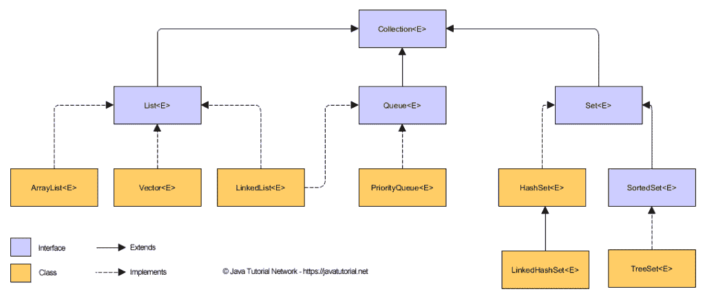

# Java `Collection`新手指南

> 原文： [https://javatutorial.net/java-collection-tutorial](https://javatutorial.net/java-collection-tutorial)

Java 中的“集合”框架随着 [JDK 1.2](https://javatutorial.net/install-java-8-jdk-on-ubuntu) 的发布而生效，并在 Java 1.4 和 Java 5 中进行了多次扩展，然后在 Java 6 中进行了扩展。

它为您（程序员）提供列表，集合，映射和队列，以满足您大多数的编码需求。 而且，无论您选择哪一个，都一定会给您至少一个合理的表现。 在深入探讨事物之前，让我们先整理一些事物。

*   `collection`（小写`c`）：这表示存储和迭代对象的不同类型的数据结构。
*   `Collection`（大写`c`）：这是集合，列表和队列扩展的接口。 “语法帮助：`java.util.Collection`”
*   `Collections`（大写`c`并以字符`s`结尾）：这是一个类，其中包含所有与集合一起使用的“静态”实用程序方法。

Java 集合层次结构

## 现在出现的问题是……我该如何处理某个`Collection`？

*   对于初学者，您可以将对象添加到集合中。
*   从集合中删除对象
*   您可以检查特定集合中是否有给定的对象
*   从集合中检索任何对象而不将其删除。 等等

现在，不用多说，让我们开始使用收藏集。 它们通常有四个变体，即：

*   **列表**：事物列表
*   **集合**：独特的事物
*   **映射**：具有唯一 ID 的事物
*   **队列**：先进先出。

## 列表接口

`List`接口中重要的首要因素是索引。 拥有索引可以为程序员提供整个索引方法库。 其次，所有三个不同的列表实现均按索引位置排序，这些实现的名称为：

*   [`ArrayList`](https://javatutorial.net/java-arraylist-example)
*   `Vector`
*   [`LinkedList`](https://javatutorial.net/java-linkedlist-example)

（我没有忘记在上述名称中按空格...）

1.  [`ArrayList`](https://javatutorial.net/java-arraylist-example) ：可以将其视为动态数组，所谓动态数组，是指可以根据需要进行扩展和收缩而无需明确指定其大小的数组。
    
    `ArrayList`帮助的区域位于快速迭代和快速随机访问领域。 但是要注意的重要一点是，默认情况下未对`ArrayList`进行排序。
2.  `Vector`：`Vector`有点像较慢的`ArrayList`，主要区别在于，为了线程安全，`Vector`方法都已同步。 （现在，线程安全性本身就是一个大话题，我们现在不再讨论。）
3.  [`LinkedList`](https://javatutorial.net/java-linkedlist-example) ：我们又有了类似于`ArrayList`的内容。 这里的主要区别在于，`LinkedList`中的元素是双向链接的。
    
    `LinkedList`的迭代速度比`ArrayList`慢，但是当需要快速插入或删除时，它是更好的选择。 我们将在我们的教程[中更详细地说明这一点[ Java 中的`ArrayList`和`LinkedList`之间的区别](https://javatutorial.net/difference-between-arraylist-and-linkedlist-in-java)

## 集合接口

这里的词组类似于您在学校数学中学习过的词组，如果您不喜欢该章，请不要着急。 这里唯一重要的是在`Set`中我们不允许重复。 就像列表接口一样，集合接口也具有三种不同的实现：

*   [`HashSet`](https://javatutorial.net/java-hashset-example)
*   [`LinkedHashSet`](https://javatutorial.net/java-linkedhashset-example)
*   [`TreeSet`](https://javatutorial.net/java-treeset-example)

1.  `HashSet`：这只是一个未排序的无序集合。 这里重要的是`LinkedHashSet`使用传入对象的哈希码。
2.  `LinkedHashSet`：您现在必须已经猜到它有点类似于`HashSet`，并且绝对正确，因此，我只想让您知道这两者之间的区别（在此处输入鼓声） 是`HashSet`的有序版本，该版本在所有元素上维护一个双向链表。
3.  `TreeSet`：这是一个有序集合，并使用红黑树结构，该结构保证元素**必定**根据自然顺序处于升序。

## 映射接口

映射接口只关心以下事实：本质上，集合中已经存在或要添加到集合中的所有对象的所有标识符都是完全唯一的。 这里的键和值都是对象。

像上面给出的两个接口一样，Map 接口也具有三个不同的实现：

*   [`HashMap`](https://javatutorial.net/java-hashmap-example)
*   [`HashTable`](https://javatutorial.net/java-hashtable-example)
*   [`LinkedHashMap`](https://javatutorial.net/java-linkedhashmap-example)

1.  `HashMap`：这为您提供了一个未分类的，未排序的映射，其中键在映射中的位置取决于键的`hashCode()`函数的值。
2.  `HashTable`：它是`HashMap`的同步副本。 不允许输入`NULL`。
3.  `LinkedHashMap`：此实现可维持插入顺序，这在我们讨论迭代及其其他用途时是一项非常重要的功能，但令人怀疑的缺点是速度太慢。

您可能也对本教程感兴趣，该教程更详细地说明了`HashMap`和`TreeMap`之间的[差异](https://javatutorial.net/difference-between-hashmap-and-treemap-in-java)

## 队列接口

是的，我们在这里谈论的是普通队列。 您几乎在任何地方都遇到的问题，包括在您进入本文之前向您展示的结果队列。

它基本上遵循 FIFO（先进先出）原则

*   `PriorityQueue`：存在`PriorityQueue`的原因是要创建一个“优先输入，优先输出”队列，而不是典型的 FIFO。

其次，在此实现中，元素通过自然排序或根据比较器排序。

这些是 [Java](http://www.trainingindelhi.com/best-java-training-in-delhi.php) 中`Collection`的基本类型，该主题仍然涉及很多内容，并且还需要进行更多的解释，因此，如果您不这样做，请不要犹豫不决。 首次获得不同`Collection`实现之间的所有差异。

参考：官方 [Oracle Collections 教程](https://docs.oracle.com/javase/tutorial/collections/implementations/index.html)