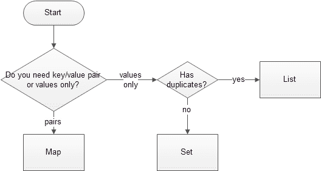

# 选择合适的 Java 集合

> 原文： [https://javatutorial.net/choose-the-right-java-collection](https://javatutorial.net/choose-the-right-java-collection)

Java 为您提供了多种收集实现供您选择。 通常，您将始终为您的编程任务寻找性能最佳的集合，在大多数情况下为[`ArrayList`](https://javatutorial.net/java-arraylist-example)，[`HashSet`](https://javatutorial.net/java-concurrenthashset-example)或[`HashMap`](https://javatutorial.net/java-identityhashmap-example)。但是请注意，如果您需要某些特殊功能（例如排序或排序），则可能需要进行特殊的实现。 该 Java 集合教程不包括[`WeakHashMap`](https://javatutorial.net/java-weakhashmap-example)等很少使用的类，因为它们是为非常特定或特殊任务设计的，因此在 99% 的情况下都不应该选择它们。

如果您需要深入了解特定集合的实现方式，则可能需要阅读官方的[集合框架教程](http://docs.oracle.com/javase/7/docs/technotes/guides/collections/index.html "Collections Framework Tutorial")。

首先让我们看下面的流程图。 它将帮助您根据要存储到此集合中的数据确定要使用的集合接口。

这里的主要规则是：如果您需要存储映射了键的值，请转到`Map`接口，否则，请使用`List`表示可能重复的值，如果您不想在集合中使用重复的值，请最终使用`Set`接口。

## 选择正确的 Java `Map`接口

[`HashMap`](https://javatutorial.net/java-identityhashmap-example) –如果迭代时项目的顺序对您不重要，请使用此实现。与`TreeMap`和[`LinkedHashMap`](https://javatutorial.net/java-linkedhashmap-example)相比，`HashMap`具有更好的性能。

[`TreeMap`](https://javatutorial.net/java-treemap-example) – 已排序和排序，但比`HashMap`慢。[`TreeMap`](https://javatutorial.net/java-treemap-example)根据其比较器具有键的升序

[`LinkedHashMap`](https://javatutorial.net/java-linkedhashmap-example) – 在插入过程中按键对项目排序

## 选择正确的 Java `List`接口

[`ArrayList`](https://javatutorial.net/java-arraylist-example) –插入期间对项目进行排序。与对`LinkedLists`的搜索操作相比，对`ArrayLists`的搜索操作更快

[`LinkedList`](https://javatutorial.net/java-linkedlist-example) – 已快速添加到列表的开头，并通过迭代从内部快速删除

## 选择正确的 Java `Set`接口

[`HashSet`](https://javatutorial.net/java-concurrenthashset-example) – 如果迭代时项目的顺序对您不重要，请使用此实现。与`TreeSet`和`LinkedHashSet`相比，`HashSet`具有更好的性能

`LinkedHashSet` – 在插入过程中排序元素

[`TreeSet`](https://javatutorial.net/java-treeset-example) – 根据其比较器，按键的升序排序