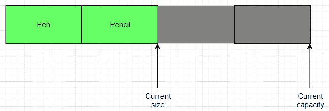

# Java `ArrayList`示例

> 原文： [https://javatutorial.net/java-arraylist-example](https://javatutorial.net/java-arraylist-example)

Java `ArrayList`类是实现`List`接口的可调整大小的数组。 它允许所有元素（包括`null`），并且实现所有可选列表操作。 可以在`ArrayList`上运行的大多数操作，例如`size`，`isEmpty`，`get`，`set`，`iterator`和`listIterator`都是恒定时间。 但是，`add`操作的复杂度为`O(n)`时间。与[`LinkedList`](https://javatutorial.net/java-linkedlist-example)相比，常数因子低。


## `ArrayList`的优点

*   动态添加或删除元素的能力。
*   `ArrayList`使用数组作为其基础实现，这使`ArrayList`类可以更快地访问元素。
*   灵活性。
*   `ArrayList`是面向对象的，因此您可以从中扩展并添加功能（如果需要）。
*   向`ArrayList`添加自定义行为是可能的，甚至很容易实现。

## `ArrayList`的局限性

*   添加元素需要`O(n)`时间。
*   `ArrayList`将数据顺序存储在内存中，因此，如果列表很大，则将需要大量连续的内存块。
*   `ArrayList`的初始容量为 10，如果不指定容量，则将受到性能限制。 每当`ArrayList`达到其自身容量时，数据将以 50% 以上的容量从旧空间复制到新空间。

## `ArrayList`的简单说明



Java 中的`ArrayList`

从上图可以看到，`ArrayList`中当前有 2 个元素，可以添加的最大元素数量（容量）为 8（或 6 个以上）。

## `ArrayList`中的构造方法

1.  `ArrayList()` – 构造一个初始容量为 10 的空列表。
2.  `ArrayList(Collection <? extended E> c)` – 构造一个列表，该列表包含指定集合的​​元素，并按集合的迭代器返回它们的顺序。
3.  `ArrayList(int initialCapacity)` – 构造一个具有指定初始容量的空列表。

## `ArrayList`类中的方法

1.  `boolean add(E e)`：将指定的元素附加到列表的末尾。
2.  `void add(int index, E element)`：将指定的元素插入列表中的指定位置。
3.  `boolean addAll(Collection <? extends E> c)`：将指定集合中的所有元素附加到列表的末尾，以指定集合的`​​Iterator`返回它们的顺序。
4.  `boolean addAll(int index, Collection <? extends E> c)`：从指定位置开始，将集合中的所有元素插入列表。
5.  `void clear()`：从列表中删除所有元素。
6.  `boolean contains(Object o)`：如果列表包含指定的元素，则返回`true`；否则返回`false`。
7.  `void ensureCapacity(int minCapacity)`：如果有必要确保列表可以容纳最小容量参数指定的所有元素，则增加列表的容量。
8.  `void forEach(Consumer<? super E> action)`：对已循环通过的每个元素执行给定的动作。
9.  `int indexOf(Object o)`：如果列表不包含元素，则返回 -1。 但是，如果元素存在于列表中，则它返回此列表中指定元素首次出现的索引。
10.  `boolean isEmpty()`：如果列表不包含任何元素，则返回`true`。
11.  `Iterator<E> iterator()`：以适当的顺序返回列表中元素的迭代器。
12.  `int lastIndexOf(Object o)`：返回列表中指定元素最后一次出现的索引;如果列表中不存在该元素，则返回 -1。
13.  `boolean remove(Object o)`：从列表中删除第一次出现的指定对象。
14.  `boolean removeAll(Collection<?> c)`：从列表中删除指定集合中包含的所有元素。
15.  `boolean removeIf(Predicate<? super E> filter)`：移除此集合中所有满足给定谓词的元素。
16.  `void removeRange(int fromIndex, int toIndex)`：删除列表中`fromIndex`和`toIndex`之间的所有元素。（`fromIndex`–包括在内，`toIndex`–排除在外）
17.  `void replaceAll(UnaryOperator<E> operator)`：使用将运算符应用于该元素的结果替换列表中的每个元素。
18.  `boolean retainAll(Collection<?> c)`：仅返回指定集合中包含的列表中的元素。
19.  `int size()`：返回列表的大小。
20.  `void sort(Comparator<? super E> c)`：根据`Comparator`指定的顺序对列表进行排序。
21.  `Object[] toArray()`：返回包含列表中包含的元素的数组。

有关所有方法的文档，请访问 [Oracle 官方文档页面](https://docs.oracle.com/javase/8/docs/api/java/util/ArrayList.html)。

### 使用`add()`在`ArrayList`中添加元素

```java
import java.util.* ;

public class ArrayListEgTwo
{

  public static void main ( String[] args)
  {
    // Create an ArrayList that consists of Strings
    ArrayList<String> animals = new ArrayList<String>();

    // Capacity starts at 10, but size starts at 0
    System.out.println("initial size: " + animals.size());

    // Populating some of the arraylist
    animals.add("Elephant");
    animals.add("Tiger");
    animals.add("Lion");
    System.out.println("new size: " + animals.size());
}
```

**输出**：

```java
size: 0
new size: 3
```

### 使用`remove()`移除`ArrayList`中的元素

```java
import java.util.* ;
public class RemoveExample
{
  public static void main ( String[] args)
  {
    ArrayList<String> animals = new ArrayList<String>();

    animals.add( "Elephant" );    
    animals.add( "Tiger" );
    animals.add( "Lion" );  

    names.remove(1);

    for ( int i=0; i < animals.size(); i++ )
      System.out.println( i + ": " + animals.elementAt(j) ); 

  }
}
```

**输出**： 

```java
0: Elephant
1: Lion
```

### 使用`isEmpty()`检查`ArrayList`是否包含元素

```java
import java.util.* ;

public class isEmptyExample
{
  public static void main ( String[] args)
  {
    ArrayList<String> animals = new ArrayList<String>();

    System.out.println( "Case 0:" + animals.isEmpty());

    animals.add("Tiger");    
    System.out.println( "Case 1:" + animals.isEmpty() );

    nobby.clear();    
    System.out.println( "Case 2:" + animals.isEmpty() );
  }
}
```

**输出**： 

```java
Case 0: true
Case 1: false
Case 2: true
```

### 使用`indexOf(Object o)`在`ArrayList`中搜索元素

```java
import java.util.* ;
public class IndexOfExample
{
  public static void main (String[] args)
  {
    ArrayList<String> animals = new ArrayList<String>();

    animals.add("Elephant");     
    animals.add("Tiger");
    animals.add("Lion");   

    System.out.println("Index of 'Elephant': " + animals.indexOf("Elephant" )); 
    System.out.println("Index of 'Lion': " + animals.indexOf("Lion")); 
  }
}
```

**输出**： 

```java
Index of 'Elephant': 0
Index of 'Lion': 2
```

### 使用`Iterator()`遍历`ArrayList`中的元素

```java
import java.util.* ;
public class IteratorExample
{
  public static void main ( String[] args)
  {
    ArrayList<String> animals = new ArrayList<String>();
    animals.add("Elephant");
    animals.add("Tiger");
    animals.add("Lion");

    // Initializing an iterator
    Iterator<String> iterator = animals.iterator();

    // Using the iterator to visit each element
    while(iterator.hasNext())
      System.out.println(iterator.next());

  }
}
```

**输出**：

```java
Elephant
Tiger
Lion
```

### 使用增强的`For`循环遍历`ArrayList`中的元素

```java
import java.util.* ;
public class ForLoopExample
{
  public static void main ( String[] args)
  {
    ArrayList<String> animals = new ArrayList<String>();

    animals.add("Elephant");
    animals.add("Tiger");
    animals.add("Lion");

    for (String animal : animals) 
      System.out.println(animal);
  }
}
```

**输出**： 

```java
Elephant
Tiger
Lion

```

### 使用`size()`获取`ArrayList`的大小

```java
import java.util.* ;
public class ForLoopExample
{
  public static void main ( String[] args)
  {
    ArrayList<String> animals = new ArrayList<String>();

    animals.add("Elephant");
    animals.add("Tiger");
    animals.add("Lion");

    System.out.println("Size of ArrayList: " + animals.size());
  }
}
```

**输出**：

```java
Size of ArrayList: 3
```