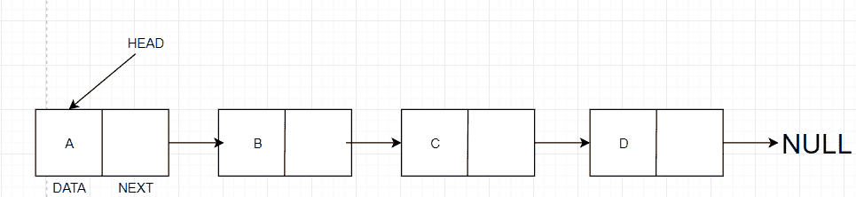

# Java `LinkedList`示例

> 原文： [https://javatutorial.net/java-linkedlist-example](https://javatutorial.net/java-linkedlist-example)

Java 中的`LinkedList`类使用双链表来存储元素，并且还提供了链表数据结构。 它实现了`List`和`Deque`接口，就像[`ArrayList`](https://javatutorial.net/java-arraylist-example) 类一样。 就像数组一样，`LinkedList`是线性数据结构，但是与数组不同，`LinkedList`中的元素是使用指针链接在一起的。 有一个指向第一个元素的指针，通常称为“头部”。 最后一个元素指向`null`元素。 此`null`元素意味着链表中没有任何其他元素。


## 关于 Java 中的`LinkedList`的重要了解是什么

*   Java 中的`LinkedList`类允许重复的元素。
*   Java 中的`LinkedList`类维护插入顺序。
*   Java 中的`LinkedList`类是不同步的。
*   Java 中的`LinkedList`类允许快速操作，因为不需要进行任何移位。
*   Java 中的`LinkedList`类可以是列表，栈甚至队列。

## `LinkedList`的局限性

*   `LinkedList`类比数组需要更多的内存，因为它们的指针使用存储。
*   由于我们不能仅通过它们的索引访问每个元素，因此很难遍历链表中的元素。

## `LinkedList`的简单说明



Java 中的`LinkedList`

这里的头是我上面提到的指针，该指针指向第一个元素。 第一个元素（以及链表中的每个单个元素）本质上具有两件事 - 数据和下一个。 数据只是指定元素包含的内容，其次是指向下一个元素的指针。 最后，在图示中我们可以看到 D 指向`null`，在链表中，`null`表示列表的末尾。

## `LinkedList`中的构造方法

1.  `LinkedList()`：用于构造一个空列表。
2.  `LinkedList(Collection<? extends E> c)`：用于构造一个包含指定集合元素的列表，这些元素按顺序由集合的迭代器返回。

## `LinksList`中的方法

1.  `boolean add(E e)`：将指定的元素添加到列表的末尾。
2.  `void add(int index, E element)`：将指定的元素添加到指定的位置。
3.  `void clear()`：从列表中删除所有元素。
4.  `Object clone()`：返回`ArrayList`的浅表副本。
5.  `boolean contains(Object o)`：如果指定的元素在列表中，则返回`true`。
6.  `Iterator<E> endingIterator()`：以反向双端队列的反向顺序返回元素上的迭代器。
7.  `E element()`：从列表中检索第一个元素。
8.  `E get(int index)`：返回列表中指定位置的元素。
9.  `int indexOf(Object o)`返回列表中指定元素首次出现的索引，如果不存在则返回 -1。
10.  `boolean offer(E e)`：将指定的元素添加为列表的最后一个元素。
11.  `E pop()`：从列表表示的栈中弹出一个元素。
12.  `void push(E e)`：将元素压入列表表示的栈。
13.  `E remove()`：用于检索和删除列表的第一个元素。
14.  `E remove(int index)`：删除列表中指定位置的元素。
15.  `int size()`：返回列表中的元素数。

有关所有方法的文档，请访问 [Oracle 官方文档页面](https://docs.oracle.com/javase/7/docs/api/java/util/LinkedList.html)。

### 使用`add()`将元素添加到`LinkedList`

语法：`boolean add(E e)`

```java
import java.io.*; 
import java.util.LinkedList; 

public class LinkedListExample { 
   public static void main(String args[]) { 

      LinkedList animals = new LinkedList(); 

      animals.add("Elephant"); 
      animals.add("Tiger"); 

      System.out.println("The list is:" + animals); 
      list.add("Lion"); 

      // printing the new list 
      System.out.println("The new List is:" + animals); 
   } 
}
```

**输出**： 

```java
The list is:[Elephant, Tiger]
The new List is:[Elephant, Tiger, Lion]
```

### 使用`push()`将元素推送到`LinkedList`

语法：`LinkedListObject.push(E e)`

```java
import java.util.LinkedList; 

public class PushExample { 
    // Main method 
    public static void main(String[] args) 
    { 
        LinkedList<String> animals = new LinkedList<>(); 

        animals.push("Elephant"); 

        animals.push("Tiger"); 

        animals.push("Lion"); 

        // Printing the complete stack. 
        System.out.println(animals); 
    } 
}
```

**输出**：

```java
[Lion, Tiger, Elephant]
```

### 使用`pop()`从`LinkedList`弹出元素

语法：`LinkedListObject.pop()`

```java
import java.io.*; 
import java.util.LinkedList; 

public class LinkedListExample { 
   public static void main(String args[]) { 

      LinkedList animals = new LinkedList(); 

      / Pushing an element in the stack 
      animals.push("Elephant"); 

      // Pushing an element in the stack 
      animals.push("Tiger"); 

      // Pop an element from stack 
      String s = animals.pop(); 

      System.out.println(s);

      // Pushing an element in the stack 
      animals.push("Lion"); 

      // Printing the complete stack. 
      System.out.println(animals); 
   } 
}
```

**输出**：

```java
Elephant
[Elephant, Lion]
```

### 使用`remove()`从`LinkedList`移除元素

语法：`LinkedList.remove()`

```java
import java.io.*; 
import java.util.LinkedList; 

public class LinkedListExample { 
    public static void main(String args[]) 
    { 
        LinkedList<String> animals = new LinkedList<String>(); 

        animals.add("Elephant"); 
        animals.add("Tiger"); 
        animals.add("Lion"); 

        System.out.println("LinkedList:" + animals); 

        // Remove the head using remove() 
        animals.remove(); 

        // Print the final list 
        System.out.println("Final LinkedList:" + animals); 
    } 
} 

```

**输出**：

```java
LinkedList:[Elephant, Tiger, Lion]
Final LinkedList:[Tiger, Lion]
```

### 使用`clear()`清除链表

```java
import java.io.*; 
import java.util.LinkedList; 

public class LinkedListExample { 
    public static void main(String args[]) 
    { 
        LinkedList<String> animals = new LinkedList<String>(); 

        animals.add("Elephant"); 
        animals.add("Tiger"); 
        animals.add("Lion"); 

        System.out.println("Before clear:" + animals); 

        animals.clear(); 

        System.out.println("After clear: " + animals); 

        // Adding elements after clearing the list 
        animals.add("Elephant"); 
        animals.add("Tiger"); 
        animals.add("Lion"); 

        System.out.println("After adding elements to empty list:" + animals); 
    } 
}
```

**输出**： 

```java
Before clear:[Elephant, Tiger, Lion]
After clear: []
After adding elements to empty list:[Elephant, Tiger, Lion]
```

### 使用`contains()`检查`LinkedList`中是否存在元素

语法：`boolean contains(Object o)`

```java
import java.io.*; 
import java.util.LinkedList; 

public class LinkedListExample { 
   public static void main(String args[]) { 
      LinkedList<String> animals = new LinkedList<String>(); 

      animals.add("Elephant"); 
      animals.add("Tiger"); 
      animals.add("Lion"); 

      System.out.println("\nIs 'Lion' in the linkedlist: " 
                                      + animals.contains("Lion")); 

      System.out.println("Is'Cat' in the linkedlist: " 
                                         + animals.contains("Cat")); 
   } 
}
```

**输出**： 

```java
Is 'Lion' in the linkedlist: true
Is 'Cat' in the linkedlist: false
```

### 使用`size()`获取`LinkedList`的大小

语法：`LinkedList.size()`

```java
import java.io.*; 
import java.util.LinkedList; 

public class LinkedListExample { 
    public static void main(String args[]) 
    { 
        LinkedList<String> animals = new LinkedList<String>(); 

        animals.add("Elephant"); 
        animals.add("Tiger"); 
        animals.add("Lion"); 

        System.out.println("The size of the linked list is: " 
                                                + animals.size()); 
    } 
}
```

**输出**：

```java
The size of the linked list is: 3
```

## 如何遍历链表

有 5 种方法：

1.  `For`循环
2.  增强的`For`循环
3.  `While`循环
4.  迭代器
5.  集合的`stream()`（Java 8）

**`For`循环**

```java
LinkedList<String> linkedList = new LinkedList<>();
for (int i = 0; i < linkedList.size(); i++) {
    System.out.println(linkedList.get(i));
}
```

**增强`For`循环**

```java
for (String temp : linkedList) {
    System.out.println(temp);
}
```

**`While`循环**

```java
int i = 0;
while (i < linkedList.size()) {
    System.out.println(linkedList.get(i));
    i++;
}
```

**迭代器**

```java
Iterator<String> iterator = linkedList.iterator();
while (iterator.hasNext()) {
    System.out.println(iterator.next()); 
}
```

**集合`stream()`（Java 8）**

```java
linkedList.forEach((temp) -> {
    System.out.println(temp);
});
```