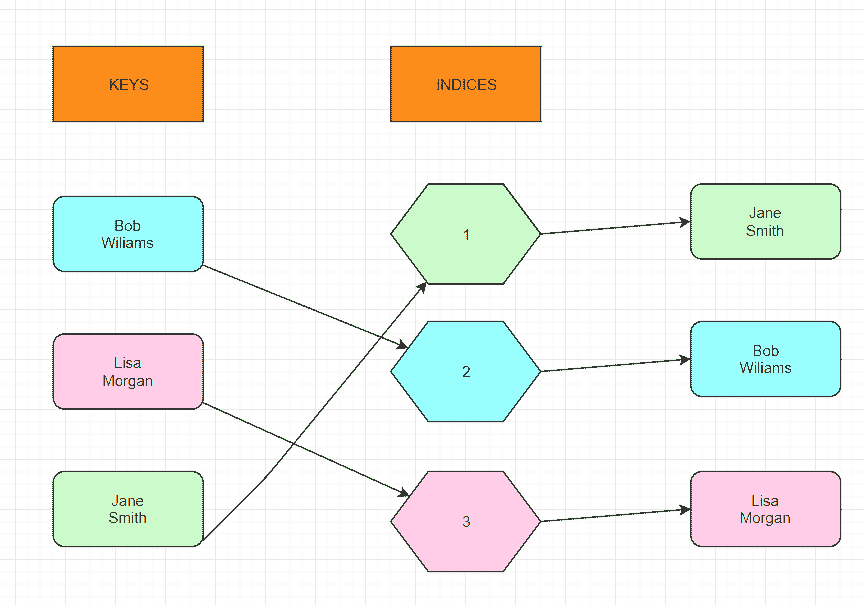

# Java `HashSet`示例

> 原文： [https://javatutorial.net/java-hashset-example](https://javatutorial.net/java-hashset-example)

使用哈希表进行存储的集合通常由 Java `HashSet`类创建。 顾名思义，`HashSet`实现`Set`接口，并且还使用一个哈希表，该哈希表是`HashMap`实例。`HashSet`中元素的顺序是随机的。 此类允许使用`null`元素。 就复杂度而言，`HashSet`为基本操作（如添加，删除，包含和大小）提供恒定的时间性能，前提是假定元素已被函数正确分散。


## 有关`HashSet`的重要信息

*   `HashSet`通过使用称为**散列**的机制来存储元素。
*   `HashSet`中不能存在重复的元素。
*   `HashSet`允许为空值。
*   `HashSet`类不同步。
*   `HashSet`的顺序不由插入顺序维护。 元素（在此类中）是根据其哈希码插入的。
*   就搜索操作而言，由于`HashSet`具有恒定的时间复杂度，因此它是最好的方法。
*   `HashSet`的初始默认容量为 16，而负载系数为 0.75。

## `HashSet`简单的结构图



Java 中的`HashSet`

我们放入`HashMap`中的每个对象都首先通过哈希算法发送。 该算法的唯一目的是为传递给它的每个对象生成一个称为**哈希**的唯一编号。 在上图中，此算法为字符串`Lisa Morgan`生成了数字 3，为`Bob Wiliams`生成了数字 2，为`Jane Smith`生成了数字 1。 以后，这些数字将作为索引存储在数组中。 每当您要对`HashSet`中的元素执行任何类型的操作时，您都将通过由哈希算法生成的索引来解决它们。 这就是`HashSet`以随机顺序返回元素的原因。 哈希号是`HashSet`知道的唯一顺序。

## `HashSet`中的构造方法

1.  `HashSet hashSet = new HashSet();`
2.  `HashSet hashSet = new HashSet(int initialCapacity);`
3.  `HashSet hashSet = new HashSet(int initialCapacity, float loadFactor);`
4.  `HashSet hashSet = new HashSet(Collection c);`

这些构造函数之间的主要区别在于，在 #1 构造函数中，初始容量为 16，默认负载因子为 0.75，但在 #2 中，您实际上可以设置容量。 负载系数的默认值仍为 0.75。 在构造函数 3 中，您可以设置容量和负载系数。

## `HashSet`类中的方法

1.  `boolean add(Object o)`：用于添加作为参数提供的元素，如果不存在，则返回`false`。
2.  `void clear()`：用于删除所有元素。
3.  `boolean contains(Object o)`：如果指定的`Object`在`HashSet`中，则返回`true`；否则，返回`false`。
4.  `boolean remove(Object o)`：用于从`HashSet`中删除指定的`Object`（如果存在）。
5.  `Iterator iterator()`：用于返回集合中元素上的迭代器。
6.  `boolean isEmpty()`：用于检查`HashSet`是否为空。 如果为空，则返回`true`；否则为`false`。
7.  `int size()`：返回集合的大小。
8.  `Object clone()`：创建集合的副本。

有关所有方法的文档，请访问 [Oracle 官方文档页面](https://docs.oracle.com/javase/8/docs/api/java/util/HashSet.html)。

### 使用`add()`在`HashSet`中添加元素

语法：`HashSet.add(Object o);`

```java
import java.io.*; 
import java.util.HashSet; 

public class HashSetExample { 
    public static void main(String args[]) 
    { 
        // Creating an empty HashSet 
        HashSet<String> animals = new HashSet<String>(); 

        animals.add("Elephant"); 
        animals.add("Tiger"); 
        animals.add("Lion"); 

        // Displaying the HashSet 
        System.out.println("HashSet: " + animals); 
    } 
}
```

**输出**：

```java
HashSet: [Elephant, Tiger, Lion]
```

### 使用`clear()`清空`HashSet`

语法：`HashSet.clear();`

**输出**：

```java
import java.io.*; 
import java.util.HashSet; 

public class HashSetExample{ 
    public static void main(String args[]) 
    { 
        // Creating an empty HashSet 
        HashSet<String> animals = new HashSet<String>(); 

        animals.add("Elephant"); 
        animals.add("Tiger"); 
        animals.add("Lion"); 

        // Displaying the HashSet 
        System.out.println("HashSet: " + animals); 

        // Clearing the hash set
        animals.clear(); 

        // Displaying the final Set after clearing; 
        System.out.println("The final set: " + animals); 
    } 
}
```

```java
HashSet: [Elephant, Tiger, Lion]
The final set: []
```

### 使用`contains()`检查`HashSet`中是否存在元素

语法：`Hash_Set.contains(Object o)`

```java
import java.io.*; 
import java.util.HashSet; 

public class HashSetExample { 
    public static void main(String args[]) 
    { 
        // Creating an empty HashSet 
        HashSet<String> animals = new HashSet<String>(); 

        animals.add("Elephant"); 
        animals.add("Tiger"); 
        animals.add("Lion"); 

        // Displaying the HashSet 
        System.out.println("HashSet: " + animals); 

        // Checking for "Lion" in the hash set
        System.out.println("Does the HashSet contain 'Lion'? " + animals.contains("Lion")); 

        // Checking for "Elephant" in the hash set
        System.out.println("Does the HashSet contain 'Elephant'? " + animals.contains("Elephant")); 

        // Checking for "Tiger" in the hash set
        System.out.println("Does the HashSet contain 'Tiger'? " + animals.contains("Tiger")); 

        // Checking for "Chicken" in the hash set 
        System.out.println("Does the HashSet contain 'Chicken'? " + animals.contains("Chicken")); 
    } 
}
```

**输出**：

```java
HashSet: [Elephant, Tiger, Lion]
Does the Set contain 'Lion'? true
Does the Set contain 'Elephant? true
Does the Set contain 'Tiger'? true
Does the Set contain 'Chicken'? false
```

### 使用`remove()`从`HashSet`中删除元素

语法：`HashSet.remove(Object o)`

```java
import java.util.*; 
import java.util.HashSet; 

public class HashSetExample { 
    public static void main(String args[]) 
    { 
        // Creating an empty HashSet 
        HashSet<String> animals = new HashSet<String>(); 

        animals.add("Elephant"); 
        animals.add("Tiger"); 
        animals.add("Lion"); 

        // Displaying the HashSet 
        System.out.println("HashSet: " + animals); 

        set.remove("Elephant"); 
        set.remove("Lion"); 

        // Displaying the HashSet after removal 
        System.out.println("HashSet after removing elements: " + animals); 
    } 
}
```

**输出**：

```java
HashSet: [Elephant, Tiger, Lion]
HashSet after removing elements: [Tiger]
```

### `Iterator()`方法

语法：`Iterator iterator = HashSet.iterator()`;

```java
import java.util.*; 
import java.util.HashSet; 

public class HashSetExample { 
    public static void main(String args[]) 
    { 
        // Creating an empty HashSet 
        HashSet<String> animals = new HashSet<String>(); 

        animals.add("Elephant"); 
        animals.add("Tiger"); 
        animals.add("Lion"); 

        // Displaying the HashSet 
        System.out.println("HashSet: " + animals); 

        // Creating an iterator 
        Iterator iterator = animals.iterator(); 

        // Displaying the values after iterating through the set 
        System.out.println("The iterator values are: "); 
        while (iterator.hasNext()) { 
            System.out.println(iterator.next()); 
        } 
    } 
}
```

**输出**： 

```java
HashSet: [Elephant, Tiger, Lion]
The iterator values are: 
Elephant
Tiger
Lion
```

### 使用`isEmpty()`检查`HashSet`是否为空

语法：`HashSet.isEmpty()`;

```java
import java.io.*; 
import java.util.HashSet; 

public class HashSetExample { 
    public static void main(String args[]) 
    { 
        // Creating an empty HashSet 
        HashSet<String> animals = new HashSet<String>(); 

        animals.add("Elephant"); 
        animals.add("Tiger"); 
        animals.add("Lion"); 

        // Displaying the HashSet 
        System.out.println("HashSet: " + animals); 

        // Check for the empty set 
        System.out.println("Is the hash set empty: " + animals.isEmpty()); 

        set.clear(); 

        // Checking after we've cleared it out
        System.out.println("Is the hash set empty: " + animals.isEmpty()); 
    } 
}
```

**输出**：

```java
HashSet: [Elephant, Tiger, Lion]
Is the hash set empty: false
Is the hash set empty: true
```

### 使用`size()`获取`HashSet`的大小

语法：`HashSet.size()`;

```java
import java.util.*; 
import java.util.HashSet; 

public class HashSetExample { 
    public static void main(String args[]) 
    { 
        // Creating an empty HashSet 
        HashSet<String> animals = new HashSet<String>(); 

        animals.add("Elephant"); 
        animals.add("Tiger"); 
        animals.add("Lion"); 

        // Displaying the HashSet 
        System.out.println("HashSet: " + animals); 

        // Get the size of the hash set
        System.out.println("The size of the hash set is: " + animals.size()); 
    } 
}
```

**输出**：

```java
HashSet: [Elephant, Tiger, Lion]
The size of the hash set is: 3
```

### 使用`clone()`克隆`HashSet`

语法：`HashSet.clone()`

```java
import java.io.*; 
import java.util.HashSet; 

public class HashSetExample { 
    public static void main(String args[]) 
    { 
        // Creating an empty HashSet 
        HashSet<String> animals = new HashSet<String>(); 

        animals.add("Elephant"); 
        animals.add("Tiger"); 
        animals.add("Lion"); 

        System.out.println("HashSet: " + animals); 

        // Creating a new set
        HashSet clonedSet = new HashSet(); 

        // Cloning the set using clone() method 
        clonedSet = (HashSet)animals.clone(); 

        // Displaying the new hashset; 
        System.out.println("The new set: " + clonedSet); 
    } 
}
```

**输出**：

```java
HashSet: [Elephant, Tiger, Lion]
The new set: [Elephant, Tiger, Lion]
```

## 如何迭代`HashSet`

有两种方法可以遍历`HashSet`：

*   使用迭代器
*   不使用迭代器

**1）使用迭代器**

```java
import java.util.HashSet;
import java.util.Iterator;

class IterateHashSetExample{ 
  public static void main(String[] args) {
     HashSet<String> animals= new HashSet<String>();

     //add elements to HashSet
     animals.add("Elephant");
     animals.add("Tiger");
     animals.add("Lion");

     Iterator<String> iterator = animals.iterator();
     while(iterator.hasNext()){
        System.out.println(iterator.next());
     }
  }
}
```

上面的代码只是将迭代器“附加”到动物散列集上，然后仅打印每一个迭代器，直到没有更多为止。 另外，此方法将忽略重复项。 如果有重复项，则重复项仅打印一次。

**输出**：

```java
Elephant
Tiger
Lion
```

**2）不使用迭代器**

```java
import java.util.HashSet;
import java.util.Set;

class IterateHashSetExample{ 
  public static void main(String[] args) {
     Set<String> animals = new HashSet<String>();

     //add elements to HashSet
     animals.add("Elephant");
     animals.add("Tiger");
     animals.add("Lion");

     for (String animal : animals) {
        System.out.println(animal);
     }
  }
}
```

**输出**：

```java
Elephant
Tiger
Lion
```