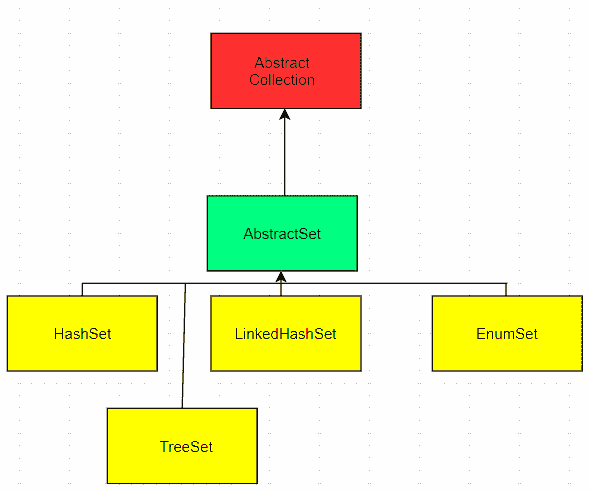

# Java `TreeSet`示例

> 原文： [https://javatutorial.net/java-treeset-example](https://javatutorial.net/java-treeset-example)

Java `TreeSet`类是一个基于[`TreeMap`](https://docs.oracle.com/javase/8/docs/api/java/util/TreeMap.html)的[`NavigableSet`](https://docs.oracle.com/javase/8/docs/api/java/util/NavigableSet.html)实现。 元素可以通过[`Comparator`](https://docs.oracle.com/javase/8/docs/api/java/util/Comparator.html)进行排序，也可以仅通过其自然排序进行排序。 在复杂度方面，此实现为所有基本操作（例如添加，删除，包含）提供了`log(n)`时间成本。


## 关于 Java 中的`TreeSet`的重要知识

*   `TreeSet`实现`SortedSe`接口，这意味着不允许重复值。
*   异构对象不能插入`TreeSet`中，因为它不允许这样做。 它将在运行时引发`classCastException`。
*   `TreeSet`类不保留元素的插入顺序，但是元素按其键排序。
*   `TreeSet`中的元素以升序和排序顺序存储。

## Java 中`TreeSet`的局限性

*   值必须是可比较的，或者需要在构造函数中提供比较器

## `TreeSet`的简单说明



继承图

## `TreeSet`中的构造方法

1.  `TreeSet()`：构造一个新的空树集，并根据其元素的自然顺序进行排序
2.  `TreeSet(Collection<? extends E> c)`：构造一个新树集，该树集包含指定集合中的元素，并根据其元素的自然顺序对其进行排序。
3.  `TreeSet(Comparator<? super E> comparator)`：构造一个空树集，该树集根据指定的比较器排序。
4.  `TreeSet(SortedSet<E> s)`：构造一个与指定集合完全相同的新树集，包括元素的顺序。

## `TreeSet`中的方法

1.  `void add(Object o)`：根据`TreeSet`中的某些排序顺序添加指定的元素。 不会添加重复项。
2.  `void clear()`：从树集中删除所有元素。
3.  `boolean contains(Object o)`：如果树集中存在给定元素，则返回`true`，否则返回`false`。
4.  `Object first()`：返回树集中的第一个元素。
5.  `Object last()`：返回树集中的最后一个元素。
6.  `boolean isEmpty()`：如果树集不包含任何元素，则返回`true`，否则返回`false`。
7.  `Object clone()`：返回树集的浅表副本。
8.  `int size()`：返回树集中的元素数量。
9.  `Iterator iterator()`：返回用于迭代树集元素的迭代器。
10.  `Comparator comparator()`：返回用于对`TreeSet`中的元素进行排序的`Comparator`。

有关所有方法的文档，请访问 [Oracle 官方文档页面](https://docs.oracle.com/javase/8/docs/api/?java/util/TreeSet.html)。

### 使用`add()`在`TreeSet`中添加元素

语法：`treeSet.add(Object o)`

```java
import java.io.*; 
import java.util.TreeSet; 

public class TreeSetExample { 
    public static void main(String args[]) 
    { 
        TreeSet<String> animals = new TreeSet<String>(); 

        animals.add("Elephant");
        animals.add("Tiger"); 
        animals.add("Lion");  

        System.out.println("TreeSet: " + animals); 
    } 
}
```

**输出**：

```java
TreeSet: [Elephant, Tiger, Lion]
```

### 使用`first()`和`last()`获取`TreeSet`的第一个和最后一个元素

语法：

`treeSet.first()`

`treeSet.last()`

```java
import java.io.*; 
import java.util.TreeSet; 

public class TreeSetExample { 
    public static void main(String args[]) 
    { 
        TreeSet<String> animals = new TreeSet<String>(); 

        animals.add("Elephant");
        animals.add("Tiger"); 
        animals.add("Lion");  

        System.out.println("TreeSet: " + animals); 
        System.out.println("The first element: " + animals.first());
        System.out.println("The last element: " + animals.last());
    } 
}
```

**输出**： 

```java
TreeSet: [Elephant, Tiger, Lion]
The first element: Elephant
The last element: Lion
```

### 使用`contains()`检查元素是否在树集中

语法：`treeSet.contains(Object element)`

```java
import java.io.*; 
import java.util.TreeSet; 

public class TreeSetExample { 
    public static void main(String args[]) 
    { 
        TreeSet<String> animals = new TreeSet<String>(); 

        animals.add("Elephant");
        animals.add("Tiger"); 
        animals.add("Lion");  

        System.out.println("TreeSet: " + animals);         
        System.out.println("Is 'Cat' in the tree set?" + animals.contains("Cat"));
        System.out.println("Is 'Lion' in the tree set?" + animals.contains("Lion"));
    } 
}
```

**输出**： 

```java
TreeSet: [Elephant, Tiger, Lion]
Is 'Cat' in the tree set? false
Is 'Lion' in the tree set? true
```

### 使用`remove()`从树集中删除一个元素

语法：`treeSet.remove(Object o)`

```java
import java.io.*; 
import java.util.TreeSet; 

public class TreeSetExample { 
    public static void main(String args[]) 
    { 
        TreeSet<String> animals = new TreeSet<String>(); 

        animals.add("Elephant");
        animals.add("Tiger"); 
        animals.add("Lion");  

        System.out.println("TreeSet: " + animals);
        animals.remove("Lion"); 
        animals.remove("Elephant"); 
        System.out.println("TreeSet: " + animals);
    } 
}
```

**输出**： 

```java
TreeSet: [Elephant, Tiger, Lion]
TreeSet: [Tiger]
```

### 使用`size()`获取树集中的元素数量

语法：`treeSet.size()`

```java
import java.util.*; 
import java.util.TreeSet; 

public class TreeSetExample { 
    public static void main(String args[]) 
    { 
        TreeSet<String> animals = new TreeSet<String>(); 

        animals.add("Elephant"); 
        animals.add("Tiger"); 
        animals.add("Lion"); 

        System.out.println("TreeSet: " + animals); 

        System.out.println("The size of the tree set is: " + animals.size()); 
    } 
}
```

**输出**： 

```java
TreeSet: [Elephant, Tiger, Lion]
The size of the tree set is: 3
```

### 使用`isEmpty()`检查树集是否为空

语法：`treeSet.isEmpty()`

```java
import java.util.*; 
import java.util.TreeSet; 

public class TreeSetExample { 
    public static void main(String args[]) 
    { 
        TreeSet<String> animals = new TreeSet<String>(); 

        animals.add("Elephant"); 
        animals.add("Tiger"); 
        animals.add("Lion"); 

        System.out.println("TreeSet: " + animals); 

        System.out.println("Empty: " + animals.isEmpty()); 

        animals.clear(); 

        System.out.println("Empty: " + animals.isEmpty()); 
    } 
}
```

**输出**： 

```java
TreeSet: [Elephant, Tiger, Lion]
Empty: false
Empty: true
```

## 使用`Iterator()`遍历树集

语法：

```java
Iterator iterator = ts.iterator();
while (iterator.hasNext())
    System.out.print(iterator.next());
```

```java
import java.util.Iterator; 
import java.util.TreeSet; 

public class TreeSetExample { 
    public static void main(String[] args) 
    { 
        TreeSet<String> 
            animals = new TreeSet<String>(); 
        animals.add("Elephant"); 
        animals.add("Tiger"); 
        animals.add("Lion"); 

        Iterator<String> iterator = animals.iterator(); 

        System.out.println("TreeSet: "); 
        System.out.println();
        while (iterator.hasNext()) 
            System.out.print(iterator.next() 
                             + "\n"); 
    } 
}
```

**输出**： 

```java
TreeSet: 
Elephant
Tiger
Lion
```

## 使用增强的`for`循环遍历树集

语法：

```java
for (String animal : animals)
    System.out.print(animal);
}
```

```java
import java.util.Iterator; 
import java.util.TreeSet; 

public class TreeSetExample { 
    public static void main(String[] args) 
    { 
        TreeSet<String> 
            animals = new TreeSet<String>(); 
        animals.add("Elephant"); 
        animals.add("Tiger"); 
        animals.add("Lion"); 

        System.out.println("TreeSet: "); 
        System.out.println();
        for (String animal : animals) 
            System.out.print(animal + "\n"); 
    } 
}
```

**输出**： 

```java
TreeSet:
Elephant
Tiger
Lion
```