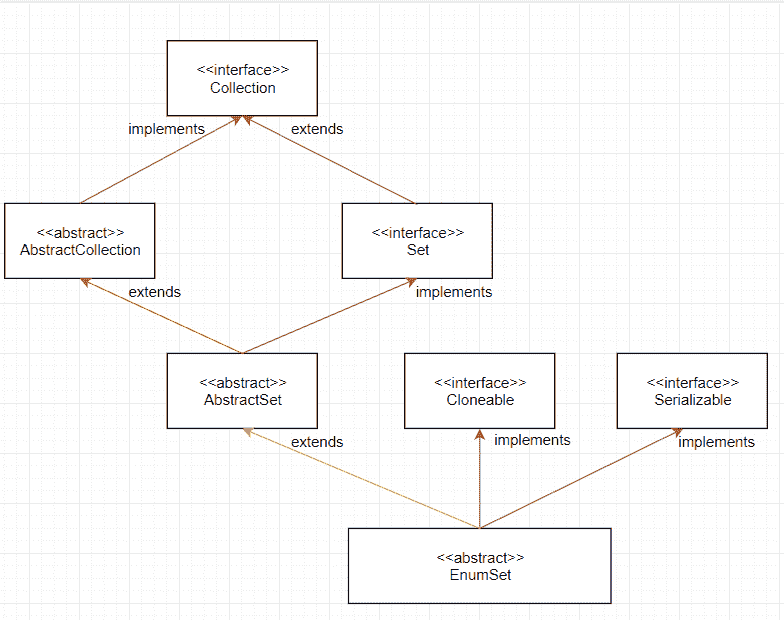

# Java EnumSet 示例

> 原文： [https://javatutorial.net/java-enumset-example](https://javatutorial.net/java-enumset-example)

Java EnumSet 类实现 [Set](https://docs.oracle.com/javase/7/docs/api/java/util/Set.html) 并将其与枚举类型一起使用。 EnumSet（顾名思义）只能包含枚举值，并且所有值都属于同一个枚举。 此外，EnumSet 不允许使用空值，这意味着它会抛出 NullPointerException 尝试添加空值。 它不是线程安全的，这意味着，如果需要，我们需要在外部进行同步。


## 继承图



枚举集

## 为什么使用 EnumSet

每当我们必须存储枚举值时，EnumSet 应该始终是最佳的 Set 实现。 所有基本操作都以固定的 time（1）复杂度执行，这非常快。 这是由于 EnumSet 类中的所有方法都是使用算术按位运算（&lt; &lt;，&gt; &gt;，&等）实现的。 总而言之，EnumSet 非常有效，因为它使用较少的内存并且速度也很快。

## EnumSet 中的方法

1.  EnumSet &lt; E &gt; close（）：返回当前集合的副本。
2.  静态&lt; E 扩展枚举&lt; E &gt; &gt; EnumSet &lt; E &gt; allOf（Class &lt; E &gt; elementType）：创建一个枚举集，该枚举集包含该枚举中的所有元素 指定的元素类型。
3.  静态&lt; E 扩展枚举&lt; E &gt; &gt; EnumSet &lt; E &gt; complementOf（EnumSet &lt; E &gt; s）：创建与指定元素类型相同的枚举集 枚举集合，最初包含此类型的所有元素，这些元素不是指定集合中包含的 _ 而不是 _。
4.  静态&lt; E 扩展枚举&lt; E &gt; &gt; EnumSet &lt; E &gt; copyOf（Collection &lt; E &gt; c）：创建一个从指定集合初始化的集合。
5.  静态&lt; E 扩展枚举&lt; E &gt; &gt; EnumSet &lt; E &gt; copyOf（EnumSet &lt; E &gt; s）：创建一个与指定元素类型相同的枚举集 set，包含相同的元素（如果有）。
6.  静态&lt; E 扩展（E e）的枚举&lt; E &gt; &gt; EnumSet &lt; E &gt;：创建一个包含指定元素的枚举集。
7.  静态&lt; E 扩展了枚举&lt; E &gt; &gt; EnumSet &lt; E &gt; range（E from，E to）：创建一个枚举集，该枚举集包含在指定范围内的所有元素 两个论点。

**从类 java.util 继承的方法。 [AbstractSet](https://docs.oracle.com/javase/7/docs/api/java/util/AbstractSet.html) ：**

[等于](https://docs.oracle.com/javase/7/docs/api/java/util/AbstractSet.html#equals(java.lang.Object))， [hashCode](https://docs.oracle.com/javase/7/docs/api/java/util/AbstractSet.html#hashCode()) ， [removeAll](https://docs.oracle.com/javase/7/docs/api/java/util/AbstractSet.html#removeAll(java.util.Collection))

**从类 java.util 继承的方法。** **[AbstractCollection](https://docs.oracle.com/javase/7/docs/api/java/util/AbstractCollection.html "class in java.util") ：**

[添加](https://docs.oracle.com/javase/7/docs/api/java/util/AbstractCollection.html#add(E))， [addAll](https://docs.oracle.com/javase/7/docs/api/java/util/AbstractCollection.html#addAll(java.util.Collection)) ，[清除](https://docs.oracle.com/javase/7/docs/api/java/util/AbstractCollection.html#clear())，[包含](https://docs.oracle.com/javase/7/docs/api/java/util/AbstractCollection.html#contains(java.lang.Object))， [containsAll](https://docs.oracle.com/javase/7/docs/api/java/util/AbstractCollection.html#containsAll(java.util.Collection)) ， [isEmpty](https://docs.oracle.com/javase/7/docs/api/java/util/AbstractCollection.html#isEmpty()) ，[迭代器](https://docs.oracle.com/javase/7/docs/api/java/util/AbstractCollection.html#iterator())，[删除](https://docs.oracle.com/javase/7/docs/api/java/util/AbstractCollection.html#remove(java.lang.Object))， [keepAll](https://docs.oracle.com/javase/7/docs/api/java/util/AbstractCollection.html#retainAll(java.util.Collection)) ，[大小](https://docs.oracle.com/javase/7/docs/api/java/util/AbstractCollection.html#size())， [toArray](https://docs.oracle.com/javase/7/docs/api/java/util/AbstractCollection.html#toArray()) ， [toArray](https://docs.oracle.com/javase/7/docs/api/java/util/AbstractCollection.html#toArray(T[])) ， [toString](https://docs.oracle.com/javase/7/docs/api/java/util/AbstractCollection.html#toString())

**从类 java.lang 继承的方法。** **[对象](https://docs.oracle.com/javase/7/docs/api/java/lang/Object.html "class in java.lang")：**

[完成](https://docs.oracle.com/javase/7/docs/api/java/lang/Object.html#finalize())， [getClass](https://docs.oracle.com/javase/7/docs/api/java/lang/Object.html#getClass()) ，[通知](https://docs.oracle.com/javase/7/docs/api/java/lang/Object.html#notify())， [notifyAll](https://docs.oracle.com/javase/7/docs/api/java/lang/Object.html#notifyAll()) ，[等待](https://docs.oracle.com/javase/7/docs/api/java/lang/Object.html#wait())，[等待](https://docs.oracle.com/javase/7/docs/api/java/lang/Object.html#wait(long))，[HTG12 等待

### 从接口 java.util 继承的方法。 [设置](https://docs.oracle.com/javase/7/docs/api/java/util/Set.html "interface in java.util")：

[添加](https://docs.oracle.com/javase/7/docs/api/java/util/Set.html#add(E))， [addAll](https://docs.oracle.com/javase/7/docs/api/java/util/Set.html#addAll(java.util.Collection)) ，[清除](https://docs.oracle.com/javase/7/docs/api/java/util/Set.html#clear())，[包含](https://docs.oracle.com/javase/7/docs/api/java/util/Set.html#contains(java.lang.Object))， [containsAll](https://docs.oracle.com/javase/7/docs/api/java/util/Set.html#containsAll(java.util.Collection)) ， [isEmpty](https://docs.oracle.com/javase/7/docs/api/java/util/Set.html#isEmpty()) ，[迭代器](https://docs.oracle.com/javase/7/docs/api/java/util/Set.html#iterator())，[删除](https://docs.oracle.com/javase/7/docs/api/java/util/Set.html#remove(java.lang.Object))， [keepAll](https://docs.oracle.com/javase/7/docs/api/java/util/Set.html#retainAll(java.util.Collection)) ，[大小](https://docs.oracle.com/javase/7/docs/api/java/util/Set.html#size())， [toArray](https://docs.oracle.com/javase/7/docs/api/java/util/Set.html#toArray()) ， [toArray](https://docs.oracle.com/javase/7/docs/api/java/util/Set.html#toArray(T[]))

有关 EnumSet 主要方法的更多信息，请随时访问原始 [Oracle 文档](https://docs.oracle.com/javase/7/docs/api/java/util/EnumSet.html)。

```java
import java.util.EnumSet; 

enum Student  
{ 
    NAME, AGE, MAJOR, YEAR 
}; 
public class EnumSetExample
{ 
    public static void main(String[] args)  
    { 
        // initializing set
        EnumSet<Student> set1, set2, set3;

        // populating the sets using of(E e)
        enumSet1 = EnumSet.of(Student.NAME, Student.MAJOR, Student.YEAR);
        // will get all of the properties that have not been initialized to the 
        // specified set (if any) 
        enumSet2 = EnumSet.complementOf(enumSet1); 
        // will get all of the properties that are present in the enumset
        enumSet3 = EnumSet.allOf(Student.class); 
        // will get from age to year and everything in between the properties of the 
        // enumset class
        enumSet4 = EnumSet.range(Student.AGE, Student.YEAR); 
        System.out.println("Set 1: " + enumSet1); 
        System.out.println("Set 2: " + enumSet2); 
        System.out.println("Set 3: " + enumSet3); 
        System.out.println("Set 4: " + enumSet4); 
    } 
}
```

**输出：** 

```java
Set 1: {NAME, MAJOR, YEAR}
Set 2: {AGE}
Set 3: {NAME, AGE, MAJOR, YEAR}
Set 4: {AGE, MAJOR, YEAR}
```