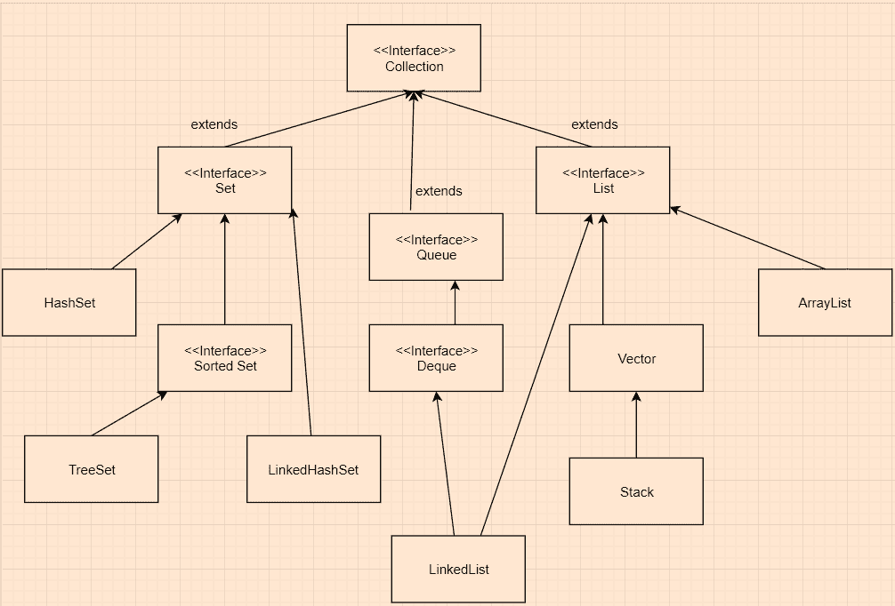

# Java `LinkedHashMap`示例

> 原文： [https://javatutorial.net/java-linkedhashmap-example](https://javatutorial.net/java-linkedhashmap-example)

`LinkedHashMap`是哈希表和链表的组合，以可预测的迭代顺序实现`Map`接口。[`HashMap`](https://javatutorial.net/java-hashmap-example)和`LinkedHashMap`之间的区别在于`LinkedHashMap`维护着一个双向链表，该列表允许来回扫描所有条目。 顺序保持不变，这意味着将键插入映射的顺序。 如果将重新插入到映射中，则顺序不会受到影响。`LinkedHashMap`提供所有可选的`Map`操作，还允许空元素。 就时间复杂度而言，就像[`HashMap`](https://javatutorial.net/java-hashmap-example)一样，它为诸如`add`，`contains`和`remove`之类的基本操作提供了恒定时间的性能。`LinkedHashMap`有两个影响其性能的参数，它们是初始容量和负载系数。 此类中的迭代不受容量的影响，因此在为初始容量选择过高的值方面，它比`HashMap`效率更高。


## 为什么`LinkedHashMap`有用

1.  它将按照输入到映射中的顺序遍历所有条目。
2.  就像在`HashMap`中一样，允许使用空值。
3.  使用双向链接的链表，使扫描效率更高。
4.  它对添加或访问项目的顺序有额外的了解。

## 继承图



继承图

## `LinkedHashMap`中的构造方法摘要

1.  `LinkedHashMap()`：构造一个空的插入顺序的 LinkedHashMap，其默认初始容量（16）和默认负载因子（0.75）。
2.  `LinkedHashMap(int initialCapacity)`：构造一个空的插入顺序的`LinkedHashMap`，并将容量设置为指定的 initialCapacity 参数和默认负载因子（0.75）。
3.  `LinkedHashMap(int initialCapacity, float loadFactor)`：使用指定的容量和负载因子构造一个空的插入顺序的`LinkedHashMap`。
4.  `LinkedHashMap(int initialCapacity, float loadFactor, boolean accessOrder)`：使用指定的初始容量，负载系数和排序方式构造一个空的`LinkedHashMap`实例。
5.  `LinkedHashMap(Map <? extends K, ? extends V> m)`：构造一个插入顺序的`LinkedHashMap`实例，该实例具有与指定映射相同的映射。

## `LinkedHashMap`类中的方法

1.  `void clear()`：从此映射中删除所有映射。
2.  `boolean containsValue(Object value)`：如果`LinkedHashMap`包含指定的值，则返回`true`，否则返回`false`。
3.  `Set<Map.Entry<K,V>> entrySet()`：返回当前映射中包含的映射的设置视图。
4.  `V get(Object key)`：返回指定键所映射到的值；如果该映射不包含该键的映射，则返回`null`。
5.  `V getOrDefault(Object key, V defaultValue)`：返回指定键所映射到的值；如果该映射不包含该键的映射，则返回`defaultValue`。
6.  `Set<K> keySet`：返回此映射中包含的键的设置视图。
7.  `protected boolean removeEldestEntry(Map. Entry<K, V> eldest)`：返回此映射中包含的值的集合视图。
8.  `void put(K key, V value)`：将指定的`Value`与指定的`Key`相关联。 （它是从 Java 中的`Map`类继承的）

有关`EnumSet`主要方法的更多信息，请随时访问原始 [Oracle 文档](https://docs.oracle.com/javase/8/docs/api/java/util/LinkedHashMap.html)。

### 获取`LinkedHashMap`的大小，检查其在特定键中是否包含某个值，并检查其是否为空，最后从`LinkedHashMap`中删除键：

```java
import java.util.*; 

public class LinkedHashMapExample
{ 
    public static void main(String args[]) 
    { 
        LinkedHashMap<String, String> student = 
                       new LinkedHashMap<String, String>(); 
        student.put("name", "Joe"); 
        student.put("major", "Computer Science"); 
        student.put("marital status", "Single"); 

        System.out.println(student); 
        // printing the value of the key called name
        System.out.println("Key 'name's value: " + student.get("name")); 

        // getting the size of the linkedHashMap (size() is inherited from Map)
        System.out.println("Size of the LinkedHashMap: " + student.size()); 

        // checking whether the map is empty or not
        System.out.println("Is the map empty: " + student.isEmpty()); 

        // checking whether the linkedHashMap contains the key specified as an argument
        System.out.println("Does it contain 'marital status'? "+  student.containsKey("marital status")); 

        // deleting/removing an element from the linkedHashMap works by using the 
        //remove method
        System.out.println("Deleting element 'name': " + student.remove("name")); 
    } 
}
```

**输出**：

```java
{name=Joe, major=Computer Science, marital status = Single}
Key 'name's value: Joe
Size of the LinkedHashMap: 3
Is the map empty: false
Does it contain 'marital status'? true
Deleting element 'name': "Joe"
```

### 使用`clear()`清除`LinkedHashMap`

```java
import java.util.*; 

public class LinkedHashMapExample { 
    public static void main(String[] args) 
    { 
        LinkedHashMap<String, String> student = 
        new LinkedHashMap<String, String>(); 

        li_hash_map.put("name", "Joe"); 
        li_hash_map.put("major", "Computer Science"); 
        li_hash_map.put("marital status", "Single"); 

        System.out.println("Current stage of linkedHashMap: " + student); 

        // Clearing the linked hash map using clear() 
        li_hash_map.clear(); 

        System.out.println("Stage after the clear() method: " + student); 
    } 
}
```

**输出**： 

```java
Current stage of linkedHashMap: {"name"="Joe", "major"="Computer Science", "marital status ="Single"}
Stage after the clear() method: {}
```