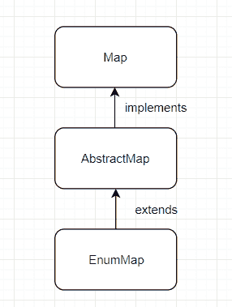

# Java `EnumMap`示例

> 原文： [https://javatutorial.net/java-enummap-example](https://javatutorial.net/java-enummap-example)

`EnumMap`类实现[`Map`](https://docs.oracle.com/javase/7/docs/api/java/util/Map.html)类，并允许使用枚举类型的键。 枚举映射按其键的自然顺序进行维护。 重要的是要注意不允许使用空键。 如果尝试添加空键，则将抛出[`NullPointerException`](https://docs.oracle.com/javase/7/docs/api/java/lang/NullPointerException.html) 。


但是，即使不允许`null`键，也允许`null`值。 由于所有可能的密钥都是预先已知的，因此可以更快地进行哈希计算。

*   `EnumMap`不同步。
*   `EnumMap`比[`HashMap`](https://javatutorial.net/java-hashmap-example)快得多

## `EnumMap`图



`EnumMap`继承图

## `EnumMap`中的构造方法

1.  `EnumMap(Class<K> keyType)`：使用指定的密钥类型创建一个空的枚举映射。
2.  `EnumMap(EnumMap<K, ? extends V> m)`：创建一个与指定枚举图具有相同键类型的枚举图，最初包含相同的映射（如果有）。
3.  `EnumMap(Map<K, ? extends V> m)`：创建一个从指定映射初始化的枚举映射。

## `EnumMap`中的方法

1.  `void clear()`：从此映射中删除所有映射。
2.  `EnumMap<K, V> clone()`：返回一个`EnumMap`，它表示另一个副本。
3.  `boolean containsKey(Object key)`：如果当前映射包含指定的键，则返回 true，否则返回 false。
4.  `boolean containsValue(Object value)`：如果当前映射包含指定值，则返回 true，否则返回 false。
5.  `boolean equals(Object o)`：比较指定对象与当前映射是否相等。
6.  `V get(Object key)`：返回指定键所映射到的值；如果键不包含任何值，则返回 null。
7.  `int hashCode()`：返回当前地图的哈希码。
8.  `V put(K key, V value)`：将指定的值映射到指定的键。
9.  `V remove(Object key)`：从地图上移除指定的键。
10. `int size()`：返回地图中的对数。

有关所有方法的文档，请访问 [Oracle 官方文档页面](https://docs.oracle.com/javase/7/docs/api/java/util/EnumMap.html)。

### 一个程序中某些方法的示例

```java
import java.util.EnumMap; 

public class EnumMapExample
{ 
    public enum Hardware 
    { 
        MONITOR, MOUSE, KEYBOARD;
    } 

    public static void main(String args[])  
    {     
        EnumMap<Hardware, String> hardwareMapInstance = new EnumMap<Hardware, String>(Hardware.class); 

        /* hardwareMapInstance is empty. Let's populate it. */

        hardwareMapInstance.put(Hardware.MONITOR, "Samsung"); 
        hardwareMapInstance.put(Hardware.MOUSE, "Logitech g403"); 
        hardwareMapInstance.put(Hardware.KEYBOARD, "Razer"); 

        /* After having put items, let's see the map size. */
        System.out.println("Size: " + hardwareMapInstance.size()); // we could use .size() to loop through an enummap

        /* This would print the EnumMap in natural order. (MONITOR => MOUSE => KEYBOARD) */
        System.out.println("EnumMap: " + hardwareMapInstance); 

        /* Getting a specific value from an EnumMap. */
        System.out.println("Key: " + Hardware.MONITOR +" Value: " + hardwareMapInstance.get(Hardware.MONITOR)); 

        /* Checking if the EnumMap contains a particular key. */
        System.out.println("Does Hardware has " + Hardware.MOUSE + ": " + hardwareMapInstance.containsKey(Hardware.MOUSE)); 

        /* Checking if EnumMap contains a particular value */
        System.out.println("Does Hardware has " + Hardware.KEYBOARD + " : " + hardwareMapInstance.containsValue("Razer")); 

        /* Let's clear the EnumMap */
        System.out.println("Clearing the map...");
        hardwareMapInstance.clear();

        /* Let's get the size now again */
        System.out.println("The size after clear() is: " + hardwareMapInstance.size());
    } 
}
```

**输出**：

```java
Size: 3
EnumMap: {MONITOR=Samsung, MOUSE=Logitech g403, KEYBOARD=Razer}
Key: MONITOR Value: Samsung
Does Hardware has MOUSE: true
Does Hardware has KEYBOARD : true
Clearing the map...
The size after clear() is: 0
```