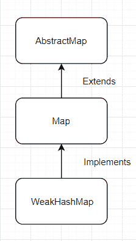

# Java `WeakHashMap`示例

> 原文： [https://javatutorial.net/java-weakhashmap-example](https://javatutorial.net/java-weakhashmap-example)

Java 中的`WeakHashMap`实现了`Map`接口，并表示一个具有弱键的哈希表。 如果按键不是通常使用的，则将从地图中自动删除该条目。 这就是它与其他`Map`实现的区别。


支持空值和非空值，并且在初始容量和负载因子方面，其性能类似于[`HashMap`](https://javatutorial.net/java-hashmap-example)类。

默认情况下，此类不同步。

**[`HashMap`](https://javatutorial.net/java-hashmap-example)和`WeakHashMap`之间的主要区别**：

1.  [`HashMap`](https://javatutorial.net/java-hashmap-example) 具有强引用，而`WeakHashMap`具有[弱引用](https://javatutorial.net/weak-references-in-java)。
2.  [`HashMap`](https://javatutorial.net/java-hashmap-example)在垃圾收集器中占主导地位。
3.  `WeakHashMap`类中没有`clone()`方法，因为它仅实现`Map`接口。



`WeakHashMap`实现`Map`并扩展`AbstractMap`。

## `WeakHashMap`中的构造方法

1.  `WeakHashMap()`：创建一个空的`WeakHashMap`，默认初始容量为 16，负载系数为 0.75。
2.  `WeakHashMap(int initialCapacity)`：创建具有指定容量的空`WeakHashMap`。
3.  `WeakHashMap(int initialCapacity, float loadFactor)`：创建具有指定容量和负载因子的空`WeakHashMap`。
4.  `WeakHashMap(Map<? extends K, ? extends V> m)`：创建一个具有与指定映射相同的映射的新`WeakHashMap`。

## `WeakHashMap`中的方法

1.  `void clear()`：从当前映射中删除所有映射。
2.  `boolean containsKey(Object key)`：如果当前映射包含指定键的映射，则返回`true`。
3.  `boolean containsValue(Object value)`：如果当前映射中有映射到指定值的一个或多个键，则返回`true`。
4.  `V get(Object key)`：返回指定键所映射到的值；如果该映射不包含指定键的映射，则返回`null`。
5.  `boolean isEmpty()`：如果映射为空，则返回`true`，否则返回`false`。
6.  `V put（K key, V value)`：将指定值“放入”当前映射中的指定键。
7.  `V remove(Object key)`：如果存在，则从此`WeakHashMap`中删除键的映射。
8.  `int size()`：返回映射中的映射数。

有关所有方法的文档，请访问 [Oracle 官方文档页面](https://docs.oracle.com/javase/7/docs/api/java/util/WeakHashMap.html)。

## 一个执行上述某些方法的示例程序：

```java
// importing the necessary library which is under java.util.*
import java.util.*; 

public class WeakHashMapExample 
{ 
    public static void main(String args[])throws Exception 
    { 
        // declaration of an instance of WeakHashMap that takes a number as a key and string as a value
        Map<Number, String> animals = new WeakHashMap<Number, String>(); 
        // populating the map
        animals.put(1, "Elephant"); 
        animals.put(2, "Tiger"); 
        animals.put(3, "Lion"); 

        // condition that checks for a certain value
        if(animals.containsValue("Tiger")) 
            System.out.println("Tiger exists."); 

        // condition that checks for a certain key
        if(animals.containsKey(3)) 
            System.out.println("'3' key exists."); 

        // removing a specific key
        animals.remove(1);

        System.out.println(animals);

        // deletes all mappings
        animals.clear(); 

        // check if weakhashmap is empty
        if(animals.isEmpty()) 
            System.out.println(animals); 
    }
}
```

**输出**：

```java
Tiger exists.
'3' key exists.
{3=Lion, 2=Tiger}
{}
```