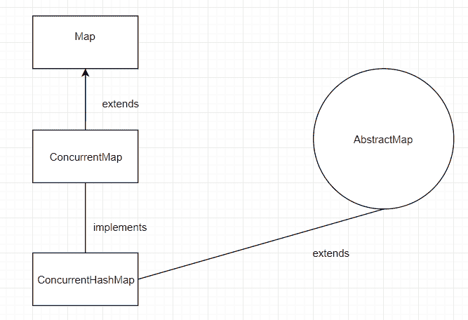

# Java `ConcurrentMap`示例

> 原文： [https://javatutorial.net/java-concurrentmap-example](https://javatutorial.net/java-concurrentmap-example)

即使[`Map`](https://docs.oracle.com/javase/7/docs/api/java/util/Map.html) 由许多类实现，但其中许多不是线程安全的，或者其中一些效率不高。 这就是为什么在 Java 1.5 中引入`ConcurrentMap`的原因。 它是线程安全且高效的。


### 覆盖的默认实现：

*   `count`
*   `replaceAll`
*   `forEach`
*   `getOrDefault`
*   `computerIfAbsent`
*   `computerIfPresent`

`ConcurrentMap`由表示为表存储桶的节点数组组成，它们在第一次插入后初始化。

## `ConcurrentMap`和[`HashMap`](https://javatutorial.net/java-hashmap-example)之间的效率比较

*   如果要尽快处理数据，则必须使用所有线程，因此这意味着`ConcurrentMap`在这里更有效。
*   如果只需要单线程访问，则`HashMap`更快。
*   如果由`HashMap`实现，则添加方法的速度快 3 倍。
*   如果由`ConcurrentMap`实现，则 get 方法会更快。

如果程序需要多个线程访问，则`ConcurrentMap`是更好的选择。 但是，如果程序仅使用 1 个线程，则`HashMap`将是更好的选择。



`ConcurrentMap`

## `ConcurrentMap`中的方法

1.  `default V compute(K key, BiFunction<? super K, ? super V, ? extends V> remappingFunction)`：尝试计算指定键及其当前映射值的映射。
2.  `default V computeIfAbsent(K key, Function<? super K, ? extends V> mappingFunction)`：如果作为参数给出的键与值不相关（或为`null`），则尝试计算其值并输入 进入此映射，除非为`null`。
3.  `default V computeIfPresent(K key, BiFunction<? super K, ? super V, ? extends V> remappingFunction)`：如果指定键的值存在且非空，则尝试计算新映射，给定键及其当前映射值。
4.  `default void forEach(BiConsumer<? super K, ? super V> action)`：对当前映射中的每个条目执行给定的操作，直到所有条目都已处理。
5.  `default V getOrDefault(Object key, V defaultValue)`：返回指定键所映射到的值或如果映射不包含该键的映射关系，则返回`defaultValue`（作为第二个参数）。
6.  `default V merge(K key, V value, BiFunction<? super V, ? super V, ? extends V> remappingFunction)`：如果键尚未与值关联或与`null`关联，则它将关联指定的非`null`值。
7.  `V putIfAbsent(K key, V value)`：如果指定的键尚未与值关联，则将其与给定的值关联。
8.  `boolean remove(Object key, Object value)`：仅当当前映射到给定值时，才删除键的条目。
9.  `V replace(K key, V value)`：仅当当前映射到某个值时才替换键的条目。
10.  `boolean replace(K key, V oldValue, V newValue)`：仅当当前映射到给定值时才替换项的条目。

有关 EnumSet 主要方法的更多信息，请随时访问原始 [Oracle 文档](https://docs.oracle.com/javase/8/docs/api/java/util/concurrent/ConcurrentMap.html)。

## 使用上述某些方法的示例程序

```java
import java.util.concurrent.*; 
class ConcurrentHashMapExample { 
    public static void main(String[] args) 
    { 
        ConcurrentHashMap conCurrHashMap = new ConcurrentHashMap(); 
        conCurrHashMap.put(100, "Elephant"); 
        conCurrHashMap.put(101, "Tiger"); 
        conCurrHashMap.put(102, "Lion"); 
        conCurrHashMap.put(103, "Cow"); 

        // since 103 already exists, this won't work
        conCurrHashMap.putIfAbsent(103, "Goat"); 

        conCurrHashMap.remove(103, "Goat"); 
        System.out.println("After removal: " + conCurrHashMap);

        // since 103 was removed, this now works
        conCurrHashMap.putIfAbsent(103, "Leopard"); 
        System.out.println("After put: " + conCurrHashMap);

        // changing Goat to Cheetah
        conCurrHashMap.replace(103, "Leopard", "Cheetah"); 
        System.out.println("Final: " + conCurrHashMap); 
    } 
}
```

**输出**：

```java
After removal: {100=Elephant, 101=Tiger, 102=Lion, 103=Cow}
After put: {100=Elephant, 101=Tiger, 102=Lion, 103=Cow}
Final: {100=Elephant, 101=Tiger, 102=Lion, 103=Cow}
```