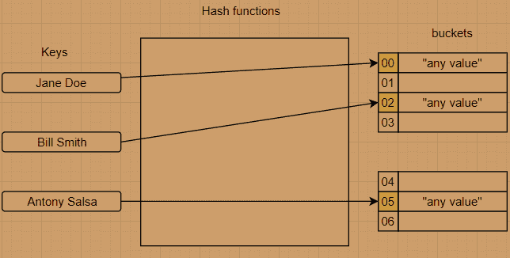

# Java `Hashtable`示例

> 原文： [https://javatutorial.net/java-hashtable-example](https://javatutorial.net/java-hashtable-example)

`Hashtable`实现一个哈希表（顾名思义），并将键映射到值（例如[`LinkedHashMap`](https://javatutorial.net/java-linkedhashmap-example)）。`Hashtable`类允许将非`null`对象用作键或值。就像[`HashMap`](https://javatutorial.net/java-hashmap-example)一样，`Hashtable`有两个影响其性能的参数：初始容量和负载因子。 容量是哈希表中存储桶的数量，初始容量是创建哈希表时存在的容量。 负载因子是在容量自身增加之前允许哈希表获得多大容量的度量。


## 它是如何工作的？

哈希表使用哈希函数，其目的是计算到插槽（或存储桶）数组中的索引，从中可以找到正确的值。



哈希表工作流程

## 好处

*   平均查找成本与表中存储的元素数量无关。
*   允许任意插入和删除键值对。
*   在许多情况下搜索树或任何其他表时效率更高。

## `Hashtable`中的构造方法摘要

1.  `Hashtable()`：构造一个具有默认初始容量（11）（与`HashMap`或`LinkedHashMap`不同）和负载因子（0.75）的新哈希表。
2.  `Hashtable(int initialCapacity)`：构造一个具有指定容量和默认负载因子（0.75）的新哈希表。
3.  `Hashtable(int initialCapacity, float loadFactor)`：构造一个具有指定容量和指定负载因子的新哈希表。
4.  `Hashtable (Map<? extends K, ? extends V> t)`：使用与给定`Map`相同的映射构造一个新的哈希表。

## `Hashtable`类中的方法

1.  `void clear`：清除当前哈希表，该哈希表删除/删除所有键/值对。
2.  `Object clone()`：创建此哈希表的浅表副本。
3.  `V contains(Object value)`：测试当前值是否映射到哈希表中的任何键。
4.  `boolean containsKey(Object key)`：测试哈希表中是否存在指定的键。
5.  `boolean containsValue(Object value)`：测试指定的值是否映射到哈希表中的任何键。
6.  `boolean equals(Object o)`：将指定的`Object`与该`Map`比较是否相等。
7.  `V get(Object key)`：返回键所映射到的值；如果此表/映射不包含键的映射关系，则返回`null`。
8.  `int hashCode()`：根据 Map 接口中的定义，返回此表/地图的哈希码值。
9.  `boolean isEmpty()`：测试哈希表是否没有键映射到值。
10.  `V put(K key, V value)`：将指定的值映射到指定的键。
11.  `V remove(Object key)`：从此哈希表中删除指定的键。
12.  `V replace(K key, V value)`：仅当当前映射到某个值时，才替换指定键的条目。
13.  `int size()`：返回此哈希表中的键数。

有关`Hashtable`类的主要方法的更多信息，请随时访问原始 [Oracle 文档](https://docs.oracle.com/javase/8/docs/api/java/util/Hashtable.html)。

### 从`Hashtable`中删除所有键并克隆`Hashtable`

```java
import java.util.*; 
class HashTableExample { 
    public static void main(String[] arg) 
    { 
        Hashtable<Integer, String> hashTable = 
                      new Hashtable<Integer, String>(); 

        Hashtable<Integer, String> hashTableCopy = 
                      new Hashtable<Integer, String>(); 

        hashTable.put(1, "javatutorial"); 
        hashTable.put(2, "dot"); 
        hashTable.put(3, "net"); 

        // create a clone of hashtable 'hashTable'
        hashTableCopy= (Hashtable<Integer, String>)hashTable.clone(); 

        System.out.println("values in clone: " + hashTableCopy); 

        hashTable.clear(); 

        System.out.println("after clearing: " + hashTable); 
    } 
}
```

**输出**：

```java
values in clone: {1="javatutorial", 2="dot", 3="net"}
after clearing: {}
```