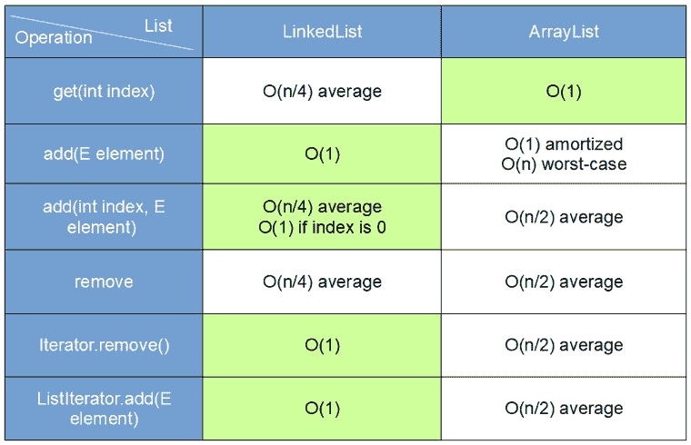

# Java 中`ArrayList`和`LinkedList`之间的区别

> 原文： [https://javatutorial.net/difference-between-arraylist-and-linkedlist-in-java](https://javatutorial.net/difference-between-arraylist-and-linkedlist-in-java)

本文介绍了[`ArrayList`](https://javatutorial.net/java-arraylist-example)和[`LinkedList`](https://javatutorial.net/java-linkedlist-example)之间的区别，在这种情况下，我们应该优先选择一个。

由于继承了相同的接口 – `List`，因此`ArrayList`和`LinkedList`共享相同的属性。 但是`ArrayList`和`LinkedList`有什么区别？ 简单地说 – `ArrayList`对于一次写入多次读取操作很有用，但不利于从前端或中间进行添加/删除。 另一方面，`LinkedList`更适合插入和删除数据。

## 性能表现

下表通过对`LinkedList`和`ArrayList`执行不同的操作来显示平均算法复杂度



`ArrayList`与`LinkedList`操作的复杂度

## [`ArrayList`](https://javatutorial.net/java-arraylist-example)与[`LinkedList`](https://javatutorial.net/java-linkedlist-example)性能示例

下面的示例演示使用`ArrayList`和`LinkedList`上的相同数据进行`add`，`set`和`remove`操作的性能

```java
package javatutorial.net;

import java.util.ArrayList;
import java.util.LinkedList;
import java.util.List;

public class ArrayListVsLinkedListExample {

	private static final int ELCOUNT = 50000;

	public static void main(String[] args) {

		List<String> alist = new ArrayList<String>();
		List<String> llist = new LinkedList<String>();

		// Insertion ////////////////

		// ArrayList
		long start = System.currentTimeMillis();
		for (int i = 0; i < ELCOUNT; i++) {
			alist.add("element #" + i);
		}
		long totalTimeMs = System.currentTimeMillis() - start;
		System.out.println("Adding 50K elements in ArrayList took " + totalTimeMs + " ms");

		// LinkedList
		start = System.currentTimeMillis();
		for (int i = 0; i < ELCOUNT; i++) {
			llist.add("element #" + i);
		}
		totalTimeMs = System.currentTimeMillis() - start;
		System.out.println("Adding 50K elements in LinkedList took " + totalTimeMs + " ms");

		// Modification /////////////

		// ArrayList
		start = System.currentTimeMillis();
		for (int i = 0; i < ELCOUNT; i++) {
			alist.set(i, "modified element #" + i);
		}
		totalTimeMs = System.currentTimeMillis() - start;
		System.out.println("Modifying 50K elements in ArrayList took " + totalTimeMs + " ms");

		// LinkedList
		start = System.currentTimeMillis();
		for (int i = 0; i < ELCOUNT; i++) {
			llist.set(i, "modified element #" + i);
		}
		totalTimeMs = System.currentTimeMillis() - start;
		System.out.println("Modifying 50K elements in LinkedList took " + totalTimeMs + " ms");

		// Removal //////////////////

		System.out.println("ArrayList size before removal " + alist.size());
		System.out.println("LinkedList size before removal " + llist.size());

		// ArrayList
		start = System.currentTimeMillis();
		for (int i = 0; i < ELCOUNT; i++) {
			alist.remove(0);
		}
		totalTimeMs = System.currentTimeMillis() - start;
		System.out.println("Removing 50K elements in ArrayList took " + totalTimeMs + " ms");

		// LinkedList
		start = System.currentTimeMillis();
		for (int i = 0; i < ELCOUNT; i++) {
			llist.remove(0);
		}
		totalTimeMs = System.currentTimeMillis() - start;
		System.out.println("Removing 50K elements in LinkedList took " + totalTimeMs + " ms");

		System.out.println("ArrayList size after removal " + alist.size());
		System.out.println("LinkedList size after removal " + llist.size());
	}

}

```

这是执行示例代码的输出。 结果将因不同的计算机配置而异

```java
Adding 50K elements in ArrayList took 10 ms
Adding 50K elements in LinkedList took 7 ms
Modifying 50K elements in ArrayList took 7 ms
Modifying 50K elements in LinkedList took 6315 ms
ArrayList size before removal 50000
LinkedList size before removal 50000
Removing 50K elements in ArrayList took 135 ms
Removing 50K elements in LinkedList took 4 ms
ArrayList size after removal 0
LinkedList size after removal 0
```

如您在上面的输出中看到的：

*   `LinkedList`在访问和修改元素方面明显较慢
*   `LinkedList`添加元素的速度较慢
*   `LinkedList`从列表开头删除元素的速度要快得多
*   `ArrayList`插入新元素的速度较慢
*   `ArrayList`在访问和修改元素方面明显更快
*   `ArrayList`从列表开头删除元素的速度明显较慢

## 结论

在所有情况下，算法复杂度和运算性能都不是恒定的。 您必须考虑两个主要因素 - 列表的大小以及我们使用的元素在列表中的放置位置（在开头，中间或结尾）。 唯一不变的规则是：如果要更快地检索元素，请使用`ArrayList`，如果要更快地处理数据，请使用`LinkedList`。