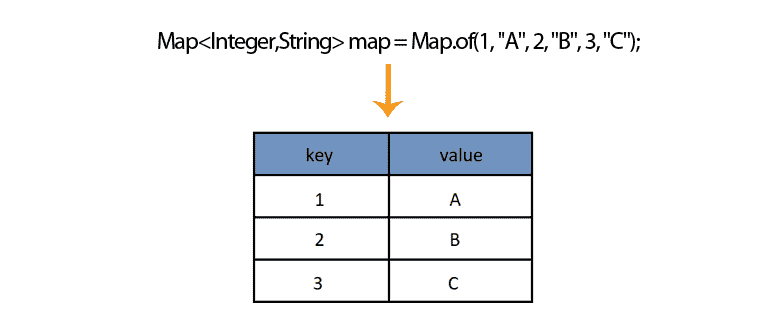

# Java `HashMap`内联初始化

> 原文： [https://javatutorial.net/java-hashmap-inline-initialization](https://javatutorial.net/java-hashmap-inline-initialization)

下面的示例演示如何使用标准方法和内联方法初始化 Java [HashMap](https://javatutorial.net/java-hashmap-example) 。

## 为什么我们需要直接初始化[`HashMap`](https://javatutorial.net/java-hashmap-example) ？

尽管`Map`被广泛用于以动态方式收集和处理数据，但通常您需要创建一个带有预定义键和值的小映射，以测试一种简短的算法或您正在研究的概念。 手动初始化 Java `HashMap`的另一个用例是测试程序或算法如何使用特定值执行。 在编写简短的演示程序时，您很可能更愿意直接初始化映射，而不是从文件或某种流中读取数据并用值填充映射。 您可以想象，与单行`HashMap`初始化相比，您需要花费更多的精力。



Java 初始化`HashMap`

## 初始化`HashMap`的必要方法

直接的解决方案是声明一个`Map`，然后只需`put()`进入`Map`。 我们将使用此示例作为参考，以与其他更节省类型的技术进行比较。

```java
Map<String,String> mymap = new HashMap<String, String>();
test.put("A","one");
test.put("B","two");
```

如您在上面的示例中看到的，首先创建一个映射对象，然后在其中放置条目。 这里要提到的另一重要事项是，通过使用此方法，您可以创建动态映射，并且可以编辑，删除或创建新条目。

## 使用匿名子类初始化`HashMap`

这将创建`HashMap`的匿名子类，其实例初始化程序将这些值放入。 换句话说，它将创建一个继承自`HashMap`的新类。 这是创建和初始化动态`HashMap`的最短方法

```java
Map<Integer, String> mymap = new HashMap<Integer, String>() {
	{
		put(1, "one");
		put(2, "two");
	}
};
```

## 初始化不可变映射

与动态映射（如上例所示）相比，不可变映射是不可编辑的。 这意味着您不能在其中添加新条目，删除条目或更新它们。 如果您想测试一个简单的算法，它们将对您很好。

## 在 Java SE 8 和更早版本中初始化不可变映射

以下示例演示了如何在 Java 8 或更早版本的 Java 中初始化不可变`Map`：

```java
Map<Integer,String> mymap = new HashMap<>();
mymap.put(1,"one");
mymap.put(2,"two");
mymap.put(3,"three");
Map<Integer,String> immutableMap = Collections.unmodifiableMap(mymap);
```

如您所见，您以老式方式创建和初始化`Map`。 使映射不可变的原因是对`Collections.unmodifiableMap(Map map)`的调用。 好吧，它看起来不太像内联初始化。 不用担心，下一个示例可以。

## 以 Guava 方式内联初始化`HashMap`

[Guava](https://github.com/google/guava) 是第一个引入真正的单行`Map`初始化的人。 参见下面的例子

```java
Map<String, Integer> left = ImmutableMap.of("a", 1, "b", 2, "c", 3);
```

## 用 Java 9 方式内联初始化`HashMap`

最后，在 Java 9 中，我们可以使用单行语句来初始化不可变的`HashMap`，而无需第三方库。

```java
Map<Integer,String> map = Map.of(1, "A", 2, "B", 3, "C");
```

您可能需要阅读完整的 [Java 9 不可变映射示例](https://javatutorial.net/java-9-immutable-map-example)，以了解更多详细信息。