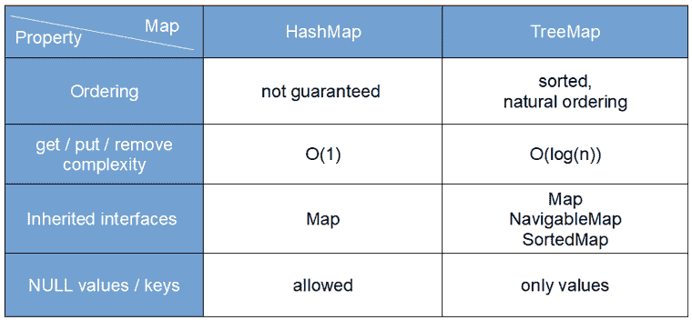

# Java 中`HashMap`和`TreeMap`之间的区别

> 原文： [https://javatutorial.net/difference-between-hashmap-and-treemap-in-java](https://javatutorial.net/difference-between-hashmap-and-treemap-in-java)

在本文中，我将解释 java [`HashMap`](https://javatutorial.net/java-hashmap-example)和 java [`TreeMap`](https://javatutorial.net/java-treemap-example)之间的区别

尽管两者都实现了`Map`接口并提供了大多数相同的功能，但是`HashMap`和`TreeMap`具有不同的实现。 最重要的区别是通过条目进行[迭代的顺序](https://javatutorial.net/java-iterate-hashmap-example)。

查看下表，直观了解`HashMap`和`TreeMap`之间的区别



Java 中`HashMap`和`TreeMap`之间的区别

## `HashMap`和`TreeMap`之间的主要区别

`TreeMap`是[`SortedMap`](https://javatutorial.net/java-sortedmap-example)的示例，由红黑树实现，这意味着对键的顺序进行了排序。 遍历键时，您可以依靠它们会井然有序的事实。 键的顺序由元素的`compareTo()`方法或外部提供的[比较器](https://javatutorial.net/java-comparator-example)确定。

`HashMap`则不做任何保证。 它由哈希表实现。 因此，当迭代`HashMap`的键时，您不能确定它们将以什么顺序排列。

看下面的例子：

```java
package javatutorial.net;

import java.util.HashMap;
import java.util.Map;
import java.util.TreeMap;

public class HashMapVsTreeMapExample {

	public static void main(String[] args) {
		Map<Integer, String> hMap = new HashMap<Integer, String>();
		hMap.put(5, "A");
		hMap.put(11, "C");
		hMap.put(4, "Z");
		hMap.put(77, "Y");
		hMap.put(9, "P");
		hMap.put(66, "Q");
		hMap.put(0, "R");

		Map<Integer, String> tMap = new TreeMap<Integer, String>();
		tMap.put(5, "A");
		tMap.put(11, "C");
		tMap.put(4, "Z");
		tMap.put(77, "Y");
		tMap.put(9, "P");
		tMap.put(66, "Q");
		tMap.put(0, "R");

		System.out.println("HashMap iteration order =======");
		for (Map.Entry<Integer, String> entry : hMap.entrySet()) {
			System.out.println(entry.getKey() + " = " + entry.getValue());
		}

		System.out.println("\nTreeMap iteration order =======");
		for (Map.Entry<Integer, String> entry : tMap.entrySet()) {
			System.out.println(entry.getKey() + " = " + entry.getValue());
		}
	}
}

```

现在看一下该程序的输出：

```java
HashMap iteration order =======
0 = R
66 = Q
4 = Z
5 = A
9 = P
11 = C
77 = Y

TreeMap iteration order =======
0 = R
4 = Z
5 = A
9 = P
11 = C
66 = Q
77 = Y
```

如您所见，在`HashMap`上进行迭代时，我们以“随机”顺序获得条目。 另一方面，`TreeMap `迭代以其自然顺序返回条目。

## 实现复杂度差异

由于`HashMap`实现的复杂度为`O(1)`，因此通常可以认为`HashMap`效率更高，因此无论您何时在乎键的顺序，都可以使用它。 另一方面，`TreeMap`中获取，放置和删除操作的复杂度为 `O(log n)`

## 允许的键和值的差异

另一个重要的区别是，`HashMap`允许使用`null`键和值，而`TreeMap`仅允许将`null`用作其值。

## 同步（无差异）

请注意，两个实现都不同步，这意味着在这些映射上进行操作不是线程安全的。 如果需要线程安全的`Map`，则可能要从`java.util.concurrent`包中选择`ConcurrentHashMap`类。 这是`Map`的线程安全实现，比`Collections.synchronizedMap(Map<K,V> m)`提供更好的并发性