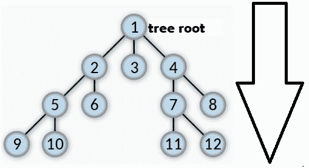
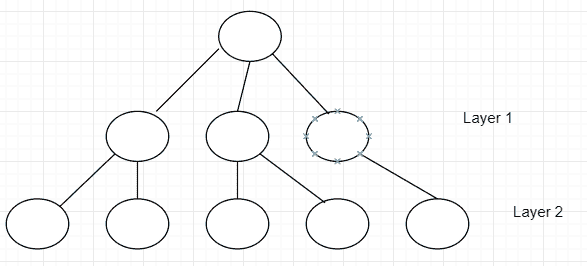
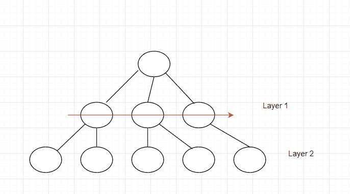
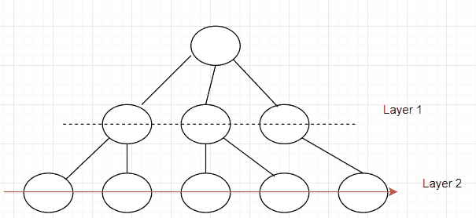

# Java 广度优先搜索示例

> 原文： [https://javatutorial.net/breadth-first-search-example-java](https://javatutorial.net/breadth-first-search-example-java)

当涉及从给定数据结构访问数据时，搜索或遍历非常重要。 在这些数据结构中，例如[图](https://javatutorial.net/graphs-java-example)和树，有多种遍历/搜索元素的方法。


广度优先搜索是这些方法的一个示例。 BFS 是一种遍历树或图形的算法，它从树的根（树中的最高节点）开始或仅从顶部开始，并在当前深度扫描所有相邻节点，然后再继续移动到节点或元素。 下一个深度级别。

简而言之，BFS 必须完成一层，然后继续进行下一层直到没有剩余的任何层。

BFS 使用与深度优先搜索完全相反的工作流程，反之亦然。

在 BFS 和 DFS 之间的实现方面，一个很大的不同是 BFS 使用队列，而 DFS 使用栈。



BFS 的工作流程

## BFS 的实现

实现 BFS 时要遵循两个简单的规则：

1.  访问给定层上的每个元素
2.  移至下一层

一个例子：



在继续进行第 2 层之前，必须先通过第 1 层。



在那之后，这是应该怎么做的：



**伪代码** 

```java
public void breadthFirstSearch(Graph G, Object S)
// G => Graph ; S => Source node
{
     define a queue named as Queue;
     insert the source node in the Q
     mark s as visited

     perform a while loop that keeps looping until the queue is not empty
        removing the current element from the queue as it will be visited now

        perform a for loop that goes through all neighbours of the current element
            if condition that checks if the current element/node/vertex is not visited
                if it has not been visited, enqueue it and mark it as visited
}
```

**实际代码实现**

```java
public void BFS(int s, int l) 
    { 
        // create an array that holds boolean values that will have length 'l'
        boolean visited[] = new boolean[l]; 

        // create a queue
        LinkedList<Integer> q = new LinkedList<Integer>(); 

        // mark the current node as visited and add it to the queue
        visited[s]=true; 
        q.add(s); 

        while (q.size() != 0) 
        { 
            // dequeuing a vertex from queue 
            s = q.poll(); 

            // get all adjacent vertices of the dequeued vertex  if a adjacent has not 
            // been visited, then mark it visited and enqueue it 
            Iterator<Integer> k = adj[s].listIterator(); 
            while (k.hasNext()) 
            { 
                int j = k.next(); 
                if (!visited[j]) 
                { 
                    visited[j] = true; 
                    q.add(j); 
                } 
            } 
        } 
    }
```