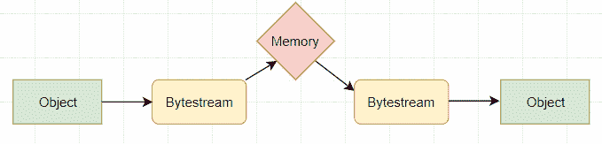
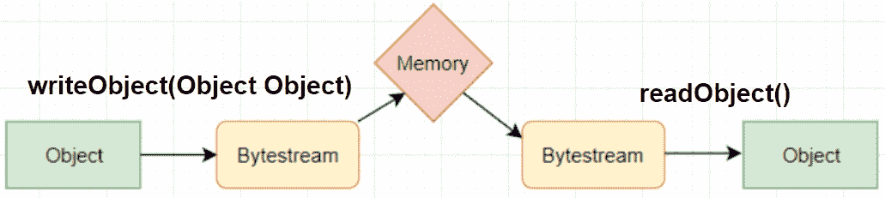

# Java 序列化示例

> 原文： [https://javatutorial.net/java-serialization-example](https://javatutorial.net/java-serialization-example)

序列化的对象。 这意味着什么？ Java 提供了一种功能，该功能将[对象](https://javatutorial.net/java-objects-and-classes-tutorial)表示为字节序列，其中包括对象的数据以及有关对象类型和该对象中存储的数据类型的信息。


将序列化的对象写入文件后，可以稍后对其进行反序列化，这反过来意味着–表示对象及其数据的类型信息和字节可用于在内存中重新创建对象。



创建的字节流与平台无关。 这意味着，如果对象在一个平台上序列化，则可以在另一个平台上反序列化。

`ObjectInputStream`和`ObjectOutputStrem`是高级流，其中包含用于序列化和反序列化对象的方法。

`ObjectInputStream`提供了一个称为`readObject()`的方法，该方法可检索对象并将其反序列化。 它返回一个`Object`值，这意味着它将需要强制转换为适当的数据类型。 它抛出`IOException`。

```java
public final Object readObject()
```

`ObjectOutputStream`提供了许多写入方法，但使用最广泛的是

```java
public final void writeObject(Object object)
```

`writeObject()`方法序列化对象并将其发送到输出流。 如果序列化出错，则可能会引发`IOException`。

因此，为了可视化这些方法的确切位置，让我们在上面的图片中显示它们。



## Java 序列化示例

`DemoObject.java`

```java
import java.io.*; 

public class DemoObject implements java.io.Serializable { 
    private String name; 
    private int age;

    public DemoObject (String name, int age) { 
        this.name = name; 
        this.age = age;  
    } 

    public String getName() {
        return this.name;
    }

    public int getAge() {
        return this.age;
    }
}
```

`Main.java`

```java
import java.io.*;  

public class Main { 
    public static void main(String[] args) {    
        DemoObject objectExample = new DemoObject("John", 19); 
        String filename = "file.ser"; 
        DemoObject obj = null; 

        // serialization  
        try {    
            FileOutputStream file = new FileOutputStream(filename); 
            ObjectOutputStream output = new ObjectOutputStream(file); 

            output.writeObject(objectExample);    
            output.close(); 

            file.close(); 

            System.out.println("Serialization of object has been completed"); 
          } 

        catch(IOException err) { 
            System.out.println("IOException occurred"); 
        } 

        // Deserialization 
        try {    
            FileInputStream file = new FileInputStream(filename); 
            ObjectInputStream input = new ObjectInputStream(file); 

            obj = (DemoObject) input.readObject(); // cast to the appropriate type

            input.close(); 
            file.close(); 

            System.out.println("Deserialization of object has been completed"); 
            System.out.println();
            System.out.println("Values of deserialized object are:");
            System.out.println("==================================");
            System.out.println("Name = " + obj.getName()); 
            System.out.println("Age  = " + obj.getAge()); 
            System.out.println("==================================");
        } 
        catch(IOException err)  { 
            System.out.println("IOException is caught"); 
        } 

        catch(ClassNotFoundException err) { 
            System.out.println("ClassNotFoundException is caught"); 
        } 

    } 
}
```

**输出**：

```java
Serialization of object has been completed
Deserialization of object has been completed

Values of deserialized object are:
==================================
Name = John
Age  = 19
==================================

```

**以上**的代码实现的细分

我们有一个`DemoObject`类，它是一个虚拟类，将对其进行序列化然后反序列化。 它有 2 个实例变量，我们称为名称和年龄。 我们可以将这些变量设置为公开，但是我们希望始终保持安全，因此在上面的示例中将它们声明为私有。

`Main.java`强制转换`writeObject`和`readObject`并基本上将错误处理并打印到控制台。 在示例中，我们有一个设置为`null`的对象。 设置为`null`是因为它充当反序列化对象的“占位符”。 基本上，我们可以将反序列化的对象复制到该空对象中。


**注意**：如果您的编辑器显示此警告：


您可以忽略它或将您的 IDE 配置为自动生成 ID。 我总是建议让您的 IDE 为您创建唯一的标识符。

## 什么时候需要序列化

序列化是一种通用且有效的协议，可在组件之间传输对象。 序列化用于遵循此协议传输对象。

最后一点：请记住，使用一个 Java 版本进行序列化的对象可能无法在另一 Java 版本上运行。 例如：用 Java 6 序列化对象不是一个好主意，用 Java 8 反序列化它们，反之亦然。