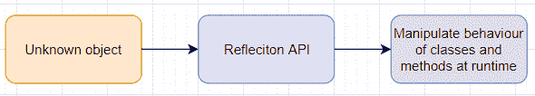
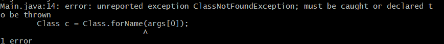

# Java 反射示例

> 原文： [https://javatutorial.net/java-reflection-example](https://javatutorial.net/java-reflection-example)

反射（这是 Java 的功能）允许执行 Java 程序检查自身（或其他代码）并操纵程序的内部属性，例如获取成员的名称并对其执行某些操作，例如删除或显示它们。




默认情况下，Java 中的每个对象都有`getClass()`，它基本上确定当前对象的类（即使在编译时未知）。

反射使您可以编写在编译时不必“识别”所有内容的程序，而可以使程序动态化，因为它们可以在运行时链接在一起。

## Java 反射的简短示例

```java
import java.lang.reflect.*;

public class Main {

    public void print() {
        System.out.println("print");
    }
    public static void main(String args[])
    {
        try {
            Class c = Class.forName("java.lang.String");
            Method m[] = c.getDeclaredMethods();

            for (int i = 0; i < m.length; i++)
                System.out.println(m[i].toString());

        } catch (Throwable e) {
            // manipulate e
            System.out.println();
        }
    }
}
```

在这里，`class.forName`为我们提供了指定的类，然后，它调用`getDeclaredMethods`，其目的是检索在该类中定义的方法的列表。

方法`m[]`存储我们要在其上调用该方法的类的所有已声明方法，在这种情况下为`String`。

尝试并在这里捕获是必需的，就好像您没有它一样，您会收到此错误：



**输出**

```java
public boolean java.lang.String.equals(java.lang.Object)
public java.lang.String java.lang.String.toString()
public int java.lang.String.hashCode()
public int java.lang.String.compareTo(java.lang.String)
public int java.lang.String.compareTo(java.lang.Object)
public int java.lang.String.indexOf(java.lang.String,int)
public int java.lang.String.indexOf(java.lang.String)
public int java.lang.String.indexOf(int,int)
public int java.lang.String.indexOf(int)
static int java.lang.String.indexOf(char[],int,int,char[],int,int,int)
static int java.lang.String.indexOf(char[],int,int,java.lang.String,int)
public static java.lang.String java.lang.String.valueOf(int)
public static java.lang.String java.lang.String.valueOf(long)
public static java.lang.String java.lang.String.valueOf(float)
public static java.lang.String java.lang.String.valueOf(boolean)
public static java.lang.String java.lang.String.valueOf(char[])
public static java.lang.String java.lang.String.valueOf(char[],int,int)
public static java.lang.String java.lang.String.valueOf(java.lang.Object)
public static java.lang.String java.lang.String.valueOf(char)
public static java.lang.String java.lang.String.valueOf(double)
public char java.lang.String.charAt(int)
private static void java.lang.String.checkBounds(byte[],int,int)
public int java.lang.String.codePointAt(int)
public int java.lang.String.codePointBefore(int)
public int java.lang.String.codePointCount(int,int)
public int java.lang.String.compareToIgnoreCase(java.lang.String)
public java.lang.String java.lang.String.concat(java.lang.String)
public boolean java.lang.String.contains(java.lang.CharSequence)
public boolean java.lang.String.contentEquals(java.lang.CharSequence)
public boolean java.lang.String.contentEquals(java.lang.StringBuffer)
public static java.lang.String java.lang.String.copyValueOf(char[])
public static java.lang.String java.lang.String.copyValueOf(char[],int,int)
public boolean java.lang.String.endsWith(java.lang.String)
public boolean java.lang.String.equalsIgnoreCase(java.lang.String)
public static java.lang.String java.lang.String.format(java.util.Locale,java.lang.String,java.lang.Object[])
public static java.lang.String java.lang.String.format(java.lang.String,java.lang.Object[])
public void java.lang.String.getBytes(int,int,byte[],int)
public byte[] java.lang.String.getBytes(java.nio.charset.Charset)
public byte[] java.lang.String.getBytes(java.lang.String) throws java.io.UnsupportedEncodingException
public byte[] java.lang.String.getBytes()
public void java.lang.String.getChars(int,int,char[],int)
void java.lang.String.getChars(char[],int)
private int java.lang.String.indexOfSupplementary(int,int)
public native java.lang.String java.lang.String.intern()
public boolean java.lang.String.isEmpty()
public static java.lang.String java.lang.String.join(java.lang.CharSequence,java.lang.CharSequence[])
public static java.lang.String java.lang.String.join(java.lang.CharSequence,java.lang.Iterable)
public int java.lang.String.lastIndexOf(int)
public int java.lang.String.lastIndexOf(java.lang.String)
static int java.lang.String.lastIndexOf(char[],int,int,java.lang.String,int)
public int java.lang.String.lastIndexOf(java.lang.String,int)
public int java.lang.String.lastIndexOf(int,int)
static int java.lang.String.lastIndexOf(char[],int,int,char[],int,int,int)
private int java.lang.String.lastIndexOfSupplementary(int,int)
public int java.lang.String.length()
public boolean java.lang.String.matches(java.lang.String)
private boolean java.lang.String.nonSyncContentEquals(java.lang.AbstractStringBuilder)
public int java.lang.String.offsetByCodePoints(int,int)
public boolean java.lang.String.regionMatches(int,java.lang.String,int,int)
public boolean java.lang.String.regionMatches(boolean,int,java.lang.String,int,int)
public java.lang.String java.lang.String.replace(char,char)
public java.lang.String java.lang.String.replace(java.lang.CharSequence,java.lang.CharSequence)
public java.lang.String java.lang.String.replaceAll(java.lang.String,java.lang.String)
public java.lang.String java.lang.String.replaceFirst(java.lang.String,java.lang.String)
public java.lang.String[] java.lang.String.split(java.lang.String)
public java.lang.String[] java.lang.String.split(java.lang.String,int)
public boolean java.lang.String.startsWith(java.lang.String,int)
public boolean java.lang.String.startsWith(java.lang.String)
public java.lang.CharSequence java.lang.String.subSequence(int,int)
public java.lang.String java.lang.String.substring(int)
public java.lang.String java.lang.String.substring(int,int)
public char[] java.lang.String.toCharArray()
public java.lang.String java.lang.String.toLowerCase(java.util.Locale)
public java.lang.String java.lang.String.toLowerCase()
public java.lang.String java.lang.String.toUpperCase()
public java.lang.String java.lang.String.toUpperCase(java.util.Locale)
public java.lang.String java.lang.String.trim()
```

从输出中可以看到，`String`有很多方法。

## 设置反射

1.  首先，必须获得一个类对象。 获得它的最常见方法是

    ```java
    Class class = Class.forName("java.lang.'class name, for example String'");
    ```

2.  下一步是调用方法（例如`getDeclaredMethods()`，`getFields()`等）
3.  下一步是使用反射 API 来操纵/更改信息

## 另一个示例，遵循上述的步骤

```java
import java.lang.reflect.*;

class Demo 
{
    private double exampleVariable; 

    public Demo()  {  
        exampleVariable = 2.3; 
    } 

    public void method1()  { 
        System.out.println("The instance variable: " + exampleVariable); 
    } 

    public void method2(int n)  { 
        System.out.println("The number passed: " + n); 
    } 

    private void method3() { // private method
        System.out.println("Private method has been called"); 
    } 
} 

class Main 
{ 
    public static void main(String args[]) throws Exception 
    { 
        Demo classToBeTested = new Demo(); 

        // creating class object from the class using getClass()
        Class classObject = classToBeTested.getClass(); 
        System.out.println("Name of class: " + classObject.getName()); 

        // getting the constructor using getConstructor()
        Constructor constructor = classObject.getConstructor(); 
        System.out.println("Name of constructor: " + constructor.getName()); 

        // stores all the methods the class has
        Method[] methods = classObject.getMethods(); 

        // printing all method names 
        for (Method method : methods) 
            System.out.println(method.getName()); 
    } 
}
```

**输出**

```java
Name of class: Demo
Name of constructor: Demo
method1
method2
wait
wait
wait
equals
toString
hashCode
getClass
notify
notifyAll
```