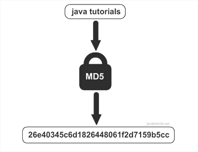

# Java 生成 MD5 哈希和

> 原文： [https://javatutorial.net/java-generate-md5-hash-sum](https://javatutorial.net/java-generate-md5-hash-sum)

在此示例中，我将向您展示如何使用 Java 为给定的字符串生成 MD5 十六进制和

有时您可能需要为给定的字符串创建 **MD5 和**。 这通常用于混淆数据库中的密码或验证字符串的内容。 例如，如果字符串已更改，则 MD5 十六进制总和可以显示给您。

## 什么是 MD5

MD5 算法是一种加密**哈希**函数，它产生 128 位（16 字节）的哈希值，通常以文本格式表示为 32 位十六进制数。 不要将哈希算法与加密算法相混淆。 哈希和加密之间的区别在于，**哈希字符串**无法还原为原始值，**加密内容**可以解密为原始值。



生成 MD5 哈希值

## 用 Java 生成 MD5 哈希

一种简单的生成字符串哈希值的方法是使用 Apache commons 编解码器类`DiagestUtils`中的静态方法。

如果使用 Maven，请将以下依赖项放入 POM 文件中：

```java
<dependency>
	<groupId>commons-codec</groupId>
	<artifactId>commons-codec</artifactId>
	<version>1.2</version>
</dependency>
```

或者您可以从 apache 的网站下载 jar 文件： [Apache 通用编解码器](https://commons.apache.org/proper/commons-codec/)

您可以使用以下静态方法使用 MD5 对字符串进行哈希处理：

```java
/**
* Returns the MD5 hex sum of given string
* @param str - the string to be hashed
* @return MD5 hex sum
*/
public static String md5(String str) {
	return DigestUtils.md5Hex(str);
}
```