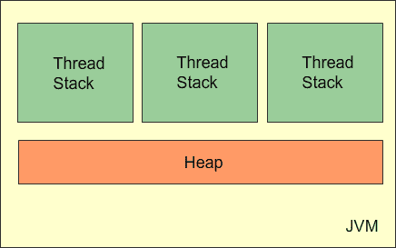

# Java 增加内存

> 原文： [https://javatutorial.net/java-increase-memory](https://javatutorial.net/java-increase-memory)

Java 内存模型指定 [Java 虚拟机](https://javatutorial.net/jvm-explained)如何与计算机的内存（RAM）配合使用。 在本教程中，我将向您展示如何配置 Java 使用的内存。

## Java 内存模型

[JVM](https://javatutorial.net/jvm-explained) 内部使用的 Java 内存模型在线程栈和堆之间分配内存。 JVM 中运行的每个线程都有自己的线程栈。 **线程栈**包含有关线程调用了哪些方法以达到当前执行点的信息。 它还包含每个正在执行的方法的所有局部变量。



基本类型的所有局部变量（`boolean`，`byte`，`short`，`char`，`int`，`long`，`float`，`double`）都完全存储在线程栈中，因此没有 对其他线程可见。

**堆**包含 Java 应用程序中创建的所有对象，而不管创建该对象的线程如何。 这包括原始类型的对象版本（例如`Byte`，`Integer`，`Long`等）。

## 增加堆大小

默认情况下，JVM 使用的最大内存小于物理内存的 1/4。 您可以通过执行以下 Java 代码来检查最大内存：

```java
long maxBytes = Runtime.getRuntime().maxMemory();
System.out.println("Max memory: " + maxBytes / 1024 / 1024 + " MB");
```

您可以通过设置初始和最大堆大小来配置 Java 程序的内存使用量，如下所示：

```java
java -Xms<initial heap size> -Xmx<maximum heap size>
```


例如：

```java
java -Xms500m -Xmx6g myprogram
```

会将初始堆大小设置为 500 MB，将最大堆大小设置为 6 GB。

## 增加栈大小

在 Windows 上，默认线程栈大小是从二进制文件（`java.exe`）中读取的。 从 Java SE 6 开始，此值在 32 位 VM 中为 320k，在 64 位 VM 中为 1024k。 在 x86 Solaris/Linux 上，在 32 位 VM 中为 320k，在 64 位 VM 中为 1024k。

您可以使用`–Xss`自变量来增加栈大小。

例如：

```java
java -Xss4m myprogram
```

将栈大小设置为 4 MB。