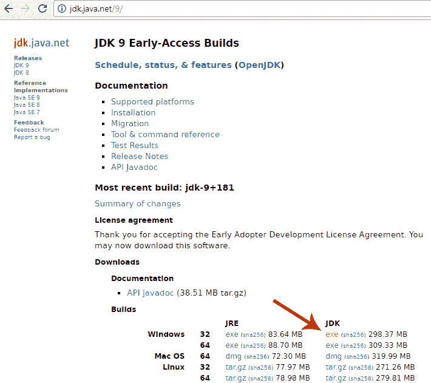
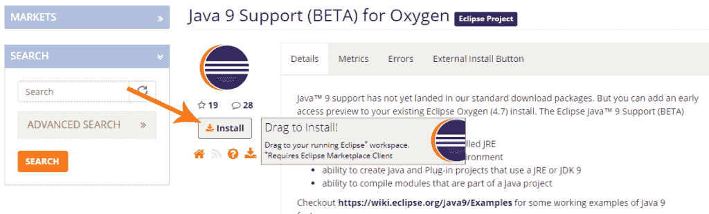
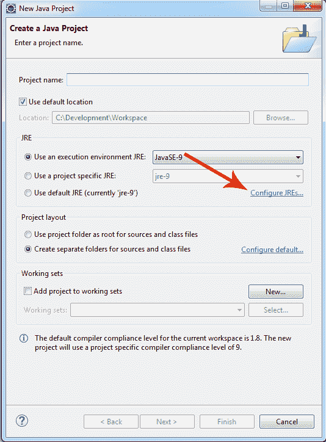
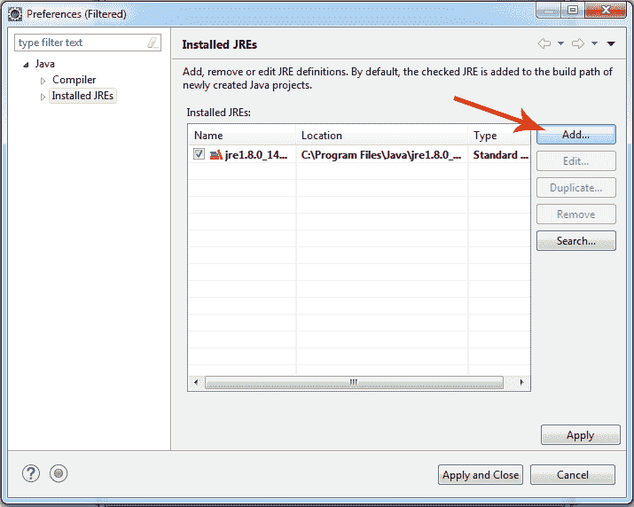
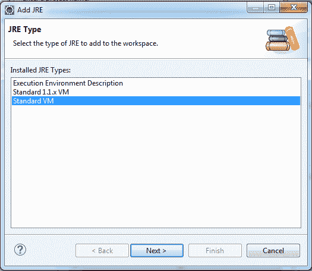
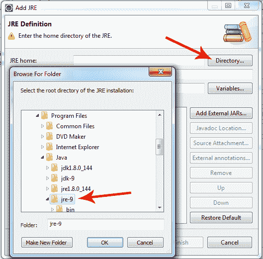
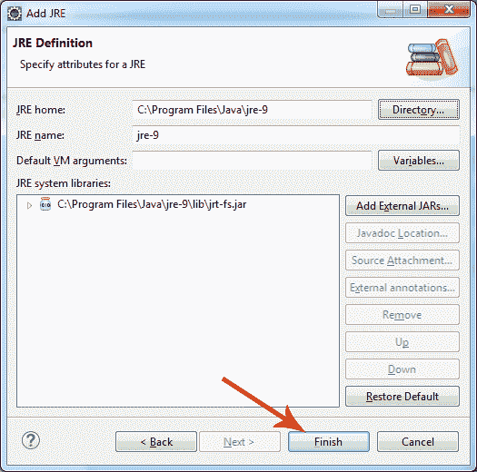
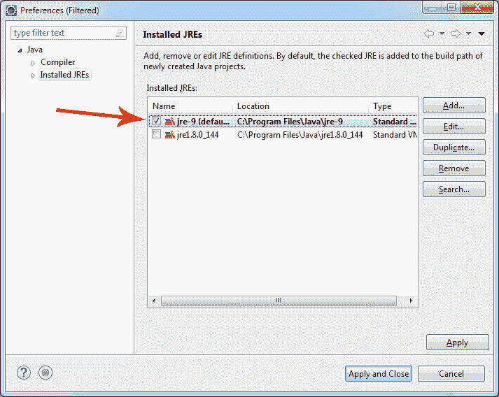
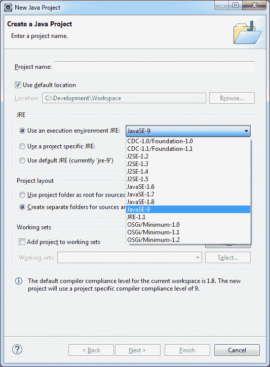

# 如何在 Eclipse 上安装 Java 9 Beta

> 原文： [https://javatutorial.net/install-java-9-eclipse](https://javatutorial.net/install-java-9-eclipse)

本教程演示了如何在 Eclipse Oxygen 上安装和配置 Java 9 Beta

本教程旨在帮助开发人员使用早期访问 Java 9 构建在正式发布之前测试 Java 9 功能。 本教程已在 Eclipse Oxygen 4.7.0 上使用 JDK 9 build 181 进行了测试。

## 1.安装 Java 9 Early Access 构建

转到 [Java 9 下载页面](http://jdk.java.net/9/)并下载安装程序包



下载 Java JDK 9

运行可执行文件，按照步骤操作并安装 Java 9

## 2.安装 Eclipse Oxygen

转到 [Eclipse 下载页面](https://www.eclipse.org/downloads/eclipse-packages/)并下载“Java 开发人员的 Eclipse IDE”或“Java EE 开发人员的 Eclipse IDE”

未归档的 Eclipse

**注意**：您将需要**预先安装在系统上的 [JDK 8](https://javatutorial.net/install-java-8-jdk-on-ubuntu)** 或更早版本。

如果 Java 9 是仅安装的 **Java 版本** – Eclipse 将不会启动。 您将在 eclipse 日志文件中发现以下错误：

```java
eclipse.buildId=4.7.0.I20170612-0950
java.version=9
java.vendor=Oracle Corporation
BootLoader constants: OS=win32, ARCH=x86_64, WS=win32, NL=en_US
Framework arguments:  -product org.eclipse.epp.package.jee.product
Command-line arguments:  -os win32 -ws win32 -arch x86_64 -product org.eclipse.epp.package.jee.product

!ENTRY org.eclipse.osgi 4 0 2017-09-08 12:17:02.768
!MESSAGE Application error
!STACK 1
org.eclipse.e4.core.di.InjectionException: java.lang.NoClassDefFoundError: javax/annotation/PostConstruct
	at org.eclipse.e4.core.internal.di.InjectorImpl.internalMake(InjectorImpl.java:410)
	at org.eclipse.e4.core.internal.di.InjectorImpl.make(InjectorImpl.java:318)
	at org.eclipse.e4.core.contexts.ContextInjectionFactory.make(ContextInjectionFactory.java:162)
	at org.eclipse.e4.ui.internal.workbench.swt.E4Application.createDefaultHeadlessContext(E4Application.java:491)
	at org.eclipse.e4.ui.internal.workbench.swt.E4Application.createDefaultContext(E4Application.java:505)
	at org.eclipse.e4.ui.internal.workbench.swt.E4Application.createE4Workbench(E4Application.java:204)
	at org.eclipse.ui.internal.Workbench.lambda$3(Workbench.java:614)
	at org.eclipse.core.databinding.observable.Realm.runWithDefault(Realm.java:336)
	at org.eclipse.ui.internal.Workbench.createAndRunWorkbench(Workbench.java:594)
	at org.eclipse.ui.PlatformUI.createAndRunWorkbench(PlatformUI.java:148)
	at org.eclipse.ui.internal.ide.application.IDEApplication.start(IDEApplication.java:151)
	at org.eclipse.equinox.internal.app.EclipseAppHandle.run(EclipseAppHandle.java:196)
	at org.eclipse.core.runtime.internal.adaptor.EclipseAppLauncher.runApplication(EclipseAppLauncher.java:134)
	at org.eclipse.core.runtime.internal.adaptor.EclipseAppLauncher.start(EclipseAppLauncher.java:104)
	at org.eclipse.core.runtime.adaptor.EclipseStarter.run(EclipseStarter.java:388)
	at org.eclipse.core.runtime.adaptor.EclipseStarter.run(EclipseStarter.java:243)
	at java.base/jdk.internal.reflect.NativeMethodAccessorImpl.invoke0(Native Method)
	at java.base/jdk.internal.reflect.NativeMethodAccessorImpl.invoke(Unknown Source)
	at java.base/jdk.internal.reflect.DelegatingMethodAccessorImpl.invoke(Unknown Source)
	at java.base/java.lang.reflect.Method.invoke(Unknown Source)
	at org.eclipse.equinox.launcher.Main.invokeFramework(Main.java:653)
	at org.eclipse.equinox.launcher.Main.basicRun(Main.java:590)
	at org.eclipse.equinox.launcher.Main.run(Main.java:1499)
	at org.eclipse.equinox.launcher.Main.main(Main.java:1472)
Caused by: java.lang.NoClassDefFoundError: javax/annotation/PostConstruct
	at org.eclipse.e4.core.internal.di.InjectorImpl.inject(InjectorImpl.java:124)
	at org.eclipse.e4.core.internal.di.InjectorImpl.internalMake(InjectorImpl.java:399)
	... 23 more
Caused by: java.lang.ClassNotFoundException: javax.annotation.PostConstruct cannot be found by org.eclipse.e4.core.di_1.6.100.v20170421-1418
	at org.eclipse.osgi.internal.loader.BundleLoader.findClassInternal(BundleLoader.java:433)
	at org.eclipse.osgi.internal.loader.BundleLoader.findClass(BundleLoader.java:395)
	at org.eclipse.osgi.internal.loader.BundleLoader.findClass(BundleLoader.java:387)
	at org.eclipse.osgi.internal.loader.ModuleClassLoader.loadClass(ModuleClassLoader.java:150)
	at java.base/java.lang.ClassLoader.loadClass(Unknown Source)
	... 25 more
```

## 3.添加对 Eclipse 的 Java 9 支持

通过将“安装”按钮拖动到正在运行的 Eclipse 窗口中，进入 Eclipse Marketplace 并安装对 Eclipse Oxygen 的 Java 9 支持。



安装对 Eclipse Oxygen 的 Java 9 支持

出现提示时重新启动 Eclipse

## 4.创建一个 Java 9 Eclipse 项目

打开 Eclipse 并转到“File -&gt; New -&gt; Java Project”

在“新建 Java 项目窗口”中，单击“配置 JRE ...”。



Eclipse 新的 Java 项目窗口

在“Installed JRE”窗口中，按“Add…”按钮



Eclipse 添加新的 JRE

选择“标准 VM”，然后按“下一步 &gt;”按钮



Eclipse 选择标准 VM

在“JRE 主目录”下，按“目录…”按钮，然后浏览并选择您的 JRE 9 根目录。 **注意**：如果您选择 JDK 目录，则将无法构建项目



选择 JRE 9 目录

按下“完成”按钮进行确认



完成 Java 9 安装

现在，在列表中选择`jre-9`并应用更改



选择 Java 9 作为默认 JRE

返回“创建 Java 项目”窗口，使用“使用执行环境 JRE”下拉菜单为新项目选择 Java 9。



选择 Java 9 执行环境

现在您准备尝试一些 Java 9 新功能

您将在此处找到的许多教程都是基于 Edward Lavieri 博士和 Peter Verhas 博士撰写的 [Mastering Java 9](https://www.amazon.com/Mastering-Java-reactive-modular-concurrent/dp/1786468735/ref=sr_1_3?ie=UTF8&qid=1520921208&sr=8-3&keywords=mastering+java+9)。 本书将为您提供对 Java 9 新概念和工具的完整而深刻的理解。