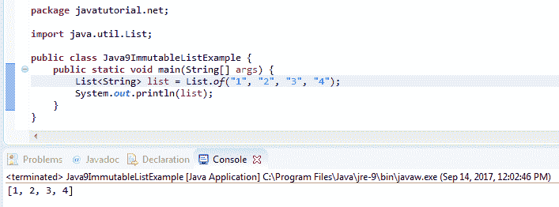

# Java 9 不可变列表示例

> 原文： [https://javatutorial.net/java-9-immutable-list-example](https://javatutorial.net/java-9-immutable-list-example)

本示例演示了如何使用新的 Java 9 `Collections`工厂方法创建不可变列表。

在 Java 9 发行版中，Oracle 从其他流行的 [JVM](https://javatutorial.net/jvm-explained) 语言（例如 Kotlin，Guava，Scala 等）获取工作实践方面迈出了第一步。做到这一点时要适当考虑到跨语言的向后兼容性和语法一致性。 [JDK](https://javatutorial.net/install-java-8-jdk-on-ubuntu) 。 这些 Java 9 新功能之一是创建不可变（不可修改）列表。



Java 9 不可变列表示例

在 Java 9 之前，创建不可变`List`是某种冗长的任务。 例如，要使用 Java 9 之前的版本创建一个空的不可变列表，我们使用以下代码：

```java
package javatutorial.net;

import java.util.ArrayList;
import java.util.Collections;
import java.util.List;

public class UnmodifiableListExample {

	public static void main(String[] args) {
		List<String> emptyList = new ArrayList<>();
		List<String> immutableList = Collections.unmodifiableList(emptyList);
	}

}
```

## 什么是不可变列表

一旦在 Java 中创建了不可变对象，就无法更改值。 不可变列表也不例外。 您**不能**：

*   从列表中添加或删除条目。 如果您尝试这样做，将在`java.lang.UnsupportedOperationException`中解决
*   修改列表的元素。 尝试这样做会导致`java.lang.UnsupportedOperationException`
*   将空元素添加到列表中。 如果您尝试将`null`元素添加到列表中，则会以`java.lang.NullPointerException`结尾

## 在 Java 9 中创建空的不可变列表

要在 Java 9 中创建一个空列表，我们需要做的就是调用`List`工厂方法`of()`，请参见下面的示例

```java
package javatutorial.net;

import java.util.List;

public class Java9EmptyImmutableListExample {
	public static void main(String[] args) {
		List<String> emptyList = List.of();
	}
}
```

## 在 Java 9 中使用元素创建不可变列表

有 10 种工厂方法可创建最多 10 个元素的不可变列表（来源：[Java 9 `List`接口 Javadoc](https://docs.oracle.com/javase/9/docs/api/java/util/List.html)）：

```java
static <E> List<E>	of​(E e1)	
Returns an immutable list containing one element.

static <E> List<E>	of​(E e1, E e2)	
Returns an immutable list containing two elements.

static <E> List<E>	of​(E e1, E e2, E e3)	
Returns an immutable list containing three elements.

static <E> List<E>	of​(E e1, E e2, E e3, E e4)	
Returns an immutable list containing four elements.

static <E> List<E>	of​(E e1, E e2, E e3, E e4, E e5)	
Returns an immutable list containing five elements.

static <E> List<E>	of​(E e1, E e2, E e3, E e4, E e5, E e6)	
Returns an immutable list containing six elements.

static <E> List<E>	of​(E e1, E e2, E e3, E e4, E e5, E e6, E e7)	
Returns an immutable list containing seven elements.

static <E> List<E>	of​(E e1, E e2, E e3, E e4, E e5, E e6, E e7, E e8)	
Returns an immutable list containing eight elements.

static <E> List<E>	of​(E e1, E e2, E e3, E e4, E e5, E e6, E e7, E e8, E e9)	
Returns an immutable list containing nine elements.

static <E> List<E>	of​(E e1, E e2, E e3, E e4, E e5, E e6, E e7, E e8, E e9, E e10)	
Returns an immutable list containing ten elements.
```

还有一种具有可变数量参数的方法，可让您创建具有令人讨厌的元素数量的不可变列表：

```java
static <E> List<E>	of​(E... elements)
```

下面的示例创建一个包含 3 个元素的不可变列表：

```java
package javatutorial.net;

import java.util.List;

public class Java9ImmutableListExample {
	public static void main(String[] args) {
		List<String> list = List.of("A", "B", "C");
	}
}
```

您将在此处找到的许多教程都是基于 Edward Lavieri 博士和 Peter Verhas 博士撰写的 [Mastering Java 9](https://www.amazon.com/Mastering-Java-reactive-modular-concurrent/dp/1786468735/ref=sr_1_3?ie=UTF8&qid=1520921208&sr=8-3&keywords=mastering+java+9) 。 本书将为您提供对 Java 9 新概念和工具的完整而深刻的理解。