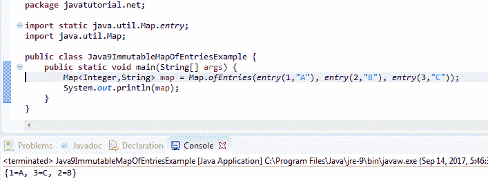

# Java 9 不可变映射示例

> 原文： [https://javatutorial.net/java-9-immutable-map-example](https://javatutorial.net/java-9-immutable-map-example)

本示例演示了如何使用新的 Java 9 `Collections`工厂方法创建不可变的`Map`。

在 Java 9 发行版中，Oracle 从其他流行的 [JVM](https://javatutorial.net/jvm-explained) 语言（例如 Kotlin，Guava，Scala 等）获取工作实践方面迈出了第一步。做到这一点时要适当考虑到跨语言的向后兼容性和语法一致性。 [JDK](https://javatutorial.net/install-java-8-jdk-on-ubuntu) 。 那些 [Java 9](https://javatutorial.net/install-java-9-eclipse) 新功能之一是**不变（不可修改）映射**的创建。



Java 9 不可变映射示例

在 Java 9 之前，创建不变 Map 是某种冗长的任务。 例如，要使用 Java 9 之前的版本创建一个空的不可变`Map`，我们使用以下代码：

```java
package javatutorial.net;

import java.util.Collections;
import java.util.HashMap;
import java.util.Map;

public class UnmodifiableMapExample {

	public static void main(String[] args) {
		Map<Integer, String> emptyMap = new HashMap<>();
		Map<Integer, String> immutableEmptyMap = Collections.unmodifiableMap(emptyMap);
	}

}

```

## 什么是不可变映射

一旦在 Java 中创建了不可变对象，就无法更改值。 不可变的映射也不例外。 您**不能**：

*   键和值无法添加，删除或更新。 如果您尝试这样做，将在`java.lang.UnsupportedOperationException`中解决
*   修改映射条目。 尝试这样做会导致`java.lang.UnsupportedOperationException`
*   在映射中使用`null`键和值。 如果您尝试向映射添加空键或空值，则最终会显示`java.lang.NullPointerException`

## 在 Java 9 中创建空的不可变映射

要使用 Java 9 创建一个空`Map`，我们需要做的就是调用工厂`Map`方法`of()`，请参见下面的示例

```java
package javatutorial.net;

import java.util.Map;

public class Java9EmptyImmutableMapExample {
	public static void main(String[] args) {
		Map<Integer,String> emptyImmutableMap = Map.of();
	}
}
```

## 在 Java 9 中使用条目创建不可变映射

有 10 种工厂方法可创建多达 10 个键值对的不可变`Map`（来源： [Java 9 Map 接口 Javadoc](https://docs.oracle.com/javase/9/docs/api/java/util/Map.html) ）：

```java
static <K,V> Map<K,V>	of​(K k1, V v1)	
Returns an immutable map containing a single mapping.

static <K,V> Map<K,V>	of​(K k1, V v1, K k2, V v2)	
Returns an immutable map containing two mappings.

static <K,V> Map<K,V>	of​(K k1, V v1, K k2, V v2, K k3, V v3)	
Returns an immutable map containing three mappings.

static <K,V> Map<K,V>	of​(K k1, V v1, K k2, V v2, K k3, V v3, K k4, V v4)	
Returns an immutable map containing four mappings.

static <K,V> Map<K,V>	of​(K k1, V v1, K k2, V v2, K k3, V v3, K k4, V v4, K k5, V v5)	
Returns an immutable map containing five mappings.

static <K,V> Map<K,V>	of​(K k1, V v1, K k2, V v2, K k3, V v3, K k4, V v4, K k5, V v5, K k6, V v6)	
Returns an immutable map containing six mappings.

static <K,V> Map<K,V>	of​(K k1, V v1, K k2, V v2, K k3, V v3, K k4, V v4, K k5, V v5, K k6, V v6, K k7, V v7)	
Returns an immutable map containing seven mappings.

static <K,V> Map<K,V>	of​(K k1, V v1, K k2, V v2, K k3, V v3, K k4, V v4, K k5, V v5, K k6, V v6, K k7, V v7, K k8, V v8)	
Returns an immutable map containing eight mappings.

static <K,V> Map<K,V>	of​(K k1, V v1, K k2, V v2, K k3, V v3, K k4, V v4, K k5, V v5, K k6, V v6, K k7, V v7, K k8, V v8, K k9, V v9)	
Returns an immutable map containing nine mappings.

static <K,V> Map<K,V>	of​(K k1, V v1, K k2, V v2, K k3, V v3, K k4, V v4, K k5, V v5, K k6, V v6, K k7, V v7, K k8, V v8, K k9, V v9, K k10, V v10)	
Returns an immutable map containing ten mappings.
```

以下示例创建具有 3 个条目的不可变`Map`：

```java
package javatutorial.net;

import java.util.Map;

public class Java9ImmutableMapExample {
	public static void main(String[] args) {
		Map<Integer,String> map = Map.of(1, "A", 2, "B", 3, "C");
	}
}
```

## 使用`Map.ofEntries()`方法在 Java 9 中创建不可变映射

Java 9 中的`Map`接口提供了另一种实用程序方法来创建不可变映射 – `ofEntries`。 该方法的签名如下所示：

```java
static <K,V> Map<K,V>	ofEntries​(Map.Entry<? extends K,? extends V>... entries)
```

这使我们可以向`Map`插入任意数量的条目。 以下示例创建了 3 个条目，并在`ofEntries()`方法的帮助下创建了一个不变的`Map`：

```java
package javatutorial.net;

import java.util.Map;

public class Java9ImmutableMapOfEntriesExample {
	public static void main(String[] args) {
		Map.Entry<Integer,String> e1 = Map.entry(1, "A");
		Map.Entry<Integer,String> e2 = Map.entry(2, "B");
		Map.Entry<Integer,String> e3 = Map.entry(3, "C");

		Map<Integer,String> map = Map.ofEntries(e1, e2, e3);
	}
}

```

您可以通过静态导入`java.util.Map.entry`大大缩短代码，请参见以下示例：

```java
package javatutorial.net;

import static java.util.Map.entry;
import java.util.Map;

public class Java9ImmutableMapOfEntriesExample {
	public static void main(String[] args) {
		Map<Integer,String> map = Map.ofEntries(entry(1,"A"), entry(2,"B"), entry(3,"C"));
	}
}

```

您将在此处找到的许多教程都是基于 Edward Lavieri 博士和 Peter Verhas 博士撰写的 [Mastering Java 9](https://www.amazon.com/Mastering-Java-reactive-modular-concurrent/dp/1786468735/ref=sr_1_3?ie=UTF8&qid=1520921208&sr=8-3&keywords=mastering+java+9) 。 本书将为您提供对 Java 9 新概念和工具的完整而深刻的理解。