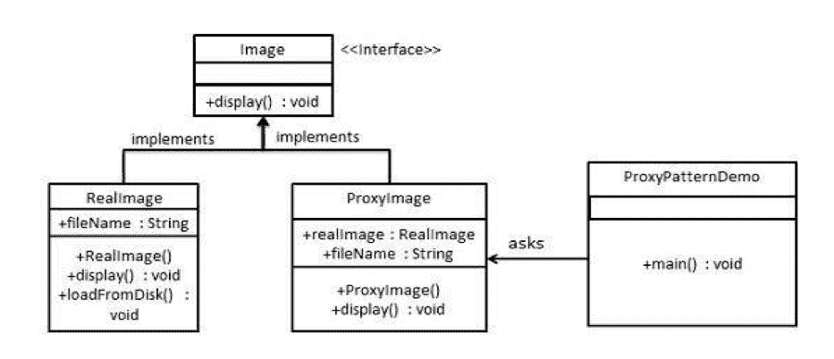

# Java 代理设计模式示例

> 原文： [https://javatutorial.net/java-proxy-design-pattern-example](https://javatutorial.net/java-proxy-design-pattern-example)

本文介绍了 Java 中的代理设计模式。

代理设计模式是“四人帮”设计模式中的基本计划设计。 辅助结构设计管理如何确认对象之间的连接以改进计划。

## 代理设计模式如何工作？

代理模式为另一个对象提供代理或占位符，以控制对其的访问。 在计算机编程中，代理设计是产品配置设计。 代理在其最广泛的结构中是充当与其他事物的接口的类。

代理可以连接任何东西：系统关联，内存中的巨大对象，记录或其他昂贵或难以复制的资产。 简而言之，代理是客户调用的包装器或运算符对象，以在后台访问真正的服务对象。 中介的使用基本上可以发送给正品，也可以提供更多的理由。 在代理中，可以授予其他用户的权限，例如，保留对正品项目的活动严重影响资产的时间，或者在对正品对象的任务被构想之前检查前提条件。

对于客户而言，代理对象的使用就像利用正品一样，因为两者都实现了相似的接口。


代理模式图

## 现实场景中代理设计模式的实现

我们可以创建一个`Image`接口，并执行`Image`接口的实体类。 `ProxyImage`是一个代理类，用于减少`RealImage`对象栈的内存印象。



Java 示例的代理模式图

## Java 中的代理设计模式示例

创建一个接口

`Image.java`

```java
public interface Image {
   void display();
}
```

创建实现相同接口的具体类。

`RealImage.java`

```java
public class RealImage implements Image {

   private String fileName;

   public RealImage(String fileName){
      this.fileName = fileName;
      loadFromDisk(fileName);
   }

   @Override
   public void display() {
      System.out.println("Displaying " + fileName);
   }

   private void loadFromDisk(String fileName){
      System.out.println("Loading " + fileName);
   }
}
```

`ProxyImage.java`

```java
public class ProxyImage implements Image{

   private RealImage realImage;
   private String fileName;

   public ProxyImage(String fileName){
      this.fileName = fileName;
   }

   @Override
   public void display() {
      if(realImage == null){
         realImage = new RealImage(fileName);
      }
      realImage.display();
   }
}
```

必要时，使用`ProxyImage`获取`RealImage`类的对象。

`ProxyPatternDemo.java`

```java
public class ProxyPatternDemo {

   public static void main(String[] args) {
      Image image = new ProxyImage("test_10mb.jpg");

      //image will be loaded from disk
      image.display(); 
      System.out.println();

      //image will not be loaded from disk
      image.display(); 	
   }
}
```

验证输出。

```java
Loading test_10mb.jpg
Displaying test_10mb.jpg

Displaying test_10mb.jpg
```