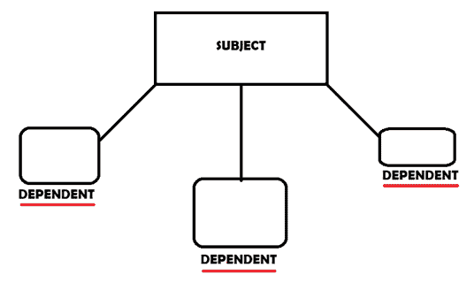
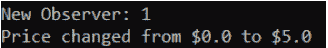
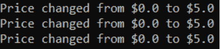

# Java 观察者设计模式示例

> 原文： [https://javatutorial.net/java-observer-design-pattern-example](https://javatutorial.net/java-observer-design-pattern-example)

**观察者模式**是一种软件设计模式，其中一个称为主题的对象维护着一个依赖于它的所有其他对象（主题）的列表。 这些依赖者称为观察者。 如果主题（所有受抚养者（观察者）的维护者）的状态发生变化，则会自动通知他们。 它通常通过方法调用来完成。

## 何时使用观察者模式

*   通常在对象之间存在一对多关系时使用。
*   如果一个对象（另一个**相关**）修改/更改了其“行为”，则需要更新该对象。
*   当主题的观察者数量未知时。

## 怎么运行的

通常，会有一个`Subject.java`文件，其中包含执行所有观察者的添加，删除和更新的所有方法，或者仅初始化它们，并在不同的`.java`文件中执行所有方法的功能。 按照约定，还有一个`Observer.java`文件，该文件包含一个每次主题更改时都会调用的`update()`方法。 之后，您必须创建实现`Subject`类或`Observer`类的`.java`文件。 请注意，这取决于您的类是应实现`Subject`还是`Observer`类文件。



观察者设计模式

## 现实生活中的例子

想想您最喜欢的会员服务。 也许是体育馆，或者是 Netflix，或者完全不同。 在本示例中，我们将使用 Netflix，但基本上任何其他成员资格服务都可以使用。 如果 Netflix 更改了其每月会员资格的价格，而您要为此付费，则它应通知您。 实际上，它应该通知所有注册/订阅人员服务。

## Java 观察者设计模式示例

`Subject.java`

```java
public interface Subject {
    public double getCurrentPrice();
    public void setNewPrice(double newPrice);
    public void addNewSubscriber(Observer newSuObserver);
    public void removeSubscriber(Observer unsubscriber);
    public void notifyAllSubscribers();
}
```

在`Subject.java`中，我们将初始化将在`SubscriptionGrabber.java`文件中使用的方法，我将在稍后向您介绍。 这些方法处理添加，删除以及主题状态更改时触发的消息。

`Observer.java`

```java
public interface Observer {
    public void update(double price);
}
```

这是我们的`Observer`类。 它具有将在类`SubscriptionObserver.java`文件中创建的`update(double price)`方法。 请**注意**：每次订阅价格更改时，都会调用此方法。

`SubscriptionGrabber.java`

```java
import java.util.*;

public class SubscriptionGrabber implements Subject { 
    private List<Observer> subscribers = new ArrayList<Observer>();
    private double price;

    public SubscriptionGrabber() {
        subscribers = new ArrayList<Observer>();
    }

    public double getCurrentPrice() {
        return price;
    }

    public void setNewPrice(double newPrice) {
        this.price = newPrice;
        notifyAllSubscribers();
    }

    public void addNewSubscriber(Observer newSubscriber) {
        subscribers.add(newSubscriber);
    }

    public void removeSubscriber(Observer unsubscriber) {
        int indexOfUnsubscriber = subscribers.indexOf(unsubscriber);
        subscribers.remove(indexOfUnsubscriber);
    }

    public void notifyAllSubscribers() {
        for (Observer subscriber : subscribers){
            subscriber.update(price);
        }
    }
}

```

此`.java`文件使用`Subject`接口。 请注意，在`setNewPrice(double newPrice)`方法中，我们在设置新价格后会通知用户。 重要的是，我们必须在价格变化后执行此操作，否则以后，如果其中有更多代码块，则可能会出现问题。 我们的`addSubscriber(Observer newSubscriber)`和`removeSubscriber(Observer subscriber)`只是在观察者列表中添加人或从观察者列表中删除人。 我们需要在我们的模式中具有删除功能，因为我们的目的是仅通知订阅者，或者仅通知使用我们服务的人员。 我们无需通知不再使用我们服务的人员。 最后，此`.java`文件中的`final`方法仅对每个订户调用`update(double price)`方法（我们仍未创建）。

`SubscriptionObserver.java`

```java
public class SubscriptionObserver implements Observer {
    private double price;
    private Subject subscriberGrabber;
    private int subscriptionID;

    public SubscriptionObserver(Subject subscriptionGrabber) {
        this.subscriberGrabber = subscriptionGrabber;
        this.subscriptionID+=1;
        subscriberGrabber.addNewSubscriber(this);
        System.out.println("New Observer: " + this.subscriptionID);
    }

    public void update(double price) {
        System.out.println("Price changed from $" + this.price + " to $" + price);
        this.price = price;  
    }
}

```

这是实际上（最终）具有更新功能的`.java`文件。 请注意我是如何在其中放入打印语句的。 这非常重要（在`update`方法中包含打印语句），因为您需要直观地显示用户所发生的事情。 在**构造函数**中，该参数始终是一个空列表（您将在下一个`.java`文件中看到），并且`subscriptionGrabber`将是我们的新列表，其中将包含订阅者。 在第 9 行，您可以看到我们正在添加此新订户。

`ObserverPattern.java`

```java
public class ObserverPattern {
    public static void main(String[] args) {
        SubscriptionGrabber subscriptionGrabber = new SubscriptionGrabber();
        SubscriptionObserver subscriptionObserver = new SubscriptionObserver(subscriptionGrabber);
        SubscriptionObserver subscriptionObserver2 = new SubscriptionObserver(subscriptionGrabber);
        SubscriptionObserver subscriptionObserver3 = new SubscriptionObserver(subscriptionGrabber);
        subscriptionGrabber.setNewPrice(5);
    }
}

```

在这里我们创建抓取程序（列表），然后将该列表作为参数传递给订阅观察者变量作为构造函数参数。 然后，我们将订阅的新价格设置为 5 美元。 预期结果将是通知所有用户价格确实已更改为 5 美元。 试试吧！



Java 观察者模式结果 1

它按预期工作。 现在，我们尝试再创建 2 个订阅，并查看消息是否会弹出 3 次（因为我们将有 3 个订阅）。



Java 观察者模式结果 2

它确实打印了三遍。