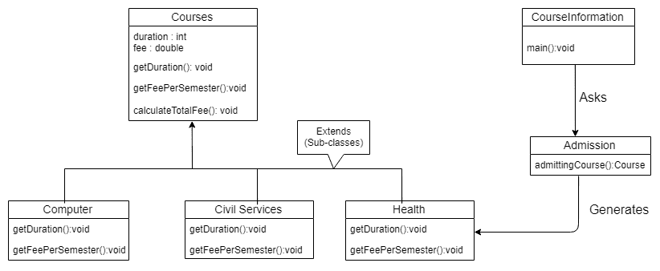

# Java 工厂设计模式

> 原文： [https://javatutorial.net/java-factory-design-pattern](https://javatutorial.net/java-factory-design-pattern)

本文讨论 [Java](https://javatutorial.net/install-java-9-eclipse) 中的工厂设计模式，这是 Java 中流行的[设计模式](https://javatutorial.net/tag/design-pattern)之一。

Java 是一种非常强大的语言。 每个人都喜欢它的主要原因是通过面向对象的编程实现了更高的可靠性和安全性。

工厂设计模式在 Java 中被广泛使用，考虑到它的使用，它理所当然地赢得了欢迎。 这种设计模式的方法也称为虚拟构造函数。

在用 Java 创建对象时，您可能不知道可能需要什么类型的对象以及在什么地方实现它们。 工厂设计模式正好解决了这个问题。 通过了解设计模式本身的名称，您可以更好地理解。 考虑一个每天生产不同产品的工厂环境。 库存中包含制造产品所需的所有材料，但是事先不知道要制造什么类型的产品。

用编程术语，您可以将清单中的组件作为类进行比较，但是您不知道要在运行时实例化哪些组件（制造什么产品）。

“工厂”一词来自设计模式，它生成许多不同类型的对象，而不必知道创建哪种对象以及如何创建对象。 当我们具有超类和各种子类时，它将投入使用。

工厂设计模式被认为是一种创新的设计模式，并部署在 JDK 和 Spring 和 Struts 等框架中。

## 为什么要使用工厂设计模式？

*   允许子类选择在运行时创建的对象的类型
*   促进松散耦合，因为它消除了将特定于应用程序的类绑定到代码中的需要

## 什么时候使用工厂设计模式？

*   当您不知道您的班级需要哪些子班级时
*   当您希望子类指定要生成的对象时

超类充当创建对象的公共接口或抽象类，但让子类决定在运行时实例化哪个类。 因此，可以说子类负责创建该类的实例。

## Java 工厂设计模式示例

让我们看一个通过实际示例并对其进行编码来实现工厂设计模式的示例。



工厂设计模式示例

**步骤 1**：创建一个名为`Courses`的抽象类

```java
abstract class Courses{  
         protected int duration;  
         protected double fee;
         abstract void getDuration();  
         abstract void getFeePerSemester();  

         public void calculateTotalFee(){  
              System.out.println(duration*fee);  
          }  
}//end of Course class
```

**步骤 2**：创建扩展课程抽象类的类，这里提供了三门课程，分别是计算机，公共服务和卫生

```java
class  Computer extends Courses{  
        //@override  
        public void getDuration(){  
             duration=8;             // duration in semesters            
        }  

        public void getFeePerSemester(){
	fee = 3000;             // fee in dollars   
        }
   }//end of Computer class.  

class  CivilServices extends Courses{  
        //@override  
         public void getDuration(){  
             duration=6;             // duration in semesters            
        }  

        public void getFeePerSemester(){
	fee = 2000;             // fee in dollars   
        }
}//end of CivilServices class.  

class  Health extends Courses{  
        //@override  
        public void getDuration(){  
             duration=10;             // duration in semesters            
        }  

        public void getFeePerSemester(){
	fee = 5000;             // fee in dollars   
        }
   }//end of Health class.
```

**步骤 3**：创建一个`Admission`类以生成子类的对象

```java
class Admission{  

   //use admittingCourse method to get object of type Course   
       public Course admittingCourse (String courseName){  
           if(courseName == null){  
               return null;  
           }  
           if(courseName.equalsIgnoreCase("Computer")) {  
                 return new Computer();  
           }   
           else if(courseName.equalsIgnoreCase("CivilServices")){  
                return new CivilServices();  
           }   
           else if(courseName.equalsIgnoreCase("Health")) {  
                return new Health();  
           }  
      return null;  
   }  
}//end of Admission class.
```

**步骤 4**：通过传递所需的信息（例如正在申请的课程，例如计算机，公务员系统和培训课程），使用招生类别获取子类别的对象，从而生成有关课程持续时间和费用的信息。

```java
import java.io.*;

class CourseInformation {
    public static void main(String args[]) throws IOException {
        Admission newApplication = new Admission();

        System.out.print("Enter the course you are trying to admit in: ");
        BufferedReader br = new BufferedReader(new InputStreamReader(System.in));

        String cousreName = br.readLine();

        Course c = newApplication.admittingCourse(courseName);

        System.out.print("For  " + courseName + "  the required duration you would have to study is: ");
        c.getDuration();
        System.out.print("For  " + courseName + "  the required fee you would have to pay per semester is: ");
        c.getFeePerSemester();
        System.out.print("The total amount you will have to pay for the entire course duration is:”);     
        c.calculateTotalFee();
    }
} //end of CourseInformation class.

```

这是 Java 中工厂设计模式的实际应用程序的源代码。 现在，您知道什么是工厂设计模式，何时使用它以及使用它的好处是什么。